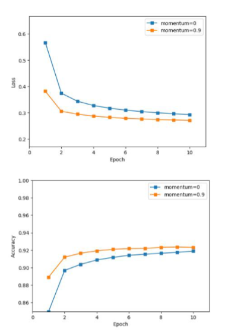

# 一、案例简介：

案例 1：Softmax 实现手写数字识别

相关知识点: numpy 科学计算包，如向量化操作，广播机制等

### 1 简介
本次案例中，你需要用 python 实现 Softmax 回归方法，用于 MNIST 手写数字数据集分类任务。你需要完成前向计算 loss 和参数更新。

你需要首先实现 Softmax 函数和交叉熵损失函数的计算。


在更新参数的过程中，你需要实现参数梯度的计算，并按照随机梯度下降法来更新参数。


具体计算方法可自行推导，或参照第三章课件。


### 2 MNIST 数据集
MNIST 手写数字数据集是机器学习领域中广泛使用的图像分类数据集。它包含 60,000 个训练样本和 10,000 个测试样本。这些数字已进行尺寸规格化，并在固定尺寸的图像中居中。每个样本都是一个 784×1 的矩阵，是从原始的 28×28 灰度图像转换而来的。MNIST 中的数字范围是 0 到 9。下面显示了一些示例。 注意：在训练期间，切勿以任何形式使用有关测试样本的信息。


### 3 任务要求

#### 1. 代码清单
- (a) data/ 文件夹：存放 MNIST 数据集。你需要下载数据，解压后存放于该文件夹下。下载链接见文末，解压后的数据为 *ubyte 形式；
- (b) solver.py 这个文件中实现了训练和测试的流程。建议从这个文件开始阅读代码；
- (c) dataloader.py 实现了数据加载器，可用于准备数据以进行训练和测试；
- (d) visualize.py 实现了 plot_loss_and_acc 函数，该函数可用于绘制损失和准确率曲线；
- (e) optimizer.py 你需要实现带 momentum 的 SGD 优化器，可用于执行参数更新；
- (f) loss.py 你需要实现 softmax_cross_entropy_loss，包含 loss 的计算和梯度计算；
- (g) runner.ipynb 完成所有代码后的执行文件，执行训练和测试过程。

#### 2. 要求
我们提供了完整的代码框架，你只需要完成 optimizer.py，loss.py 中的 #TODO 部分。你需要提交整个代码文件和带有结果的 runner.ipynb (不要提交数据集) 并且附一个 pdf 格式报告，内容包括：
- (a) 记录训练和测试的准确率。画出训练损失和准确率曲线；
- (b) 比较使用和不使用 momentum 结果的不同，可以从训练时间，收敛性和准确率等方面讨论差异；
- (c) 调整其他超参数，如学习率，Batchsize 等，观察这些超参数如何影响分类性能。写下观察结果并将这些新结果记录在报告中。

### 4 其他
1. 注意代码的执行效率，尽量不要使用 for 循环；
2. 不要在 pdf 报告中粘贴很多代码(只能包含关键代码)，对添加的代码作出解释;
3. 不要使用任何深度学习框架，如 TensorFlow，Pytorch 等；
4. 禁止抄袭。

### 5 参考
1. 数据集下载：http://yann.lecun.com/exdb/mnist/index.html


# 二、关键代码及解释：
### Loss 文件代码：类设计概览
此类设计为一个全连接层（也称为线性层），后接一个 Softmax 函数和一个交叉熵损失（Cross-Entropy Loss）计算。该类旨在处理多类分类问题，其中Softmax函数将线性层的输出转化为概率分布，而交叉熵损失评估该分布与真实标签的接近程度。
```python
class SoftmaxCrossEntropyLoss:
    """
    Softmax Cross-Entropy Loss layer
    """
    def __init__(self, num_input, num_output, trainable=True):
        """
        Initialize SoftmaxCrossEntropyLoss instance
        Args:
            num_input: Size of each input sample
            num_output: Size of each output sample
            trainable: Whether if this layer is trainable
        """
        self.num_input = num_input
        self.num_output = num_output
        self.trainable = trainable
        self.XavierInit()
```

##### 前向传播（forward 方法）
1. 计算输入 Input 通过线性变换（Wx + b）后的得分。
2. 应用 Softmax 函数将得分转换为概率分布。这是通过对每个类的得分应用指数函数，然后按样本进行归一化来实现的。
3. 计算交叉熵损失，方法是将真实标签（转换为独热编码）和预测概率进行比较。
4. 此外，根据预测概率计算准确率，作为模型性能的直接指标。保存相关数据以用于梯度计算。

```python
def forward(self, Input, labels):
    """
    Forward pass of SoftmaxCrossEntropyLoss layer
    Args:
        Input: Input data (batch_size, num_input)
        labels: Ground truth label (batch_size,)
    Returns:
        loss: Cross-entropy loss
        acc: Accuracy
    """
    # Linear transformation
    scores = np.dot(Input, self.W) + self.b # Shape: (batch_size, num_output)
    # Softmax probabilities
    scores_exp = np.exp(scores)
    scores_sum = np.sum(scores_exp, axis=1, keepdims=True)
    probs = scores_exp / scores_sum # Shape: (batch_size, num_output)
    # Cross-entropy loss
    N = Input.shape[0] # Batch size
    C = self.num_output # Number of classes
    # Convert labels to one-hot vectors
    y_onehot = np.zeros((N, C))
    y_onehot[np.arange(N), labels] = 1 # Shape: (batch_size, num_output)
    # Compute loss
    loss = -np.sum(y_onehot * np.log(probs)) / N
    # Compute accuracy
    preds = np.argmax(probs, axis=1) # Shape: (batch_size,)
    acc = np.mean(preds == labels)
    # Save some arrays for gradient computing
    self.Input = Input
    self.probs = probs
    self.y_onehot = y_onehot
    return loss, acc
```

##### 梯度计算（gradient_computing 方法）
1. 计算与得分 scores 相关的梯度，基于预测概率 probs 与独热编码的真实标签y_onehot 之间的差异。
2. 进一步计算这个梯度关于权重 W 和偏置 b 的导数，这是通过反向传播算法实现的，用于后续的权重更新。

```python
def gradient_computing(self):
    """
    Compute gradients of SoftmaxCrossEntropyLoss
    """
    # Gradient of loss with respect to scores,W,b
    d_scores = (self.probs - self.y_onehot) / self.Input.shape[0] # Shape: (batch_size, num_output)
    self.grad_W = np.dot(self.Input.T, d_scores) # Shape: (num_input, num_output)
    self.grad_b = np.sum(d_scores, axis=0, keepdims=True) # Shape: (1, num_output)

def XavierInit(self):
    """
    Initialize weights using Xavier initialization
    """
    raw_std = (2 / (self.num_input + self.num_output))**0.5
    init_std = raw_std * (2**0.5)
    self.W = np.random.normal(0, init_std, (self.num_input, self.num_output))
    self.b = np.random.normal(0, init_std, (1, self.num_output))
```

##### 总结
SoftmaxCrossEntropyLoss类是一个典型的用于多类分类问题的全连接层+Softmax 输出层设计。通过其设计，可以直接集成到深度学习模型中，用于分类任务。此设计细心考虑了初始化权重的重要性、计算交叉熵损失和梯度的方法，使它能够有效地作为优化过程的一部分。通过提供准确率计算，它也为模型性能评估提供了便利。

### OPTIMIZER 代码：
```python
import numpy as np

class SGD(object):
    def __init__(self, model, learning_rate, momentum=0.0):
    self.model = model
    self.learning_rate = learning_rate
    self.momentum = momentum
    # Initialize velocity for momentum
    self.v_W = np.zeros_like(model.W)
    self.v_b = np.zeros_like(model.b)
```

step 方法：
1. 执行一步优化过程。
2. 如果模型是可训练的，则进行梯度更新。
3. 根据动量更新规则，更新权重和偏置的速度：对于每个参数，将上一步的速度乘以动量因子，然后减去当前梯度乘以学习率。
4. 最后，应用更新，将权重和偏置更新为当前值加上更新后的速度。

```python
def step(self):
    if self.model.trainable:
        # Momentum update
        self.v_W = self.momentum * self.v_W - self.learning_rate * self.model.grad_W
        self.v_b = self.momentum * self.v_b - self.learning_rate * self.model.grad_b

        # Apply update
        self.model.W += self.v_W
        self.model.b += self.v_b

            # # Weight update without momentum
            # layer.W += -self.learning_rate * layer.grad_W
            # layer.b += -self.learning_rate * layer.grad_b
            ############################################################################
```

# 三、结果分析：

### Runner 关键代码及结果展示：
``` python
# train without momentum
cfg = {
    'data_root': "D:\Data1",
    'max_epoch': 10,
    'batch_size': 100,
    'learning_rate': 0.01,
    'momentum': 0,
    'display_freq': 50,
}

# train with momentum
cfg = {
    'data_root': "D:\Data1",
    'max_epoch': 10,
    'batch_size': 100,
    'learning_rate': 0.01,
    'momentum': 0.9,
    'display_freq': 50,
}

runner = Solver(cfg)
loss2, acc2 = runner.train()

```

##### Momentum0.9 学习率 0.01 epoch 为 10：
Final test accuracy 0.9012

Final test accuracy 0.9214


##### Momentum0.9 学习率 0.01 epoch 为 20：
Final test accuracy 0.9091

Final test accuracy 0.9214

结论：增大训练轮数可以微小地提升模型的性能，从 Loss 和 Acc 两个指标来看最终数值趋于稳定，epoch 在 20 左右已经可以满足任务要求，过度增大 epoch意义不大。


##### 调整学习率为 0.05 其他超参数值与初始值一样：

Final test accuracy 0.9175

Final test accuracy 0.9234


##### 调整学习率为 0.1 其他超参数值与初始值一样：
Final test accuracy 0.9192
Final test accuracy 0.9209




##### 调整学习率为 0.2 其他超参数值与初始值一样：
Final test accuracy 0.9217

Final test accuracy 0.9207


##### 调整学习率为 0.5 其他超参数值与初始值一样：
Final test accuracy 0.9226
Final test accuracy 0.8925


### 学习率分析结论：
当学习率从 0.05 增加到 0.1 时，测试准确率有所提高，说明学习率过小可能会导致模型收敛速度慢，或者陷入局部最优解；

当学习率从 0.1 增加到 0.2 时，测试准确率没有明显变化，说明学习率过大可能会导致模型在最优解附近震荡，或者跳过最优解；

当学习率从 0.2 增加到 0.5 时，测试准确率先有所提高，然后有所下降，说明学习率过大可能会导致模型不稳定或发散，或者过拟合训练集；

在这个问题中，学习率为 0.1 或 0.2 都是比较合适的选择，可以达到较高的测试准确率，但是也要注意不要过大，否则可能会导致模型不稳定或发散。

### 有无 momentum 的分析结论：
在每一组中，使用动量方法的测试准确率都高于不使用动量方法的测试准确率，说明动量方法可以加速模型的收敛，避免陷入局部最优解，提高模型的泛化能力；

在不同的学习率中，使用动量方法的测试准确率都比较稳定，而不使用动量方法的测试准确率则有明显的波动，说明动量方法可以增加模型的稳定性，避免在最优解附近震荡，或者跳过最优解；

在学习率为 0.5 时，不使用动量方法的测试准确率出现了明显的下降，说明学习率过大可能会导致模型不稳定或发散，或者过拟合训练集，而使用动量方法的测试准确率则没有受到太大的影响，说明动量方法可以抵抗学习率过大的负面效果。

##### Momentum0.5 其他超参数值与初始值一样：
Final test accuracy 0.9016

Final test accuracy 0.9084


##### Momentum0.7 其他超参数值与初始值一样：
Final test accuracy 0.9016

Final test accuracy 0.9084

### 分析结论：
当动量系数从 0.5 增加到 0.7 时，测试准确率有所提高，说明动量方法可以加速模型的收敛，避免陷入局部最优解，提高模型的泛化能力；

当动量系数从 0.7 增加到 0.9 时，测试准确率也有所提高，说明动量方法可以进一步加速模型的收敛，避免在最优解附近震荡，提高模型的稳定性；

在这个问题中，动量系数为 0.9 是一个比较合适的选择，可以达到较高的测试准确率。


# 四、实验心得
在本次深度学习实验过程中，我经历了从遇到数据权限问题的解决、实现loss 文件与 optimizer 的 TODO 部分代码，到进行超参数对比分析等多个阶段。每个阶段不仅锻炼了我的技术解决能力，也加深了我对深度学习模型优化的理解。

##### 1. 解决数据文件权限问题：

实验初期，我遇到了数据文件权限无法读取的问题，这一问题阻碍了数据的正常加载。在尝试多种方法后，我通过更改文件权限的方式成功解决了这一问题。这一过程让我意识到在实际的机器学习项目中，数据的预处理和准备阶段可能会
遇到各种预料之外的问题，及时解决这些基础性问题是实验成功的关键。

##### 2. 自主完成 loss 文件和 optimizer 的 TODO 代码部分：

在理解了 Softmax 回归和梯度下降的理论基础之后，我根据算法原理，自主完成了 loss 文件和 optimizer 的 TODO 部分。这个过程不仅加深了我对算法的理解，还提升了我的编程能力。实际动手实现这些算法，让我对它们的工作
机制有了更加深刻的理解。

##### 3. 进行不同超参数的结果对比分析：

通过设置不同的学习率、批次大小（Batch size）和 Momentum 值，我对模型进行了多轮训练，记录并分析了不同超参数设置下的模型性能。这一过程教会了我如何根据实验结果来调整超参数，以达到最佳的模型训练效果，并且让我
理解了超参数对模型性能的重要影响。

##### 4. 代码优化与效率提高：

实验过程中，我发现原始的实现存在效率问题，尤其是在数据处理和参数更新方面。通过研究和引入向量化操作，我成功优化了代码，大幅减少了运行时间。这让我领悟到高效代码对于处理大规模数据集和加速模型训练的重要性，也理解了向量化在数值计算中的应用价值。

##### 5. 团队合作与知识共享：

在这次实验中，我有幸与其他几位同学共同讨论问题。我们相互分享了解决特定问题的方法和编码技巧，这种合作互助不仅加快了问题的解决，还增进了我们之间的友谊。我意识到了团队合作在解决复杂问题中的力量，以及知识共享对个人和团队成长的重要性。

通过这次实验，我不仅加深了对深度学习算法的理解，还学会了如何高效地解决问题，并且认识到团队合作的重要性。这是一次非常宝贵的经历，对我的学习和未来职业生涯都有着积极的影响。


