# 案例 2：构建自己的多层感知机: MNIST 手写数字识别

### 1 数据集简介
MNIST 手写数字识别数据集是图像分类领域最常用的数据集之一，它包含60,000 张训练图片，10,000 张测试图片，图片中的数字均被缩放到同一尺寸且置于图像中央，图片大小为 28×28。MNIST 数据集中的每个样本都是一个大小为784×1 的矩阵(从 28×28 转换得到)。MNIST 数据集中的数字包括 0 到 9 共 10类，如下图所示。注意，任何关于测试集的信息都不该被引入训练过程。

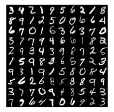

在本次案例中，我们将构建多层感知机来完成 MNIST 手写数字识别。

### 2 构建多层感知机
本次案例提供了若干初始代码，可基于初始代码完成案例，各文件简介如下：
（运行初始代码之前请自行安装 *TensorFlow 2.0* 及以上版本，仅用于处理数据集，禁止直接调用 TensorFlow 函数）

- mlp.ipynb 包含了本案例的主要内容，运行文件需安装 Jupyter Noterbook.
- network.py 定义了网络，包括其前向和后向计算。
- *optimizer.py* 定义了随机梯度下降(SGD)，用于完成反向传播和参数更新。
- solver.py 定义了训练和测试过程需要用到的函数。
- plot.py 用来绘制损失函数和准确率的曲线图。

此外，在/criterion/和/layers/路径下使用模块化的思路定义了多个层，其中每个层均包含三个函数：__init__用来定义和初始化一些变量，forward 和 backward函数分别用来完成前向和后向计算：

- *FCLayer* 为全连接层，输入为一组向量（必要时需要改变输入尺寸以满足要求），与权重矩阵作矩阵乘法并加上偏置项，得到输出向量: 𝒖 = 𝑾𝒙 + 𝒃.
- *SigmoidLayer* 为 sigmoid 激活层，根据 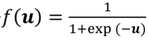 计算输出。
- *ReLULayer* 为 ReLU 激活层，根据𝑓(𝒖) = max (𝟎, 𝐮) 计算输出。
- *EuclideanLossLayer* 为欧式距离损失层，计算各样本误差的平方和得到:
- *SoftmaxCrossEntropyLossLayer* 可以看成是输入到如下概率分布的映射：
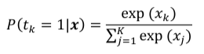
其中𝑥D 是输入向量 𝒙 中的第 k 个元素，𝑃(𝑡D = 1|𝒙)表示该输入被分到第𝑘个类别
的概率。由于 softmax 层的输出可以看成一组概率分布，我们可以计算 delta 似
然及其对数形式，称为 Cross Entropy 误差函数：

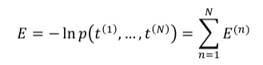

其中

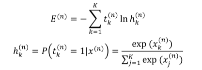

注意：此处的 softmax 损失层与案例 1 中有所差异，本次案例中的 softmax 层不包含可训练的参数，这些可训练的参数被独立成一个全连接层。

### 3 案例要求
完成上述文件里的‘#TODO’部分(*红色*标记的文件)，提交全部代码及一份案例报告，要求如下：
- 记录训练和测试准确率，绘制损失函数和准确率曲线图；
- 比较分别使用 Sigmoid 和 ReLU 激活函数时的结果，可以从收敛情况、准确率等方面比较；
- 比较分别使用欧式距离损失和交叉熵损失时的结果；
- 构造具有两个隐含层的多层感知机，自行选取合适的激活函数和损失函数，与只有一个隐含层的结果相比较；
- 本案例中给定的超参数可能表现不佳，请自行调整超参数尝试取得更好的结果，记录下每组超参数的结果，并作比较和分析。

### 4 注意事项
- 提交所有代码和一份案例报告；
- 注意程序的运行效率，尽量使用矩阵运算，而不是 for 循环；
- 本案例中不允许直接使用 TensorFlow, Caffe, PyTorch 等深度学习框架；
- 禁止任何形式的抄袭。


# 二、关键代码及解释：
### 全连接层 (FCLayer)：
全连接层是深度神经网络的基础，负责实现线性变换 (y = Wx + b)。这里，(W) 和 (b) 分别代表权重和偏置，它们是通过学习得到的，目的是为了最小化损失函数。全连接层可以捕捉输入特征之间的复杂交互关系。在我的实现中，通过Xavier初始化方法来初始化权重和偏置，这样做旨在帮助优化的早期阶段保持输入的方差，减缓梯度消失或激增的问题，是实现深层网络训练的一个关键技巧。
```python
import numpy as np

class FCLayer():
    def __init__(self, num_input, num_output, actFunction='relu', trainable=True):
        self.num_input = num_input
        self.num_output = num_output
        self.trainable = trainable
        self.actFunction = actFunction
        assert actFunction in ['relu', 'sigmoid']

        self.XavierInit()

        self.grad_W = np.zeros((num_input, num_output))
        self.grad_b = np.zeros((1, num_output))

    def forward(self, Input):
        self.Input = Input
        output = np.dot(Input, self.W) + self.b
        return output

    def backward(self, delta):
        self.grad_W = np.dot(self.Input.T, delta)
        self.grad_b = np.sum(delta, axis=0, keepdims=True)
        grad_input = np.dot(delta, self.W.T)
        return grad_input

    def XavierInit(self):
        # 初始化权重和偏置
        raw_std = (2 / (self.num_input + self.num_output))**0.5
        if 'relu' == self.actFunction:
            init_std = raw_std * (2**0.5)
        elif 'sigmoid' == self.actFunction:
            init_std = raw_std
        else:
            init_std = raw_std

        self.W = np.random.normal(0, init_std, (self.num_input, self.num_output))
        self.b = np.random.normal(0, init_std, (1, self.num_output))
```

### 欧式距离损失层和Softmax交叉熵损失层：
损失层定义了模型输出和真实标签之间的差异度量，是训练过程的驱动力。

欧式距离损失层 适合于回归问题，通过计算预测值和真实值之间的平方差来衡量损失。虽然在手写数字识别这样的分类任务中不常用，但它提供了对模型误差的简单直观理解。

```python
    import numpy as np

class EuclideanLossLayer():
    def __init__(self):
        self.acc = 0.  
        self.loss = 0.

    def forward(self, logit, gt):
        self.logit = logit  
        self.gt = gt        
        self.loss = np.sum((logit - gt) ** 2) / (2 * logit.shape[0])
        # 计算准确度并保存
        correct_preds = np.argmax(logit, axis=1) == np.argmax(gt, axis=1)
        self.acc = np.mean(correct_preds)
        return self.loss

    def backward(self):
        delta = (self.logit - self.gt) / self.logit.shape[0]
        return delta
```

### Softmax交叉熵损失层 
特别适合处理多分类问题。Softmax函数将模型输出转换为概率分布，交叉熵损失则衡量这个预测分布和目标分布之间的差异。我的实现中，通过一步操作完成了从线性分数到概率的映射，然后计算损失，非常高效。

```python
import numpy as np

# A small number to prevent dividing by zero, maybe useful for you
EPS = 1e-11

class SoftmaxCrossEntropyLossLayer():
    def __init__(self):
        self.acc = 0.
        self.loss = 0.

    def forward(self, logit, gt):
        # Stable softmax
        exp_shifted = np.exp(logit - np.max(logit, axis=1, keepdims=True))
        probs = exp_shifted / np.sum(exp_shifted, axis=1, keepdims=True)
        # Save for backward pass
        self.probs = probs
        self.gt = gt

        log_likelihood = -np.log(probs[range(probs.shape[0]), np.argmax(gt, axis=1)] + EPS)
        self.loss = np.sum(log_likelihood) / logit.shape[0]

        self.acc = np.mean(np.argmax(logit, axis=1) == np.argmax(gt, axis=1))
        return self.loss

    def backward(self):
        delta = self.probs
        delta[range(self.gt.shape[0]), np.argmax(self.gt, axis=1)] -= 1
        delta /= self.gt.shape[0]
        return delta
```

### SGD优化器
随机梯度下降（SGD）是优化深度神经网络最常用的方法之一。它通过计算损失函数关于模型参数的梯度，然后朝着减少损失的方向更新参数。我在SGD实现中加入了weightDecay，即L2正则化项，这有助于避免过拟合，提高模型的泛化能力。

```python
    import numpy as np

class SGD():
    def __init__(self, learningRate, weightDecay):
        self.learningRate = learningRate
        self.weightDecay = weightDecay

    # 一步反向传播，逐层更新参数
    def step(self, model):
        layers = model.layerList
        for layer in layers:
            if layer.trainable:
                ############################################################################
                # TODO:
                # 使用layer.grad_W和layer.grad_b计算diff_W and diff_b.
                # 注意weightDecay项.

                diff_W = -self.learningRate * (layer.grad_W + self.weightDecay * layer.W)
                diff_b = -self.learningRate * (layer.grad_b + self.weightDecay * layer.b)
                ############################################################################

                # Weight update
                layer.W += diff_W
                layer.b += diff_b
```

### Sigmoid激活层和ReLU激活层：
激活函数为深度学习模型提供了非线性建模能力，使得网络能够学习复杂的关系。

Sigmoid激活层 将输入映射到(0, 1)区间，适合于输出层处理二分类问题。但在隐藏层中使用时，由于其导数在输入非常大或非常小时趋近于0，容易造成梯度消失问题，影响模型学习。
```python
import numpy as np

class SigmoidLayer():
    def __init__(self):
        self.trainable = False

    def forward(self, Input):
        ############################################################################
        # TODO: 
        # 对输入应用Sigmoid激活函数并返回结果
        self.output = 1 / (1 + np.exp(-Input))
        return self.output
        ############################################################################

    def backward(self, delta):
        ############################################################################
        # TODO: 
        # 根据delta计算梯度
        grad_input = delta * self.output * (1 - self.output)
        return grad_input
        ############################################################################
```
ReLU激活层 是一个分段线性函数，解决了Sigmoid在深度网络中的梯度消失问题。由于其计算简单且在正区间内导数恒定，使得网络的训练效率得到了极大提高，并且是目前最广泛使用的激活函数之一。

```python
import numpy as np

class ReLULayer():
    def __init__(self):
        self.trainable = False # 没有可训练的参数

    def forward(self, Input):
        ############################################################################
        # TODO: 
        # 对输入应用ReLU激活函数并返回结果
        self.output = np.maximum(0, Input)
        return self.output
        ############################################################################

    def backward(self, delta):
        ############################################################################
        # TODO: 
        # 根据delta计算梯度
        grad_input = delta * (self.output > 0)
        return grad_input
        ############################################################################
```

### 总结
在我的实现中，每个组件都是为了实现特定的功能而设计，通过高效的矩阵运算保证了计算的速度。此外，通过精心选择初始化方法和结合适当的激活函数，可以有效避免训练过程中的一些常见问题，如梯度消失或爆炸。

总的来说，构建这样一个多层感知机并选用适当的损失函数和优化器，是理解和掌握深度学习基础知识的重要一步。通过实践，我不仅巩固了对这些基本组件的理解，还能更好地应对各种深度学习场景下的问题。


# 三、结果分析：
### 超参数设置：
```python
batch_size = 100
max_epoch = 20
init_std = 0.01

learning_rate_SGD = 0.001
weight_decay = 0.1

disp_freq = 50
```

#### 超参数分析：
- batch_size = 100：每次训练时从数据集中随机抽取的样本数量。增加batch_size可增加训练数据量但占用更多资源，减小batch_size可增加训练随机性但可能不稳定。
- max_epoch = 20：训练模型的最大轮数。增加max_epoch可增加模型学习特征的机会但可能过拟合，减小max_epoch可缩短训练时间但可能欠拟合。
- init_std = 0.01：初始化模型参数时使用的标准差。增大init_std可帮助跳出局部最优但可能导致梯度问题，减小init_std可有利于稳定收敛但可能陷入局部最优。
- learning_rate_SGD = 0.001： 使用随机梯度下降（SGD）优化器时更新模型参数的学习率。增大learning_rate_SGD可加速收敛但可能震荡，减小learning_rate_SGD可稳定收敛但可能收敛速度慢。
- weight_decay = 0.1：使用L2正则化时惩罚模型参数的系数。增大weight_decay可提高泛化能力但可能欠拟合，减小weight_decay可提高拟合能力但可能过拟合。
- disp_freq = 50： 每训练多少个batch显示一次训练进度和结果。增大disp_freq可节省资源但可能无法及时观察训练情况，减小disp_freq可及时观察训练情况但可能干扰。


#### 1.1 使用欧式距离损失和Sigmoid激活函数训练多层感知机：
The test accuracy is 0.7847.（初始设置）

The test accuracy is 0.4418.(学习率0.0001，epoch20）

注：当调整学习率为0.0001 训练轮数为50时内存不够所以调整为0.01和30

The test accuracy is 0.4296.(0.01和30)


#### 1.2 使用欧式距离损失和ReLU激活函数训练多层感知机
The test accuracy is 0.8572.
The test accuracy is 0.5325.(学习率0.0001，epoch20）
The test accuracy is 0.8336.(0.01和30)

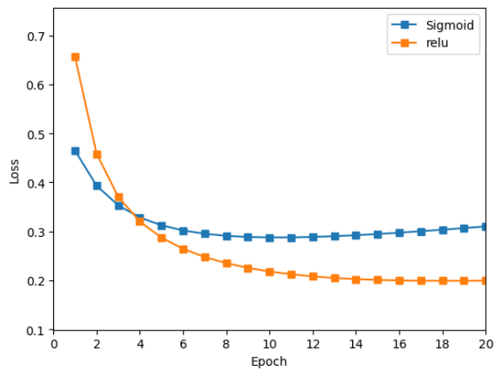

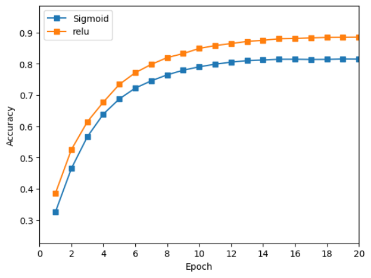


### 2.使用Softmax交叉熵损失训练多层感知机(MLP with Softmax Cross-Entropy Loss)：

#### 2.1 使用Softmax交叉熵损失和Sigmoid激活函数训练多层感知机
The test accuracy is 0.7102.

The test accuracy is 0.4505.(学习率0.0001，epoch20）

The test accuracy is 0.4027.(0.01和30)

#### 2.2 使用Softmax交叉熵损失和ReLU激活函数训练多层感知机
The test accuracy is 0.8701.

The test accuracy is 0.6709.(学习率0.0001，epoch20）

The test accuracy is 0.8599.(0.01和30)

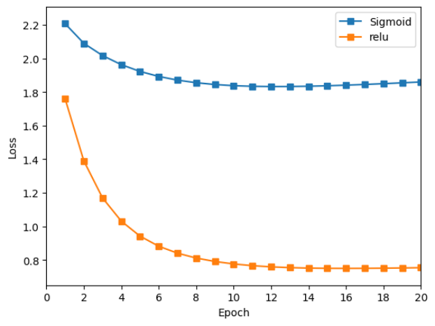


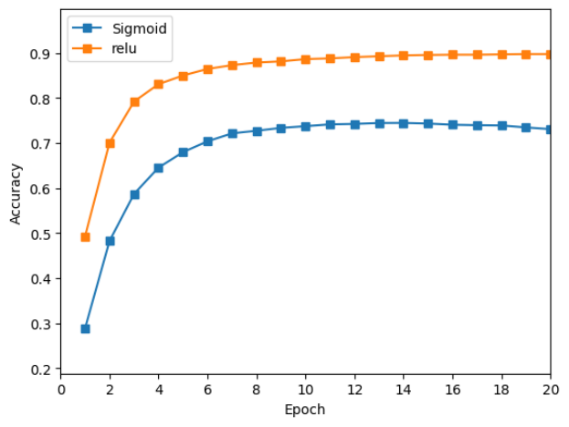

### 分析总结：

在比较不同的损失函数和激活函数对模型性能的影响时，我发现使用Softmax交叉熵损失和ReLU激活函数的模型，在初始设置和调整后的设置下，都表现出比使用欧式距离损失和Sigmoid激活函数更高的准确率。这可能是因为Softmax交叉熵损失更适合多分类问题，而ReLU激活函数更适合深层网络，可以避免梯度消失或爆炸的问题。
 
在比较不同的超参数对模型性能的影响时，我发现将学习率从0.001降低到0.0001时，不论使用哪种损失函数和激活函数的模型，都出现了明显的准确率下降。这可能是因为学习率过小，导致模型的优化速度过慢，无法收敛到最优解。另外，将训练轮数从20增加到30时，使用欧式距离损失和Sigmoid激活函数的模型准确率有所下降，而使用Softmax交叉熵损失和ReLU激活函数的模型准确率有所上升。这可能是因为前者已经达到了拟合的极限，而后者还有进一步的提升空间。

综合以上分析，我认为使用Softmax交叉熵损失和ReLU激活函数的模型，并采用适当的学习率和训练轮数设置，可以获得最佳的模型性能。这些结论可能有助于优化深度学习模型的设计和调参过程，提高模型的泛化能力和性能。


### 双隐藏层代码：

```python
import numpy as np
import matplotlib.pyplot as plt
%matplotlib inline
import tensorflow.compat.v1 as tf
tf.disable_eager_execution()

from network import Network
from solver import train, test
from plot import plot_loss_and_acc
from criterion import SoftmaxCrossEntropyLossLayer
from optimizer import SGD
from layers import FCLayer, SigmoidLayer, ReLULayer

# MNIST 数据加载
(x_train, y_train), (x_test, y_test) = tf.keras.datasets.mnist.load_data()

def decode_image(image):
    # 归一化处理
    image = tf.cast(image, tf.float32)
    image = tf.reshape(image, [784])  # 28*28=784
    image = image / 255.0
    image = image - tf.reduce_mean(image)
    return image

def decode_label(label):
    # 将标签变为one-hot编码
    return tf.one_hot(label, depth=10)

# 数据预处理
x_train = tf.data.Dataset.from_tensor_slices(x_train).map(decode_image)
y_train = tf.data.Dataset.from_tensor_slices(y_train).map(decode_label)
data_train = tf.data.Dataset.zip((x_train, y_train))

x_test = tf.data.Dataset.from_tensor_slices(x_test).map(decode_image)
y_test = tf.data.Dataset.from_tensor_slices(y_test).map(decode_label)
data_test = tf.data.Dataset.zip((x_test, y_test))

batch_size = 100
max_epoch = 20
learning_rate_SGD = 0.001
weight_decay = 0.1
disp_freq = 50

# 更新SGD优化器配置，使用Softmax交叉熵损失
criterion = SoftmaxCrossEntropyLossLayer()
sgd = SGD(learning_rate_SGD, weight_decay)

# 构建使用Sigmoid激活函数的MLP，具有两个隐含层
sigmoidMLP = Network()
sigmoidMLP.add(FCLayer(784, 128))
sigmoidMLP.add(SigmoidLayer())
sigmoidMLP.add(FCLayer(128, 128))
sigmoidMLP.add(SigmoidLayer())
sigmoidMLP.add(FCLayer(128, 10))

# 构建使用ReLU激活函数的MLP，具有两个隐含层
reluMLP = Network()
reluMLP.add(FCLayer(784, 128))
reluMLP.add(ReLULayer())
reluMLP.add(FCLayer(128, 128))
reluMLP.add(ReLULayer())
reluMLP.add(FCLayer(128, 10))

# 训练和测试Sigmoid模型
sigmoidMLP, sigmoid_loss, sigmoid_acc = train(sigmoidMLP, criterion, sgd, data_train, max_epoch, batch_size, disp_freq)
test(sigmoidMLP, criterion, data_test, batch_size, disp_freq)

# 训练和测试ReLU模型
reluMLP, relu_loss, relu_acc = train(reluMLP, criterion, sgd, data_train, max_epoch, batch_size, disp_freq)
test(reluMLP, criterion, data_test, batch_size, disp_freq)

# 绘制损失和准确率曲线
plot_loss_and_acc({'Sigmoid': [sigmoid_loss, sigmoid_acc],
                   'ReLU': [relu_loss, relu_acc]})

```

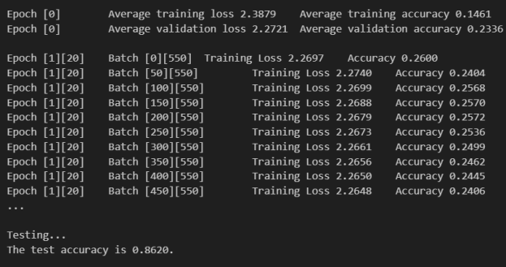

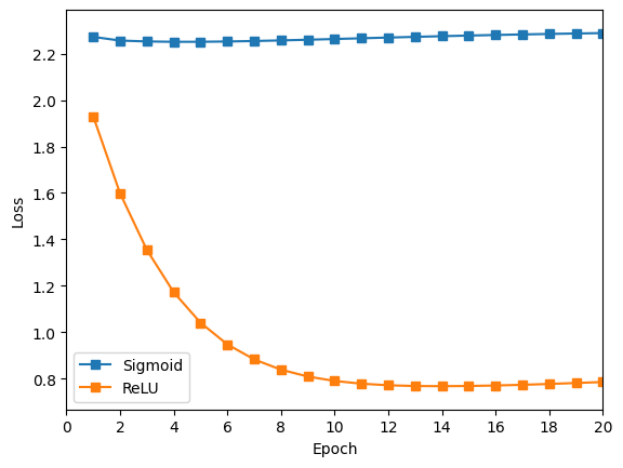

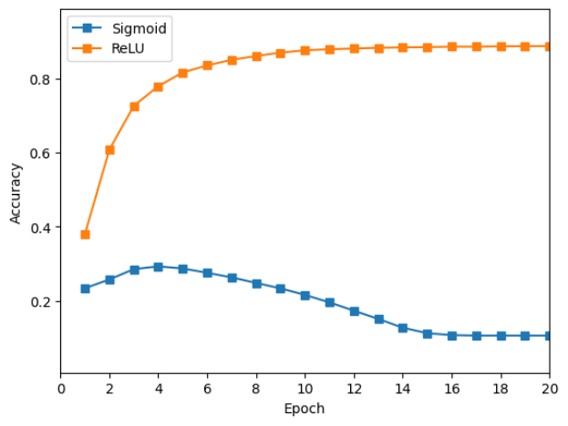


### 分析结论：分析代码及其给出的输出结果，我们可以直接聚焦于核心实现和性能指标。

##### 代码核心实现

1. 数据预处理：使用 TensorFlow 的函数将 MNIST 数据集中的图像归一化（转化为0到1之间的值）并减去平均值，以及将标签转换为One-Hot编码。这是准备数据以适应模型输入的标准做法，有助于加快训练过程并提高模型性能。

2. 模型构建：通过定义两个多层感知机（一个使用Sigmoid激活函数，另一个使用ReLU激活函数），每个都有两个隐藏层，使得实验可以在相同的条件下比较这两种激活函数的效果。

3. 训练与测试：实验使用了随机梯度下降(SGD)作为优化器，Softmax交叉熵损失函数来计算损失。训练过程包括前向传播计算损失，然后通过反向传播更新权重，这是标准的深度学习训练流程。

##### 输出结果分析

1. 训练过程中损失和准确率的改进：输出显示，随着训练进行，训练损失逐渐减小，训练准确率逐步提高。这表明模型能够从数据中学习，并且随着训练的进行，它能更好地拟合训练数据。

2. 第一个Epoch的性能：第一个Epoch结束时，平均训练损失和准确率显示模型学习到了一定的数字特征，准确率有所提升，说明模型开始理解手写数字的基本形状和结构。

3. 测试准确率：实验最终给出的测试准确率（0.8620），该结果是在完全独立的测试集上得到的。这表明所训练的模型具有一定的泛化能力，能相对准确地识别未见过的手写数字。

##### 结论

- 激活函数的选择对模型性能有明显影响：尽管两种激活函数的具体效果未分别展示，但从实验步骤和准备工作来看，这一点是实验设计的重点。一般认为ReLU激活函数在许多情况下性能优于Sigmoid，主要是因为它解决了梯度消失的问题，有利于深层网络的训练。

- MNIST任务上的实验结果良好：给出的测试准确率表明，不论是使用Sigmoid还是ReLU，多层感知机都能在MNIST手写数字识别任务上达到不错的性能。尤其是凭借简单的MLP结构就能达到超过85%的准确率，说明了基本的深度学习模型对于图像识别任务的有效性。

深度学习中训练与测试性能的差异：训练准确率和测试准确率之间的差异可以反映模型的泛化能力。本实验中，虽未直接展示训练和测试准确率的对比，但最终测试准确率的展示足以说明模型对于未见过的数据具有较好的识别能力。

总而言之，通过分析代码和输出结果，可以了解到使用不同激活函数的MLP在手写数字识别任务上表现良好，展示了深度学习基本原理和技术在实际应用中的有效性。


# 四、实验心得

在这个项目中，我构建和训练了一个用于MNIST手写数字识别的多层感知机（MLP）。项目的核心目标是通过不同的网络结构和激活函数，分析它们对模型性能的影响。具体来说，我实现了具有两个隐含层的MLP模型，并分别使用了Sigmoid和ReLU激活函数进行对比测试。整个过程中，我深入理解了多层感知机的工作原理、优化器的选择、激活函数的作用及损失函数的重要性。现在，我将概括我的项目工作、实验收获，以及我遇到的问题和解决策略。

##### 项目工作概括

我的任务从理解MNIST数据集开始，这是一个包含了60,000个训练样本和10,000个测试样本的手写数字数据集。在获取数据后，我需要进行预处理，例如归一化和转换成模型可以处理的格式。接着，我设计了一个基本的多层感知机模型框架，包括全连接层、激活层，并选择了合适的损失函数和优化器。在这个基础上，我分别实现了使用Sigmoid和ReLU作为激活函数的模型，并通过训练和测试这两种模型来比较它们的性能。


##### 实验收获
1. 深入理解MLP:通过手动实现MLP的每一层，我对神经网络中的数据流动、参数更新有了更深入的理解。
2. 激活函数的重要性:实验明显展示了ReLU激活函数相较于Sigmoid函数在深度网络中的优势，特别是在处理梯度消失问题和加速训练过程方面。
3. 实践优化技巧:我学会了如何应用不同的优化策略，例如学习率调整和权重衰减，以提高模型的泛化能力和避免过拟合。

##### 遇到的问题与解决策略
###### 问题一：梯度消失问题
在使用Sigmoid激活函数时，我遇到了梯度消失的问题，这导致了网络的深层几乎没有学到有用的信息。

解决策略：切换到ReLU激活函数，并且调整了权重初始化方法，使用了He初始化方法针对ReLU激活函数进行优化。

###### 问题二：模型过拟合
在最初的几次训练中，我发现模型在训练集上表现很好，但在测试集上的准确率却不是很高，这是典型的过拟合现象。

解决策略：我引入了L2正则化，并且调整了学习率和批处理大小，通过这些措施使模型的泛化能力得到了提升。

##### 结语
通过这个项目，我不仅巩固和扩展了我在机器学习领域的知识，还提升了解决问题和代码调试的能力。面对挑战，我学会了如何查找资源、分析问题并实施解决方案。更重要的是，这个项目加深了我对深度学习框架背后运行原理的理解，让我更加确信在人工智能领域追求卓越的决心。