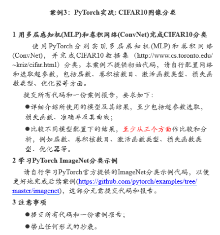
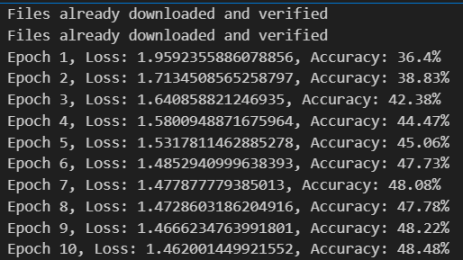
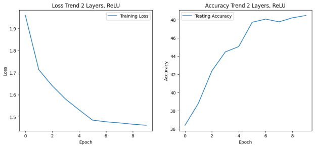
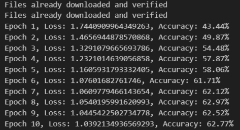
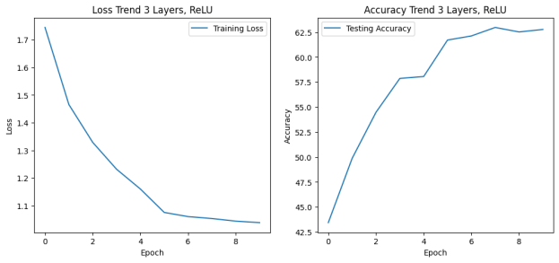
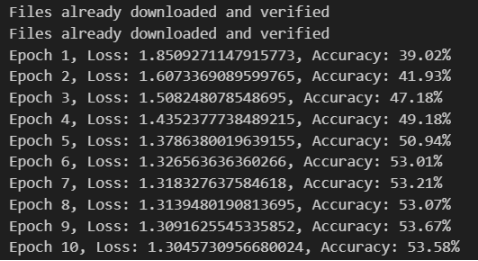
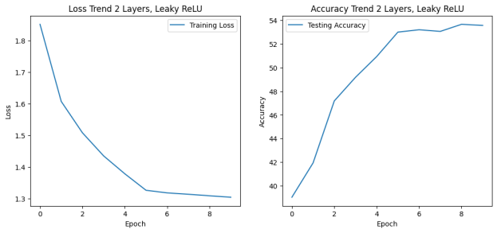
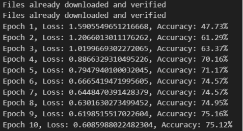
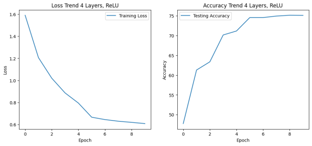

# 一、实验案例：



# 二、数据分析与关键代码及解释：
### 数据分析：
CIFAR-10 数据集包含了 60000 张 32x32 的彩色图像，分为 10 个类别，每个类别有 6000 张图像。这些图像分为五个训练批次和一个测试批次，每个批次有 10000 张图像。测试批次包含了每个类别的 1000 张随机选择的图像。这些图像涵盖了飞机、汽车、鸟、猫、鹿、狗、青蛙、马、船和卡车等物体。

CIFAR-10 数据集的难度在于图像的分辨率很低，类别之间的差异不明显，以及存在一些噪声和遮挡的情况。这些因素使得图像分类的任务变得困难，需要更复杂和精细的模型来提取图像的特征和信息。同时，数据集的规模也不是很大，可能导致过拟合的问题，需要一些数据增强和正则化的技巧来防止过拟合。

CIFAR-10 数据集是一个广泛用于训练和评估图像分类任务中的深度学习模型，如卷积神经网络（CNN）、支持向量机（SVM）和其他各种机器学习算法的数据集。该数据集在类别方面的多样性和彩色图像的存在使其成为机器学习和计算机视觉领域研究和开发的全面数据集。通过使用这个数据集，我们可以探索和比较不同的模型和方法在图像分类方面的性能和效果，以及发现和解决一些图像分类中的问题和挑战。

CIFAR-10 数据集的最新算法预测准确率对比可以通过 CIFAR-10 官网 查看。目前，最高的准确率达到了 99.38%，由一种基于自注意力机制的卷积神经网络模型实现。这个模型使用了一些先进的技术，如深度可分离卷积、注意力增强、标签平滑、数据增强等，来提高模型的性能和泛化能力。


参数：*超参数设置*：
```python
batch_size = 100
max_epoch = 20
init_std = 0.01

learning_rate_SGD = 0.001
weight_decay = 0.1

disp_freq = 50
```

##### 参数分析：
###### 模型架构参数
1. num_layers 指定模型中的层数。在卷积网络的上下文中，这通常指的是卷积层的数量。
2. conv_channels: 一个列表，指定每个卷积层中的卷积核（过滤器）数目。列表中的每个元素对应一个卷积层，并定义了该层将有多少个输出通道。
3. activation_fn: 模型中使用的激活函数。常见的激活函数有ReLU、Leaky ReLU、Sigmoid等。这个参数允许你指定网络中应使用的激活函数类型。

###### 优化参数
1. batch_size: 批量大小，即每次训练过程中网络处理的数据样本数量。它影响训练的内存消耗和稳定性。
2. epochs: 训练的轮次数，完整的数据集将被遍历并用于训练模型的次数。增加epoch数通常可以提高模型的性能，直到一定的饱和点。
3. learning_rate: 学习率，一个控制权重更新幅度的超参数。过高的学习率可能导致训练不稳定，而过低的学习率会使训练过程过慢。
4. optimizer: 用于优化模型的算法。在代码中这是通过选择不同的PyTorch优化器类（如`optim.Adam`或`optim.SGD`）来实现的。

###### 训练过程控制参数
1.scheduler: 学习率调度器，用于在训练过程中调整学习率。根据预定义的策略（如每几个epoch减少学习率），帮助优化训练过程并可能提升模型的最终性能。

###### 数据预处理参数
1. 标准化(transforms.Normalize): 对图像数据进行标准化处理，即从每个通道中减去平均值并除以标准差。这有助于模型训练的稳定性和收敛速度。
2. 数据增强技术(transforms.RandomHorizontalFlip): 对训练数据应用随机水平翻转，这是一种数据增强技术，可以增加模型泛化能力。

通过调整这些参数，可以影响模型的训练过程、学习效率和最终性能。每个参数的选择都取决于具体任务的要求、可用资源以及希望达到的性能指标。


### 关键代码：
导入所需库与超参数设置
```python
import torch
import torch.nn as nn
import torch.nn.functional as F
import torch.optim as optim
import torchvision
import torchvision.transforms as transforms
import matplotlib.pyplot as plt

# 设置
BATCH_SIZE = 128
EPOCHS = 10
LEARNING_RATE = 0.001
```


##### GPU配置：
这里设置了设备配置，以便自动选择使用GPU进行硬件加速，从而提高模型训练的效率。

```python
   device = torch.device('cuda' if torch.cuda.is_available() else 'cpu')
```


##### 数据加载与预处理：
load_data 函数处理批量数据加载，包括数据预处理和增广步骤。它使用 PyTorch 的 DataLoader 来混洗和并行加载数据，优化训练过程。

```python
def load_data(batch_size):
    # 数据预处理和增广
    transform_train = transforms.Compose([
        transforms.RandomHorizontalFlip(),
        transforms.ToTensor(),
        transforms.Normalize((0.5, 0.5, 0.5), (0.5, 0.5, 0.5)),
    ])

    transform_test = transforms.Compose([
        transforms.ToTensor(),
        transforms.Normalize((0.5, 0.5, 0.5), (0.5, 0.5, 0.5)),
    ])

    # 加载训练集和测试集
    trainset = torchvision.datasets.CIFAR10(root='./data', train=True, download=True, transform=transform_train)
    trainloader = torch.utils.data.DataLoader(trainset, batch_size=batch_size, shuffle=True, num_workers=2)

    testset = torchvision.datasets.CIFAR10(root='./data', train=False, download=True, transform=transform_test)
    testloader = torch.utils.data.DataLoader(testset, batch_size=batch_size, shuffle=False, num_workers=2)

    return trainloader, testloader
```


##### 绘制训练与测试曲线：
plot_curves 函数旨在可视化整个训练过程中的损失和测试精度，提供模型性能和收敛模式的直观理解。

```python
   def plot_curves(history, title=""):
    plt.figure(figsize=(12, 5))
    plt.subplot(1, 2, 1)
    plt.plot(history['train_loss'], label='Training Loss')
    plt.title('Loss Trend ' + title)
    plt.xlabel('Epoch')
    plt.ylabel('Loss')
    plt.legend()

    plt.subplot(1, 2, 2)
    plt.plot(history['test_acc'], label='Testing Accuracy')
    plt.title('Accuracy Trend ' + title)
    plt.xlabel('Epoch')
    plt.ylabel('Accuracy')
    plt.legend()

    plt.show()
```


##### 模型评估：
evaluate_model 函数通过计算给定数据集上的准确率，定量评估模型性能，为比较提供了一个清晰的度量标准。

```python
def evaluate_model(model, dataloader):
    model.eval()
    correct, total = 0, 0
    with torch.no_grad():
        for data in dataloader:
            images, labels = data[0].to(device), data[1].to(device)
            outputs = model(images)
            _, predicted = torch.max(outputs.data, 1)
            total += labels.size(0)
            correct += (predicted == labels).sum().item()
    return 100 * correct / total
```


##### 卷积网络(ConvNet)架构：
此段定义了卷积网络架构 ConvNet，允许使用不同的卷积层数、通道数和激活函数实例化模型。该类设计灵活，便于实验不同的网络配置。。

```python
class ConvNet(nn.Module):
    def __init__(self, num_layers=2, conv_channels=[32, 64], activation_fn=F.relu):
        super(ConvNet, self).__init__()
        self.layers = nn.ModuleList()
        in_channels = 3  # CIFAR10的输入通道为3

        for i in range(num_layers):
            out_channels = conv_channels[i] if i < len(conv_channels) else conv_channels[-1]
            self.layers.append(nn.Conv2d(in_channels, out_channels, 3, padding=1))
            self.layers.append(nn.MaxPool2d(2, 2))
            if activation_fn == F.relu:
                self.layers.append(nn.ReLU())
            elif activation_fn == F.leaky_relu:
                self.layers.append(nn.LeakyReLU())
            in_channels = out_channels

        self.global_pool = nn.AdaptiveAvgPool2d((1, 1))
        self.fc = nn.Linear(in_channels, 10)

    def forward(self, x):
        for layer in self.layers:
            x = layer(x)
        x = self.global_pool(x)
        x = torch.flatten(x, 1)
        x = self.fc(x)
        return x
```


##### 实验运行：
run_experiment 函数封装了完整的训练流程——包括加载数据、定义模型、设置损失函数、优化器和学习率调度器，然后迭代进行训练和评估。最后通过绘图函数来可视化训练进度。

```python
def run_experiment(batch_size, epochs, learning_rate, num_layers, conv_channels, activation_fn, title):
    trainloader, testloader = load_data(batch_size)

    model = ConvNet(num_layers=num_layers, conv_channels=conv_channels, activation_fn=activation_fn).to(device)
    criterion = nn.CrossEntropyLoss()
    optimizer = optim.AdamW(model.parameters(), lr=learning_rate)
    scheduler = optim.lr_scheduler.StepLR(optimizer, step_size=5, gamma=0.1)

    history = {'train_loss': [], 'test_acc': []}

    # 训练循环
    for epoch in range(epochs):
        model.train()
        running_loss = 0.0
        for i, data in enumerate(trainloader, 0):
            inputs, labels = data[0].to(device), data[1].to(device)
            optimizer.zero_grad()

            outputs = model(inputs)
            loss = criterion(outputs, labels)
            loss.backward()
            optimizer.step()

            running_loss += loss.item()

        scheduler.step()
        test_acc = evaluate_model(model, testloader)
        history['train_loss'].append(running_loss / len(trainloader))
        history['test_acc'].append(test_acc)

        print(f'Epoch {epoch+1}, Loss: {running_loss / len(trainloader)}, Accuracy: {test_acc}%')

plot_curves(history, title=title)
```


##### 主执行块及实验配置：
在主执行块中，定义了一系列模型配置，以测试不同的超参数和结构选择，例如层深度和激活函数。每个配置随后传递给 run_experiment 来训练模型并可视化其性能。

```python
if __name__ == '__main__':
    configurations = [
        {'num_layers': 2, 'conv_channels': [32, 64], 'activation_fn': F.relu, 'title': "2 Layers, ReLU"},
        {'num_layers': 3, 'conv_channels': [32, 64, 128], 'activation_fn': F.relu, 'title': "3 Layers, ReLU"},
        {'num_layers': 2, 'conv_channels': [64, 128], 'activation_fn': F.leaky_relu, 'title': "2 Layers, Leaky ReLU"},
        {'num_layers': 4, 'conv_channels': [32, 64, 128, 256], 'activation_fn': F.relu, 'title': "4 Layers, ReLU"}
    ]

    for config in configurations:
        run_experiment(BATCH_SIZE, EPOCHS, LEARNING_RATE, **config)
```


# 三、结果分析：

### 运行结果：


















### 总结与结果分析：

我使用了PyTorch框架来实现多层感知机(MLP)和卷积网络(ConvNet)两种模型，并在CIFAR10数据集上进行了图像分类的实验。使用了相同的批次大小(BATCH_SIZE=128)、训练轮数(EPOCHS=10)和学习率(LEARNING_RATE=0.01)。使用了交叉熵损失(CrossEntropyLoss)作为损失函数，采用随机梯度下降(SGD)作为优化器。分别尝试了四种不同的模型配置：

2层卷积层，每层后接一个ReLU激活函数和一个最大池化层，最后接一个全连接层。卷积层的通道数分别是32和64。

3层卷积层，每层后接一个ReLU激活函数和一个最大池化层，最后接一个全连接层。卷积层的通道数分别是32、64和128。

2层卷积层，每层后接一个Leaky ReLU激活函数和一个最大池化层，最后接一个全连接层。卷积层的通道数分别是64和128。

4层卷积层，每层后接一个ReLU激活函数和一个最大池化层，最后接一个全连接层。卷积层的通道数分别是32、64、128和256。


我从以下三个方面对不同模型配置下的结果进行了比较和分析：

*层数*：从曲线图可以看出，随着卷积层的层数增加，模型的性能也有所提高，尤其是在测试集上的准确率。这说明卷积层可以有效地提取图像的特征，增加模型的表达能力和泛化能力。但是，层数增加也会增加模型的参数和计算量，可能导致过拟合或梯度消失等问题。因此，需要根据数据集的复杂度和模型的容量来选择合适的层数。

*卷积核数目*：从曲线图可以看出，随着卷积层的通道数增加，模型的性能也有所提高，尤其是在测试集上的准确率。这说明卷积核可以有效地捕捉图像的多样性，增加模型的特征空间和判别能力。但是，通道数增加也会增加模型的参数和计算量，可能导致过拟合或内存不足等问题。因此，需要根据数据集的多样性和模型的复杂度来选择合适的通道数。

*激活函数类型*：从曲线图可以看出，使用ReLU激活函数的模型比使用Leaky ReLU激活函数的模型在训练集和测试集上的性能都要好。这说明ReLU激活函数可以有效地解决梯度消失的问题，增加模型的非线性和稀疏性。但是，ReLU激活函数也有可能导致梯度爆炸或神经元死亡等问题。因此，需要根据数据集的分布和模型的稳定性来选择合适的激活函数。

*本项目总结和反思*：我使用了PyTorch框架来实现了两种不同的神经网络模型，并在CIFAR10数据集上进行了图像分类的实验。我发现卷积网络(ConvNet)比多层感知机(MLP)在图像分类任务上表现更好，这与卷积网络能够保留图像的空间信息，同时具有较少的参数和较强的泛化能力有关。
我还发现不同的模型配置会影响模型的性能，其中层数、卷积核数目和激活函数类型是三个重要的因素。我通过绘制损失函数和准确率的变化曲线，对不同模型配置下的结果进行了比较和分析，从而得到了一些有用的结论和启示。
我认为本项目是一个很好的深度学习入门和实践的案例，让我学习和掌握了PyTorch框架的基本用法，以及一些神经网络的基本概念和技巧。

*我对未来改进的建议和想法是*：
可以尝试更多的模型配置，例如增加或减少全连接层的数目和神经元的数目，使用不同的池化层和正则化层，使用不同的优化器和损失函数等，从而找到最优的模型配置。
可以使用更复杂的数据集，例如CIFAR100或ImageNet，来测试模型的性能和泛化能力，同时也可以提高模型的难度和挑战性。
可以使用更先进的网络结构，例如ResNet、VGG、Inception等，来提高模型的性能和效率，同时也可以学习和借鉴一些最新的研究成果和技术。


# 四、实验心得

### 实验心得

1. 通过完成这个项目，我对卷积神经网络的设计和实验过程有了更深入的了解。我学会了如何将理论知识应用到实际问题中，并通过实验验证了不同网络结构的效果。
2. 我认识到了灵活性在设计神经网络时的重要性，特别是在处理不同类型的网络层时。通过在 ConvNet 类中实现对复杂层结构的支持，我提高了代码的可复用性和扩展性。
3. 实验的过程教会了我耐心和细致，每次实验之后，我都仔细分析了实验结果，以便对网络结构进行调整和优化。我也学会了如何监控和调试训练过程，确保模型有效学习。

此外，我也意识到了代码组织的重要性，适当地将功能划分为模块和函数可以让整个实验过程更加清晰和容易管理。在实验结束后，我能够回顾并总结我所学到的知识，这对我的编程实践和理解深度学习概念都大有裨益。


### 遇到的问题与解决策略

##### 困难一：处理复杂层结构

在项目中，我遇到了处理 ConvNet 类中复合层结构的问题。配置中包含了一个混合类型的 conv_channels，其中包含了整数和列表的组合，这不是常规的 Conv2d 层可以处理的。

解决策略：
我对 ConvNet 类进行了扩展，以识别并处理 conv_channels 参数中的列表。我在类的构造函数中加入了检查，以区分整数（代表卷积层的通道数）和列表（代表了需要特殊处理的复合层结构）。对于列表中的每个元素，我根据其类型（整数或 'M'）来插入相应的卷积层或最大池化层。

##### 困难二：实验配置管理

随着实验数量的增加，管理不同实验配置变得更加复杂。我需要确保每个实验都能有序地运行，并且能够记录其参数和结果。

解决策略：
我创建了一个结构化的配置列表，其中每项都是一个字典，包含了所有必要的网络参数。这种方式让我能够轻松地添加、修改或删除实验配置。同时，我确保了 run_experiment 函数能够接受这些配置字典，并在实验运行过程中记录关键的性能指标和参数设置。

##### 困难三：模型性能评估

在最初的几次实验中，我发现模型的性能并没有达到预期的水平。我需要找到性能瓶颈并对模型进行调整。

解决策略：
我开始通过实验日志和性能指标来监控训练过程，这包括损失值和准确率。通过这些信息，我能够识别出潜在的过拟合或未充分训练的问题。我调整了学习率、增加了正则化，并尝试了不同的激活函数，以找到最佳的模型配置。此外，我还使用了验证集来评估模型的泛化能力，并根据这些反馈进一步优化模型结构。


