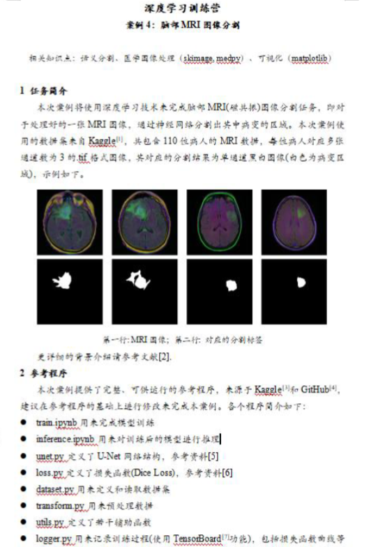
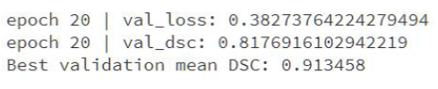
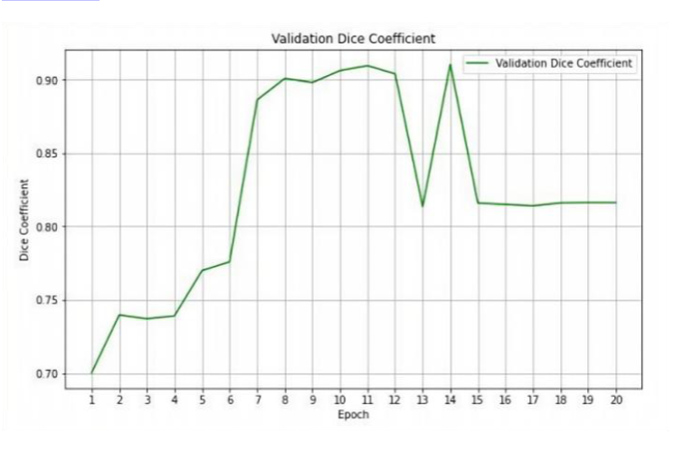
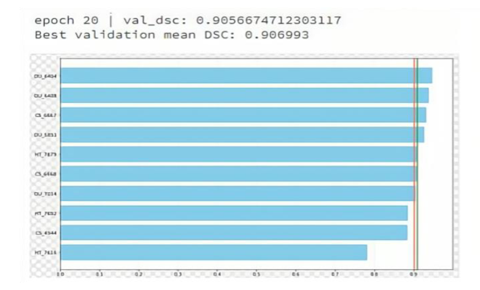
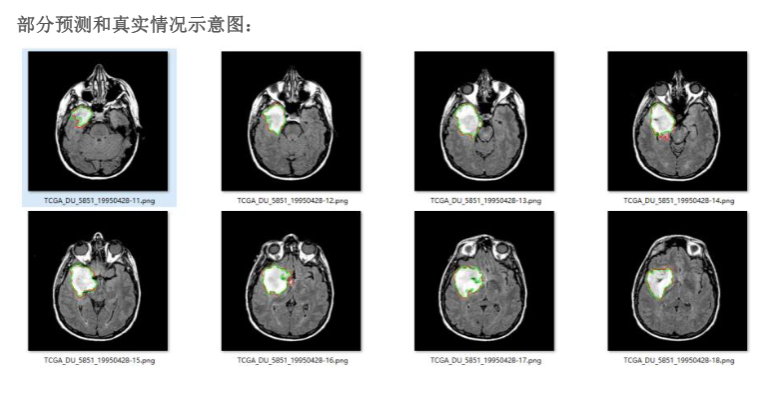
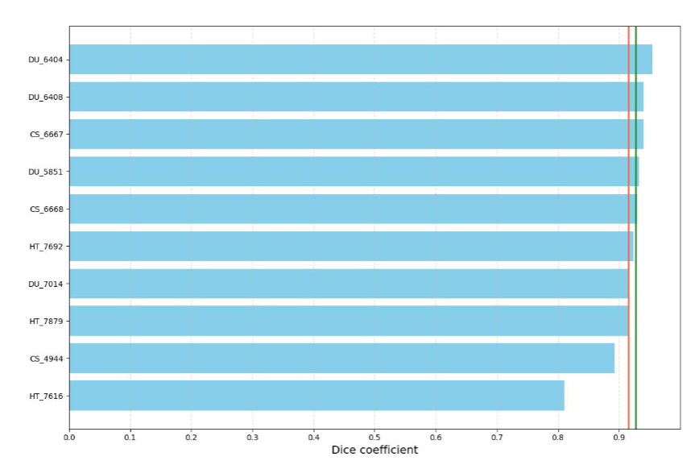

# 一、案例简介：



# 二、任务分析与关键代码及解释：
本次数据来源于：项目案例是关于脑部 MRI 图像分割的任务，即对于处理好的一张 MRI图像，通过神经网络分割出其中病变的区域。数据集来自 Kaggle1，共包含 110 位病人的MRI 数据，每位病人对应多张通道数为 3 的.tif 格式图像，其对应的分割结果为单通道黑白图像(白色为病变区域)。

任务分析：
案例的目标和要求：
目标：使用深度学习技术来完成脑部 MRI 图像分割任务，即对于处理好的一张 MRI图像，通过神经网络分割出其中病变的区域。

要求：在参考程序的基础上，尝试提升该模型在脑部 MRI 图像上的分割效果，以程序最终输出的 validation mean DSC 值作为评价标准。可从网络结构、损失函数、训练过程等角度尝试改进，还可参考通用图像分割的一些技巧。

难点：脑部 MRI 图像分割是一个典型的语义分割任务，即要求对图像中的每个像素进行分类，而不是对整个图像进行分类。这就需要模型具有较强的特征提取和空间定位能力，同时也要保证分割结果的连续性和平滑性。此外，脑部 MRI 图像还存在一些特殊的挑战，如灰度不均匀性、部分容积效应、噪声干扰、数据稀缺等，这些都会影响分割的质量和准确性。

关键点：为了提升脑部 MRI 图像分割的效果，我们需要从以下几个方面进行改进：数据预处理：在输入模型之前，我们需要对原始的 MRI 图像进行一些必要的预处理，如颅骨剥离、灰度校正、数据增强等，以去除无关的背景信息，增强图像的对比度，减少灰度不均匀性的影响，扩充数据集的规模和多样性等。

网络结构：在选择或设计网络结构时，我们需要考虑到脑部 MRI 图像的特点，如高维度、多模态、多类别等，以及语义分割任务的要求，如保留空间信息、融合多尺度特征、生成高分辨率输出等。一种常用的网络结构是 U-Net，它由一个编码器和一个解码器组成，能够有效地提取和重建图像的特征。我们可以在 U-Net 的基础上进行一些改进，如增加残差连接、注意力机制、深度监督等，以提升网络的性能和泛化能力。

损失函数：在定义损失函数时，需要考虑到分割任务的评价指标，如 Dice 系数、Jaccard系数等，它们能够衡量分割结果与真实标签之间的重叠程度，同时也能够解决类别不平衡的问题。我们可以使用这些指标作为损失函数，或者将它们与其他损失函数，如交叉熵、均方误差等，进行加权或组合，以达到更好的分割效果。

训练过程：在训练模型时，我们需要注意一些细节，如选择合适的优化器、学习率、批量大小、迭代次数等，以保证模型的收敛和稳定。此外，我们还可以使用一些技巧，如早停、学习率衰减、模型保存、模型融合等，以提升模型的效率和鲁棒性。

优化思路：
网络结构：除了 U-Net 之外，你可以考虑使用其他的网络结构，如 U-Net++、ResUnet、SegNet 等，或者尝试对 U-Net 本身进行改进，比如引入残差连接或注意力机制。

损失函数：尝试使用其他的损失函数组合来强化训练，如结合 Dice Loss 与 Cross-Entropy Loss，或者尝试新的损失函数，比如 Focal Loss，以更好地处理类别不平衡问题。

数据增强：通过图像的旋转、缩放、翻转等方式增加数据的多样性，这可能有助于提高模型的泛化能力。（参考程序已经设置没有再次进行优化）

训练细节：调整训练过程中的参数，如学习率、批量大小、优化器（比如 AdamW 或 SGD with momentum），或者尝试使用学习率衰减策略。

后处理：在模型推理后应用一些后处理技术，如 CRF（Conditional Random Fields）或其他形态学操作，来改善分割结果的精度。

Net 算法分析：

U-Net 算法是一种用于生物医学图像分割的卷积神经网络，它由弗莱堡大学计算机科
学系的研究人员开发。1 U-Net 算法的特点是它由一个收缩路径和一个扩张路径组成，形成了一个 U 型的结构。收缩路径负责提取输入图像的特征，扩张路径负责根据特征生成分割结果。两个路径之间通过跳跃连接来传递空间信息，以提高分割的精度。U-Net 算法可以在较少的训练图像上达到很好的效果，而且分割速度很快，一张 512×512 的图像在现代GPU 上不到一秒就可以完成。

U-Net 算法的具体结构如下：

收缩路径：它由多个编码层组成，每个编码层包含两个 3×3 的卷积操作（不使用填充），每个卷积操作后跟一个 ReLU 激活函数，然后是一个 2×2 的最大池化操作（步长为 2），用于下采样。每次下采样时，特征通道的数量增加一倍，从 64 开始，最终达到 1024。这样可以捕获输入图像的高层特征，但是也会丢失一些空间信息。

扩张路径：它由多个解码层组成，每个解码层包含一个 2×2 的上采样操作，用于将特征图放大两倍，然后是一个 3×3 的卷积操作，用于减少特征通道的数量，最终达到 64。每个解码层还会接收来自收缩路径对应层的特征图，通过跳跃连接将它们与上采样后的特征图拼接在一起，这样可以保留一些空间信息，帮助定位分割的目标。最后，一个 1×1 的卷积操作将特征图转换为分割结果，每个像素表示一个类别或一个对象。

输出：U-Net 算法的输出是一个与输入图像相同大小的分割图，每个像素表示一个类别或一个对象。如果没有使用填充，那么输出的大小会比输入的大小小一些，因为卷积操作会减少边缘的像素。如果使用了填充，那么输出的大小会与输入的大小一致。


# 三、实验结果与分析
群里同学说训练 20 轮次左右 MEAN DSC 已经趋于稳定到 0.9，所以自己尝试了epoch=15 和 epoch=20 差别不是很大20 轮运算结果如下：




### 网络结构优化代码

在 U-Net 中引入注意力机制代码如下：

```python
from collections import OrderedDict

import torch
import torch.nn as nn

class AttentionGate(nn.Module):
    def __init__(self, F_g, F_l, F_int):
        super(AttentionGate, self).__init__()

        self.W_g = nn.Sequential(
            nn.Conv2d(F_g, F_int, kernel_size=1, stride=1, padding=0, bias=True),
            nn.BatchNorm2d(F_int)
        )

        self.W_x = nn.Sequential(
            nn.Conv2d(F_l, F_int, kernel_size=1, stride=1, padding=0, bias=True),
            nn.BatchNorm2d(F_int)
        )

        self.psi = nn.Sequential(
            nn.Conv2d(F_int, 1, kernel_size=1, stride=1, padding=0, bias=True),
            nn.BatchNorm2d(1),
            nn.Sigmoid()
        )

        self.relu = nn.ReLU(inplace=True)

    def forward(self, g, x):
        g1 = self.W_g(g)
        x1 = self.W_x(x)
        psi = self.relu(g1 + x1)
        psi = self.psi(psi)
        return x * psi


# 在 UNet 中添加注意力机制
class UNet(nn.Module):
    def __init__(self, in_channels=3, out_channels=1, init_features=32):
        super(UNet, self).__init__()
        features = init_features
        self.encoder1 = UNet._block(in_channels, features, name="enc1")
        self.pool1 = nn.MaxPool2d(kernel_size=2, stride=2)
        self.encoder2 = UNet._block(features, features * 2, name="enc2")
        self.pool2 = nn.MaxPool2d(kernel_size=2, stride=2)
        self.encoder3 = UNet._block(features * 2, features * 4, name="enc3")
        self.pool3 = nn.MaxPool2d(kernel_size=2, stride=2)
        self.encoder4 = UNet._block(features * 4, features * 8, name="enc4")
        self.pool4 = nn.MaxPool2d(kernel_size=2, stride=2)

        self.bottleneck = UNet._block(features * 8, features * 16, name="bottleneck")

        self.attention4 = AttentionGate(F_g=features * 16, F_l=features * 8, F_int=features * 8)
        self.upconv4 = nn.ConvTranspose2d(
            features * 16, features * 8, kernel_size=2, stride=2
        )
        self.decoder4 = UNet._block((features * 8) * 2, features * 8, name="dec4")
        self.attention3 = AttentionGate(F_g=features * 8, F_l=features * 4, F_int=features * 4)
        self.upconv3 = nn.ConvTranspose2d(
            features * 8, features * 4, kernel_size=2, stride=2
        )
        self.decoder3 = UNet._block((features * 4) * 2, features * 4, name="dec3")
        self.attention2 = AttentionGate(F_g=features * 4, F_l=features * 2, F_int=features * 2)
        self.upconv2 = nn.ConvTranspose2d(
            features * 4, features * 2, kernel_size=2, stride=2
        )
        self.decoder2 = UNet._block((features * 2) * 2, features * 2, name="dec2")
        self.attention1 = AttentionGate(F_g=features * 2, F_l=features, F_int=features)
        self.upconv1 = nn.ConvTranspose2d(
            features * 2, features, kernel_size=2, stride=2
        )
        self.decoder1 = UNet._block(features * 2, features, name="dec1")

        self.conv = nn.Conv2d(
            in_channels=features, out_channels=out_channels, kernel_size=1
        )


    def forward(self, x):
        enc1 = self.encoder1(x)
        enc2 = self.encoder2(self.pool1(enc1))
        enc3 = self.encoder3(self.pool2(enc2))
        enc4 = self.encoder4(self.pool3(enc3))
        bottleneck = self.bottleneck(self.pool4(enc4))
        dec4 = self.upconv4(bottleneck)
        dec4 = torch.cat((dec4, self.attention4(g=dec4, x=enc4)), dim=1)
        dec4 = self.decoder4(dec4)
        dec3 = self.upconv3(dec4)
        dec3 = torch.cat((dec3, self.attention3(g=dec3, x=enc3)), dim=1)
        dec3 = self.decoder3(dec3)
        dec2 = self.upconv2(dec3)
        dec2 = torch.cat((dec2, self.attention2(g=dec2, x=enc2)), dim=1)
        dec2 = self.decoder2(dec2)
        dec1 = self.upconv1(dec2)
        dec1 = torch.cat((dec1, self.attention1(g=dec1, x=enc1)), dim=1)
        dec1 = self.decoder1(dec1)
        return torch.sigmoid(self.conv(dec1))

```


### 输出结果：






### 结果分析：
引入注意力机制后从图中看到性能的提升（同样训练轮数设置为 20 轮次）在训练到第十五轮周期时 DSC 值就达到 91% ，并且在分割结果来看明显比原始结果更好。

算法对比分析：

在医学图像分割任务中，引入注意力机制可以带来以下几点好处：
1. 更好的特征选择
2. 更好的细节
3. 捕捉更好的解释性

对比传统的 UNet 算法，虽然 UNet 算法已经在医学图像分割任务中取得了很好的效果，但是它并没有显式地选择和关注重要的特征，也没有提供一种理解模型决策过程的方式。此外，UNet 算法在捕捉细节信息方面也可能不如引入了注意力机制的模型。

总的来说，引入注意力机制的 UNet 模型在特征选择、细节捕捉和模型解释性方面都可能优于传统的 UNet 模型，从而在医学图像分割任务中取得更好的效果。

### Unet++：
自己参考官方文档和相关资料采用 U-net++ 优化网络自己编写了一下代码但是由于时间和算力问题没有跑完得出最终结果（实在抱歉）

代码如下：


```python
from collections import OrderedDict

import torch
import torch.nn as nn
import torch.nn.functional as F

class UNetPlusPlus(nn.Module):
    def __init__(self, in_channels=3, out_channels=1, init_features=32):
        super(UNetPlusPlus, self).__init__()
        features = init_features
        self.encoder1 = UNetPlusPlus._block(in_channels, features, name="enc1")
        self.pool1 = nn.MaxPool2d(kernel_size=2, stride=2)
        self.encoder2 = UNetPlusPlus._block(features, features * 2, name="enc2")
        self.pool2 = nn.MaxPool2d(kernel_size=2, stride=2)
        self.encoder3 = UNetPlusPlus._block(features * 2, features * 4, name="enc3")
        self.pool3 = nn.MaxPool2d(kernel_size=2, stride=2)
        self.encoder4 = UNetPlusPlus._block(features * 4, features * 8, name="enc4")
        self.pool4 = nn.MaxPool2d(kernel_size=2, stride=2)
        
        self.bottleneck = UNetPlusPlus._block(features * 8, features * 16, name="bottleneck")

        # Nested skip pathways and deep supervision
        self.conv_x00 = self.encoder1
        self.conv_x10 = self.encoder2
        self.conv_x20 = self.encoder3
        self.conv_x30 = self.encoder4
        self.conv_x40 = self.bottleneck

        self.up_x10 = nn.ConvTranspose2d(features * 2, features, kernel_size=2, stride=2)
        self.conv_x01 = UNetPlusPlus._block(features * 2, features, name="conv_x01")

        self.up_x20 = nn.ConvTranspose2d(features * 4, features * 2, kernel_size=2, stride=2)
        self.conv_x11 = UNetPlusPlus._block(features * 4, features * 2, name="conv_x11")

        self.up_x21 = nn.ConvTranspose2d(features * 4, features, kernel_size=2, stride=2)
        self.conv_x02 = UNetPlusPlus._block(features * 3, features, name="conv_x02")

        self.up_x30 = nn.ConvTranspose2d(features * 8, features * 4, kernel_size=2, stride=2)
        self.conv_x21 = UNetPlusPlus._block(features * 8, features * 4, name="conv_x21")
        self.up_x31 = nn.ConvTranspose2d(features * 8, features * 2, kernel_size=2, stride=2)
        self.conv_x12 = UNetPlusPlus._block(features * 6, features * 2, name="conv_x12")
        self.up_x32 = nn.ConvTranspose2d(features * 8, features, kernel_size=2, stride=2)
        self.conv_x03 = UNetPlusPlus._block(features * 4, features, name="conv_x03")

        self.up_x40 = nn.ConvTranspose2d(features * 16, features * 8, kernel_size=2, stride=2)
        self.conv_x31 = UNetPlusPlus._block(features * 16, features * 8, name="conv_x31")
        self.up_x41 = nn.ConvTranspose2d(features * 16, features * 4, kernel_size=2, stride=2)
        self.conv_x22 = UNetPlusPlus._block(features * 12, features * 4, name="conv_x22")
        self.up_x42 = nn.ConvTranspose2d(features * 16, features * 2, kernel_size=2, stride=2)
        self.conv_x13 = UNetPlusPlus._block(features * 10, features * 2, name="conv_x13")
        self.up_x43 = nn.ConvTranspose2d(features * 16, features, kernel_size=2, stride=2)
        self.conv_x04 = UNetPlusPlus._block(features * 5, features, name="conv_x04")

        self.final_conv = nn.Conv2d(features, out_channels, kernel_size=1)

    def forward(self, x):
        # Encoder pathway
        x00 = self.conv_x00(x)
        x10 = self.pool1(x00)
        x10 = self.conv_x10(x10)
        x20 = self.pool2(x10)
        x20 = self.conv_x20(x20)
        x30 = self.pool3(x20)
        x30 = self.conv_x30(x30)
        x40 = self.pool4(x30)
        x40 = self.conv_x40(x40)

        # Decoder pathway with nested skip connections
        x01 = self.up_x10(x10)
        x01 = torch.cat((x01, x00), dim=1)
        x01 = self.conv_x01(x01)

        x11 = self.up_x20(x20)
        x11 = torch.cat((x11, x10), dim=1)
        x11 = self.conv_x11(x11)
        x02 = self.up_x21(x11)
        x02 = torch.cat((x02, x01, x00), dim=1)
        x02 = self.conv_x02(x02)

        x21 = self.up_x30(x30)
        x21 = torch.cat((x21, x20), dim=1)
        x21 = self.conv_x21(x21)
        x12 = self.up_x31(x21)
        x12 = torch.cat((x12, x11, x10), dim=1)
        x12 = self.conv_x12(x12)
        x03 = self.up_x32(x12)
        x03 = torch.cat((x03, x02, x01, x00), dim=1)
        x03 = self.conv_x03(x03)

        x31 = self.up_x40(x40)
        x31 = torch.cat((x31, x30), dim=1)
        x31 = self.conv_x31(x31)
        x22 = self.up_x41(x31)
        x22 = torch.cat((x22, x21, x20), dim=1)
        x22 = self.conv_x22(x22)
        x13 = self.up_x42(x22)
        x13 = torch.cat((x13, x12, x11, x10), dim=1)
        x13 = self.conv_x13(x13)
        x04 = self.up_x43(x13)
        x04 = torch.cat((x04, x03, x02, x01, x00), dim=1)
        x04 = self.conv_x04(x04)

        # Final convolution
        output = self.final_conv(x04)
        return torch.sigmoid(output)


    @staticmethod
    def _block(in_channels, features, name):
        return nn.Sequential(
            OrderedDict(
                [
                    (name + "conv1", nn.Conv2d(in_channels, features, kernel_size=3, padding=1, bias=False)),
                    (name + "norm1", nn.BatchNorm2d(num_features=features)),
                    (name + "relu1", nn.ReLU(inplace=True)),
                    (name + "conv2", nn.Conv2d(features, features, kernel_size=3, padding=1, bias=False)),
                    (name + "norm2", nn.BatchNorm2d(num_features=features)),
                    (name + "relu2", nn.ReLU(inplace=True))
                ]
            )
        )

# Instantiate the model
model = UNetPlusPlus(n_channels=3, n_classes=1)

# Print the model summary (optional)
print(model)

```




替换损失函数：

### 采用 calc_loss 算法：

```python
def calc_loss(prediction, target, bce_weight=0.5):
    # 计算 BCE Loss，使用 logits 作为输入，避免重复计算 sigmoid
    bce = F.binary_cross_entropy_with_logits(prediction, target)
    # 计算 sigmoid，将 logits 转换为概率
    prediction = F.sigmoid(prediction)
    # 计算 Dice Loss，使用自定义的 dice_loss 函数
    dice = dice_loss(prediction, target)
    # 计算总的损失，根据 bce_weight 的值进行加权
    loss = bce * bce_weight + dice * (1 - bce_weight)
    return loss

```



*从结果来看两种算法在本实验的性能相差不大。*


Calc-loss 算法是一个结合了二元交叉熵（BCE）损失和 Dice 损失的函数。BCE损失是一种常用的分类损失函数，它衡量预测值和真实值之间的差异。Dice 损失是一种常用的分割损失函数，它衡量预测的分割区域和真实的分割区域之间的重叠程度。通过调整 bce_weight 参数，可以控制这两种损失之间的权重。一般来说，BCE 损失更关注像素级别的准确性，而 Dice 损失更关注区域级别的一致性。


### 引入 FocalLoss 函数

```python
import torch.nn as nn
import torch

class FocalLoss(nn.Module):
    def __init__(self, weight=None, reduction='mean', gamma=0.25, eps=1e-7):
        super(FocalLoss, self).__init__()
        self.gamma = gamma
        self.eps = eps
        self.ce = nn.CrossEntropyLoss(weight=weight, reduction=reduction)
    def forward(self, y_pred, y_true):
        logp = self.ce(y_pred, torch.squeeze(y_true).long())
        p = torch.exp(-logp)
        loss = (1 - p) ** self.gamma * logp
        return torch.Tensor(loss.mean())

```

引入 FocalLoss 后模型性能未得到显著提升:

```
Best validation mean DSC: 0.9014558
```
*DiceLoss 和 FocalLoss 是两种不同的损失函数，它们在处理不同问题时有各自的优势。*


DiceLoss 是一种专门用于处理图像分割问题的损失函数，特别是在处理前景和背景像素不平衡的情况下。DiceLoss 计算的是预测和真实标签之间的相似度，通过优化 Dice 系数（Dice Coefficient）来最小化损失。Dice 系数的值在 0 到 1 之间，值越大表示相似度越高。因此，DiceLoss 的值在 0 到 1 之间，值越小表示预测结果和真实标签越相似。

FocalLoss 是一种用于处理分类问题的损失函数，特别是在处理类别不平衡的情况下。FocalLoss 是对标准的交叉熵损失（Cross Entropy Loss）的一种改进，通过增加一个调节因子来减少对于容易分类的样本的关注度，从而更加关注那些难以分类的样本 。FocalLoss 的主要思想是在训练过程中更加关注那些被模型预测错误的样本，从而提高模型的性能。

总的来说，DiceLoss 和 FocalLoss 都是为了解决类别不平衡问题而设计的损失函数，但是它们关注的问题和应用的场景不同。DiceLoss 主要用于图像分割任务，而 FocalLoss 主要用于分类任务。


# 四、实验心得

### 实验中遇到的问题：

*云平台问题*：对云平台的整体使用不够熟悉，在熟悉规则搭建环境，代码调试等方面花费了量的时间，但是经过这一次实验后对云平台的使用规则有了比较全面的了解为接下来的实验打下了基础。

*环境配置问题*：由于本次案例使用的参考程序对运行环境有一些特殊的要求，比如需要安装一些特定版本的库和包，我在运行程序时遇到了一些环境配置的问题，比如一些库和包的版本不兼容，导致程序无法运行或者报错。为了解决这个问题，我参考了程序的说明和要求，以及一些网上的解决方案，使用 pip 或者 conda 等工具来安装和管理所需的库和包，还使用了虚拟环境来隔离和切换不同的环境，避免了一些冲突和干扰。通过仔细地检查和调整环境，我成功地配置了符合程序要求的环境，能够正常地运行和修改程序。

*算法问题*：初期对本次实验用到的算法一些原理和细节不太理解，比如 U-Net 的网络结构，Dice Loss 的损失函数，学习率衰减的策略等不够了解走了很多的弯路，为了解决这个问题，我参考了一些相关的文献和资料，以及一些网上的教程和解释，学习了这些算法和方法的背景、目的、流程、优缺点等，还使用了一些示例和图示来帮助我理解和记忆。通过深入地学习和思考，我提高了对这些算法和方法的理解，能够灵活地使用和改进它们。目前对 Unet，Unet++，ResUnet（本次未尝试）等算法有了较好的理解。

### 实验收获：
1.进一步了解了语义分割的应用以及对语义分割有了更深层次的理解。
2.提高了我的数据分析和可视化的能力，学习了使用一些工具和库来处理和展示图像数据，以及如何使用一些指标和图表来评价和展示模型的性能和效果。


# 五、参考说明
本次实验参考了老师给的参考案例和官方程序和部分网络资源完成本次项目，在完成项目时由于时间和算力问题在云平台和本地同时进行但仍有部分项目未完成再次抱歉，汇报以后会完善整个项目。

感谢老师和同学们的帮助。


