# 一、案例简介：
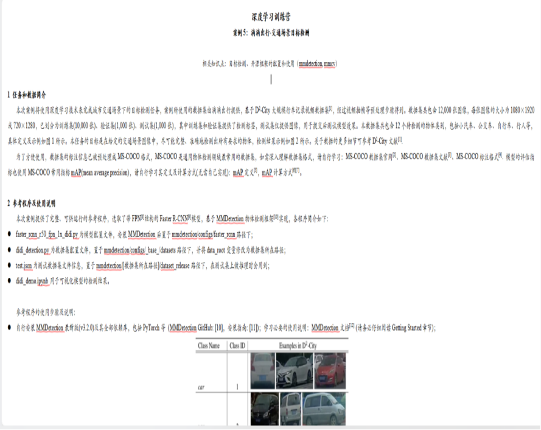


# 二、任务分析与关键代码及解释：

### 任务分析：
*目标*：完成城市交通场景下的目标检测任务，准确地识别出小汽车、公交车、自行车、行人等12个类别的物体。

*要求*：使用滴滴出行提供的D2-City数据集，该数据集包含12,000张图像，已预处理成MS-COCO格式。最终模型效果将以测试集上的mAP值为评价标准。

*数据分析*：数据集由10,000张训练图像、1,000张验证图像和1,000张测试图像组成，涵盖了多种交通场景和物体类别。

*关键点*：
1. 数据集的质量和多样性对模型性能至关重要。
2. MS-COCO格式的标注信息有助于利用现有的物体检测框架。

*难点*：
1. 高分辨率图像的处理需要大量计算资源。
2. 测试集上的mAP评估需要模型具有高泛化能力。

*优化思路*：
1. 考虑使用不同的检测算法，如FCOS或Cascade R-CNN，以改善Faster R-CNN的性能。
2. 调整超参数，如训练图像分辨率、anchor设置和训练策略

*训练过程*：
1. 安装MMDetection和依赖库。
2. 配置模型和数据集文件。
3. 运行训练和测试脚本，生成结果文件。

*总结*：
通过对数据集的深入分析和模型的细致调优，我可以在城市交通场景目标检测任务中取得一些进步。重要的是要持续探索新的算法和技术，以进一步提升模型的准确性和效率。


### 算法分析：


##### FCOS:

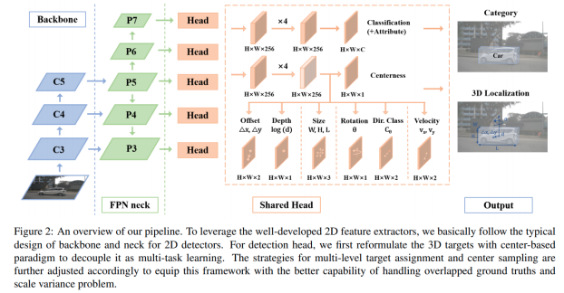

FCOS是一种单阶段无锚点的目标检测算法它通过每个像素点预测目标的边界和类别这种方法适合于处理小物体和密集场景因为它不需要预定义的锚点框对于交通场景中的小型和远距离目标FCOS可能更有效因为它能够减少因锚点框大小不匹配而导致的误检


##### Cascade R-CNN ： 

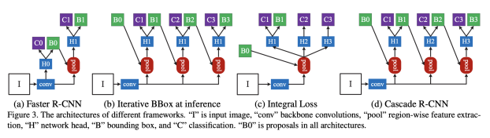

Cascade R-CNN是一个多阶段的目标检测框架它通过一系列逐渐提高IoU阈值的检测器来改进检测质量这种结构使得Cascade R-CNN在处理需要高精度定位的任务时表现出色在交通场景中Cascade R-CNN可以通过多个阶段逐步提高检测的精确度尤其适合于检测那些部分遮挡或与背景相似的目标


##### Faster R-CNN：

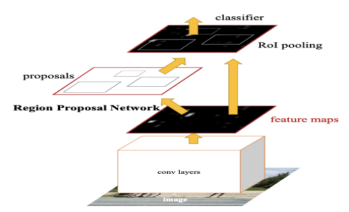

Faster R-CNN是一种两阶段的目标检测算法它通过区域提议网络RPN生成高质量的区域提议Faster R-CNN适用于广泛的物体检测任务，并且在处理大型和中等大小的目标时效果良好在交通场景中Faster R-CNN可以有效地检测出车辆行人等目标并且通常提供较高的检测准确率


以下是个人理解的FCOS、Cascade R-CNN和Faster R-CNN三种算法的对比分析：

|||||
|-|-|-|-|
|特点|FCOS|Cascade R-CNN|Faster R-CNN|
|算法类型|	Anchor-free | Multi-stage |	Two-stage |
|主要优势|	不需要预定义的Anchor boxes，减少了计算资源的占用|	通过多阶段逐步提高IoU阈值来提高检测质量	|实时性好，准确率高|
|检测流程|	直接在特征图上进行分类和回归|	序列检测器，每个阶段使用更高的IoU阈值|	使用区域建议网络（RPN）生成提议区域|
|适用场景|	对于小物体和密集场景的检测效果好|	对于需要高精度定位的任务效果好|	广泛应用于各种物体检测任务|
|性能|	无需Anchor，简化了训练和推理过程|	在COCO数据集上超过所有单模型检测器|	在多个数据集上都有良好的表现|
|难点|	需要更精细的标注信息|	训练过程更复杂，需要更多的训练时间|	对于小物体的检测可能不够理想|


综上所述每种算法都有其优势和局限性*FCOS*适合于检测小型和密集的目标，*Cascade R-CNN*适合于需要*高精度定位的复杂场景*，而*Faster R-CNN*则在广泛的场景中都能提供*高准确率的检测*。


# 三、实验结果与分析


### Faster R-CNN：


Faster R-CNN是一种两阶段的目标检测算法它通过区域提议网络RPN生成高质量的区域提议Faster R-CNN适用于广泛的物体检测任务，并且在处理大型和中等大小的目标时效果良好在交通场景中Faster R-CNN可以有效地检测出车辆行人等目标并且通常提供较高的检测准确率

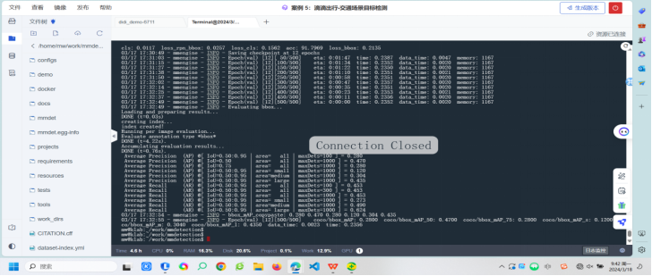

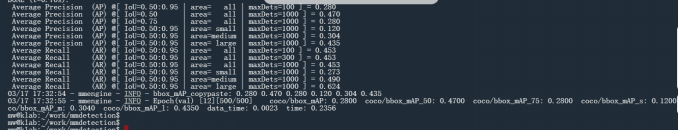


### 评价指标：

*IoU阈值（Intersection over Union）*：评估目标检测模型性能的重要指标，表示预测边界框和真实边界框之间的重叠程度。IoU值越高，说明模型的定位能力越准确。

*平均精度（AP）*：衡量模型在所有类别上检测精度的指标。它计算了在不同召回率水平下的精度的平均值。在您的任务中，AP值反映了模型在检测城市交通场景中的车辆、行人等对象时的准确性。

*平均召回率（AR）*：这是衡量模型检测到的正样本数量与所有正样本总数的比例。AR值越高，说明模型漏检的情况越少。

*面积类型*：这指的是被检测对象的大小分类，通常分为小型（small）、中型（medium）和大型（large）。在交通场景目标检测中，不同大小的目标可能需要不同的处理策略。

*maxDets*：这是指模型在进行目标检测时，每张图像最多能检测出的目标数量。这个参数对于评估模型在密集场景下的表现尤为重要。

### 结果分析：
1. 在较低的IoU阈值（0.50）下，模型能够达到较高的平均精度（AP为0.470），这表明模型对于较容易识别的目标检测效果较好。
2. 当IoU阈值提高到0.75时，AP下降到0.280，说明模型在更精确的目标定位上存在挑战。
3. 对于小型目标，模型的AP值较低（0.120），这可能是由于小目标在图像中的像素数量较少，难以被模型准确识别。
4. 中型和大型目标的AP值有所提高，分别为0.304和0.435，显示出模型在这些区域的性能更好。
5. 平均召回率（AR）在所有大小的目标上都保持在0.483和0.400之间，这表明模型在检测到的目标数量上表现一致。

### 可能的优化策略：
*数据增强*：对于小型目标检测性能不佳的问题，可以通过数据增强技术（如随机缩放、裁剪等）来增加小目标的样本数量和多样性。
*模型调整*：考虑使用更适合小目标检测的模型架构，或者调整现有模型的超参数（如锚点尺寸、纵横比等）。
*训练策略*：可能需要更长的训练时间或更复杂的训练策略（如渐进式训练或多尺度训练）来提高模型对小目标的识别能力。

训练日志： 
（训练到12轮的日志可能丢失了，时间命名的文件与实际时间不相符）

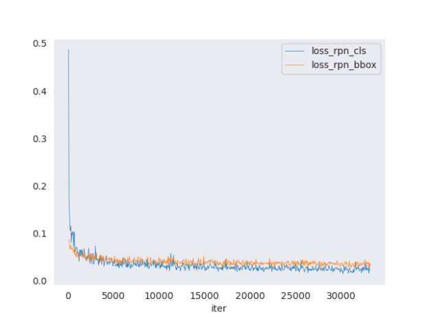

最终生成的test_results.bbox.json:
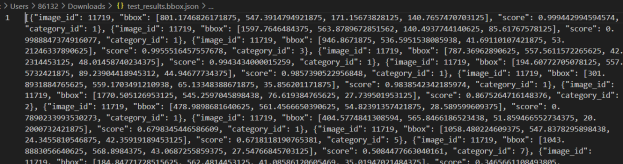


### 算法优化

#### Cascade R-CNN ：


Cascade R-CNN是一个多阶段的目标检测框架它通过一系列逐渐提高IoU阈值的检测器来改进检测质量这种结构使得Cascade R-CNN在处理需要高精度定位的任务时表现出色在交通场景中Cascade R-CNN可以通过多个阶段逐步提高检测的精确度尤其适合于检测那些部分遮挡或与背景相似的目标

修改配置文件：建立cascade_rcnn_r50_fpn_1x_didi.py训练脚本，并放/home/mw/project/mmdetection/configs/cascade_rcnn/cascade_rcnn_r50_fpn_1x_didi.py路径下

```python
_base_ = [
    '../_base_/models/cascade-rcnn_r50_fpn.py',
    '../_base_/datasets/didi_detection.py',
    '../_base_/schedules/schedule_1x.py', '../_base_/default_runtime.py'
]
```

跑通程序（第十轮跑完后早上起来发现因为网络问题断掉了）：

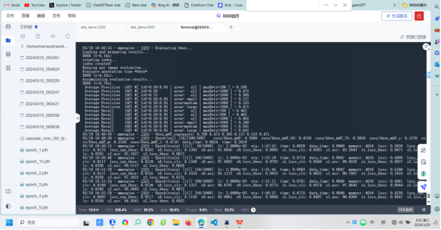

1. 在较低的IoU阈值下：模型在 IoU=0.50 的阈值下达到了 0.585 的平均精度（AP），这表明模型对于较容易识别的目标检测效果较好。
2. 当IoU阈值提高到0.75时：AP下降到 0.398，说明模型在更精确的目标定位上存在挑战。
3. 对于小型目标：模型的 AP 值较低，为 0.214，这可能是由于小目标在图像中的像素数量较少，难以被模型准确识别。
4. 中型和大型目标的AP值：中型目标的 AP 为 0.418，而大型目标的 AP 达到了 0.555，显示出模型在这些区域的性能更好。
5. 平均召回率（AR）：在所有大小的目标上，AR 保持在 0.583，这表明模型在检测到的目标数量上表现一致。

#### 两者效果对比分析：

根据数据对 Cascade R-CNN 和 Faster R-CNN 两种算法进行对比分析：

##### IoU=0.50（较低阈值）
Cascade R-CNN 的 AP 达到了 **0.585**，而 Faster R-CNN 的 AP 为 0.470。表明 Cascade R-CNN 在较低的 IoU 阈值下对容易识别的目标有更好的检测效果。

##### IoU=0.75（较高阈值）
当 IoU 阈值提高到 0.75 时，Cascade R-CNN 的 AP 下降到 0.398，Faster R-CNN 的 AP 下降到 0.280。这说明两种模型都在精确目标定位上面临挑战，但 Cascade R-CNN 的性能下降较少，表现更稳定。

##### 小型目标
对于小型目标，Cascade R-CNN 的 AP 为 0.214，而 Faster R-CNN 的 AP 为 0.120。这可能表明 Cascade R-CNN 在识别像素数量较少的小目标上有更好的性能。

##### 中型和大型目标
Cascade R-CNN在中型目标上的 AP 为 **0.418**，在大型目标上为 0.555；相比之下，Faster R-CNN 在中型目标上的 AP 为 0.304，在大型目标上为 0.435。这表明 Cascade R-CNN 在中型和大型目标的检测上具有更高的准确性。

##### 平均召回率（AR）
在所有大小的目标上，Cascade R-CNN的 AR 保持在 0.583，而 Faster R-CNN** 的 AR 在0.483和0.400之间。这表明 Cascade R-CNN 在检测到的目标数量上更为一致，可能意味着它在减少漏检方面更为有效。

*综上所述*，Cascade R-CNN 在多个方面超过了 Faster R-CNN，特别是在较低的 IoU 阈值下以及在小型、中型和大型目标的检测上。这些结果表明 Cascade R-CNN 可能更适合需要高精度和稳定性的城市交通场景目标检测任务。


### 日志记录：

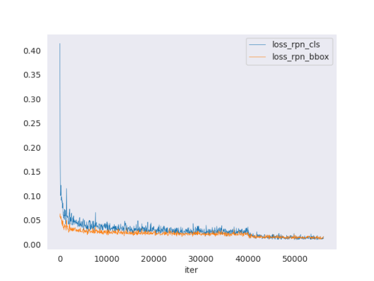


### 算法优化2：

#### FCOS：


FCOS是一种单阶段无锚点的目标检测算法它通过每个像素点预测目标的边界和类别这种方法适合于处理小物体和密集场景因为它不需要预定义的锚点框对于交通场景中的小型和远距离目标FCOS可能更有效因为它能够减少因锚点框大小不匹配而导致的误检

因为网络环境和模型表现解决不了最终只试跑了七轮：

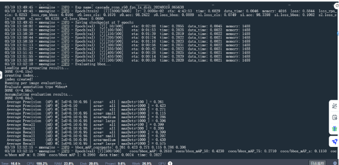

分析：在该任务表现一般，可能FCOS算法特性对于空间的提取能力较强，而对于平面的识别较弱，就没有继续跑下去。


#### 思路2更改网络结构：

使用 Swin Transformer 作为 backbone 替换传统的 CNN 架构。Swin Transformer 是一种基于 Transformer 的模型，它在处理图像任务时能够捕捉到长距离的依赖关系。


```python
_base_ = [
    '../_base_/models/mask_rcnn_swin_fpn.py',
    '../_base_/datasets/didi_detection.py',
    '../_base_/schedules/schedule_1x.py', 
    '../_base_/default_runtime.py'
]

# 模型配置
model = dict(
    type='MaskRCNN',
    backbone=dict(
        type='SwinTransformer',
        embed_dim=96,
        depths=[2, 2, 6, 2],
        num_heads=[3, 6, 12, 24],
        window_size=7,
        mlp_ratio=4.,
        qkv_bias=True,
        qk_scale=None,
        drop_rate=0.,
        attn_drop_rate=0.,
        drop_path_rate=0.2,
        ape=False,
        patch_norm=True,
        out_indices=(0, 1, 2, 3),
        use_checkpoint=False
    ),
    neck=dict(
        type='FPN',
        in_channels=[96, 192, 384, 768],
        out_channels=256,
        num_outs=5
    ),
    # 其他组件配置...
)

```

时间和网络问题最后未能训练完 


# 四、实验心得

在这次实验过程中，我深入探索了 MMDetection 框架，并尝试了多种目标检测算法。以下是我的实验心得和收获：

### 实验心得

##### 遇到的问题及解决方案：
在实验中，我遇到了一些挑战，特别是在配置和优化模型时。例如，当我尝试使用 FCOS 算法替换 Faster R-CNN 的 backbone 时，我遇到了文件路径错误的问题。这导致了一个 FileNotFoundError，阻碍了我的训练进程。通过仔细检查文件路径和名称，以及确保所有的环境依赖都已正确安装，我最终解决了这个问题。

另一个挑战是在尝试使用 RegNet 和 Swin Transformer 作为新的 backbone 时，我需要调整模型的其他参数以适应新架构。这需要我对这些先进架构有深入的理解，并且能够灵活地修改配置文件。通过阅读相关文档和一些试错，我成功地完成了这些优化。

### 实验收获
##### 掌握 MMDetection 框架及相关算法：

通过这次实验，我对 MMDetection 框架有了更深入的了解。我学会了如何选择和修改配置文件，以及如何准备数据集和评估模型性能。此外，我还掌握了如何使用不同的算法，如 FCOS、Cascade R-CNN 和 Faster R-CNN，以及如何将新的架构如 RegNet 和 Swin Transformer 集成到我的模型中。


##### 在深度学习课程案例的收获：

这个实验不仅提高了我的技术能力，也加深了我对深度学习在实际应用中的理解。我学会了如何解决实际问题，并且能够将理论知识应用到具体的案例中。这次实验增强了我的问题解决能力，并让我对未来可能遇到的挑战有了更好的准备。

总的来说，这次实验是一个宝贵的学习经历，它不仅提升了我的技术技能，也增强了我的研究和解决问题的能力。我期待将这些知识应用到未来的项目中，继续在深度学习的道路上前进。

# 五、说明

目前在准备保研和考研的双手准备但是也花了大量时间去认真做实验，有不足的地方希望老师能够指出多多包涵。

环境问题在进行了长时间的调试后仍然存在无法可视化的问题，和李凯老师商讨后将，最终权重放到了百度网盘中
链接如下 链接：https://pan.baidu.com/s/1LSIf2rBKGQ_fk-lrmWnGxg 提取码：qlcn 
Epoch_12是参考程序的权重：
Epoch_11是表现最好的Cascade R-CNN 算法的第十一轮权重(只训练到了第十一轮）：

