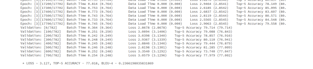

# 一、案例分析与规划：


案例分析：

### 核心点

- *Encoder-Decoder结构*：这是图像自然语言描述生成任务的基础，其中Encoder负责提取图像特征，Decoder负责生成描述。
- *数据处理*：图像和文本数据的预处理对模型性能至关重要，包括图像的归一化和标准化，以及文本的标记化和序列化。
- *Attention机制*：这是提高模型性能的关键技术，能够使模型在生成描述时更加关注图像的相关部分。

### 关键要求
- *实现两种Decoder*：实现基于RNN的Decoder和结合Attention机制的Decoder。
- *模型评估*：使用BLEU分数来评估模型的性能，这要求模型生成的描述与真实描述在语义上尽可能接近。
- *训练与测试*：需要进行充分的训练以优化模型参数，并在测试集上验证模型的效果。

### 存在的难点
- *模型优化*：找到最佳的网络结构和超参数设置是一个挑战，需要多次实验进行调整。
- *数据集的规模和复杂性*：coco2014数据集非常庞大且多样，处理和学习这样的数据集需要高效的算法和强大的计算资源。
- *自然语言的多样性*：生成的描述需要准确且丰富，这要求模型能够理解和生成多样化的自然语言表达。
- *Attention权重的计算*：在Attention机制中，如何有效地计算权重以突出图像的相关部分是技术上的一个难题。

总的来说，本次项目要求深入理解深度学习在图像处理和自然语言处理中的应用，同时也需要创新和实验来克服存在的难点。这是一个综合性很强的项目，涉及到多个深度学习领域的知识点和技术挑战。

### 项目规划：
##### 完善models.py文件：
我将首先阅读第2部分的方法描述和原论文，理解两种Decoder的结构和工作原理。
然后，完成models.py文件中标记为#To Do的部分，确保两种Decoder都能按预期工作。

##### 模型训练：
1. 调整超参数，并运行train.ipynb来训练模型。
2. 使用attention参数来指定正在使用的Decoder类型。
3. 分别训练两种不同Decoder的模型，并在两个不同的jupyter文件中记录最佳参数和训练过程，例如train1.ipynb和train2.ipynb。

##### 模型评估：
运行test.ipynb来评估两个模型在测试集上的性能，并记录它们的BLEU分数。

##### 结果可视化：
选择多张图片，然后使用模型对其进行语言描述。
模型优化：
在参考程序的基础上，尝试使用更先进的深度学习技术来提升模型性能。
使用更好的预训练模型作为Encoder，或者提出更好的Decoder结构，例如Adaptive Attention。


# 二、算法分析关键代码及解释：


### 算法分析：
#### RNN (Recurrent Neural Network)

*序列处理*：RNN能够处理任意长度的序列数据，如文本、时间序列等。

*状态保持*：RNN在处理序列的每个元素时会维护一个内部状态，该状态包含了之前步骤的信息。

*参数共享*：RNN在序列的不同时间步使用相同的权重，从而学习如何从新输入和旧状态中提取信息。

*时间依赖性*：RNN可以捕捉时间序列数据中的依赖关系。


#### RNN with Attention Mechanism

*权重分配*：Attention机制决定在生成每个输出时应该关注输入序列的哪些部分。

*上下文向量*：利用权重创建一个加权的上下文向量，反映了当前步骤最相关的信息。

*动态关注*：Attention机制允许模型在每个输出步骤关注输入序列的不同部分。

#### 应用于图像描述生成

*RNN的应用*：作为Decoder，RNN接收Encoder的图像特征表示，生成描述的单词序列。

*Attention机制的优势*：允许Decoder更加关注与生成的单词最相关的图像部分，创建动态上下文向量。

在图像描述生成任务中，RNN提供了序列生成的基础框架，而Attention机制则增强了模型对图像细节的关注，使得生成的描述不仅连贯，还能更好地反映图像的细节。这种结合使得模型能够有效地处理长序列和复杂的序列到序列的任务，如图像描述生成，其中模型需要生成准确且丰富的自然语言描述。


### 划分数据


### RNN-Decoder：


定义DecoderWithRNN类，它继承自nn.Module。在这个类中，初始化解码器需要的各种组件：

```python
self.embedding = nn.Embedding(cfg['vocab_size'], cfg['embed_dim'])  # 词嵌入层
self.decode_step = nn.LSTMCell(cfg['embed_dim'], cfg['decoder_dim'])  # LSTMCell作为解码单元
self.init = nn.Linear(encoder_dim, cfg['embed_dim'])  # 将编码器的输出转换为LSTMCell的初始输入
self.bn = nn.BatchNorm1d(cfg['embed_dim'], momentum=0.01)  # 对编码器的输出进行批量归一化
self.fc = nn.Linear(cfg['decoder_dim'], cfg['vocab_size'])  # 将LSTMCell的输出转换为对词汇表的预测
```


在forward()方法中，这个解码器接收三个参数：编码器的输出encoder_out，编码后的字幕encoded_captions，以及字幕的长度caption_lengths。这个方法的任务是生成一个单词序列，即自然语言描述。


```python
batch_size = encoder_out.size(0)
encoder_out = encoder_out.view(batch_size, -1)  # 将编码器的输出扁平化
# 对数据进行排序，以便能够按照字幕长度降序处理
caption_lengths, sort_ind = caption_lengths.squeeze(1).sort(dim=0, descending=True)
encoder_out = encoder_out[sort_ind]
encoded_captions = encoded_captions[sort_ind]

embeddings = self.embedding(encoded_captions)  # 对字幕进行词嵌入
decode_lengths = (caption_lengths - 1).tolist()  # 计算解码长度，因为我们不会解码<end>标记
predictions = torch.zeros(batch_size, max(decode_lengths), vocab_size).to(self.device)  # 创建预测得分的张量
```


在初始化LSTM的隐藏状态（h）和单元状态（c）之后，解码器开始在每个时间步上进行解码。对于每个时间步t，解码器只处理那些长度大于t的字幕：

```python
init_input = self.bn(self.init(encoder_out))  # 使用全连接层和批量归一化处理编码器的输出
h, c = self.decode_step(init_input)  # 初始化LSTM的隐藏状态和单元状态

for t in range(max(decode_lengths)):  # 开始循环解码
    batch_size_t = sum([l > t for l in decode_lengths])  # 当前时间步需要处理的字幕数量
    embeddings_t = embeddings[:batch_size_t, t, :]  # 获取当前时间步的嵌入向量
    # 更新LSTM的隐藏状态和单元状态
    h[:batch_size_t], c[:batch_size_t] = self.decode_step(embeddings_t, (h[:batch_size_t], c[:batch_size_t]))
    preds = self.fc(self.dropout(h[:batch_size_t]))  # 计算预测得分
    predictions[:batch_size_t, t, :] = preds  # 存储预测得分
```


在one_step函数中，通过调用注意力模块self.attention，使用隐藏状态h和编码器输出encoder_out得到注意力加权编码z和注意力权重alpha。self.f_beta层和Sigmoid函数生成调节因子beta来门控z。编码z与词嵌入embeddings拼接后输入LSTM单元self.decode_step更新隐藏状态h和单元状态c。

最后，全连接层self.fc输出下一单词的预测得分preds。one_step返回preds、alpha、h、c，使解码器逐步构建图像描述。

```python
def one_step(self, embeddings, encoder_out, h, c):
    z, alpha = self.attention(encoder_out, h)
    beta = F.sigmoid(self.f_beta(h))
    z = beta * z
    h, c = self.decode_step(torch.cat([embeddings,z], dim=1),(h,c))
    preds = self.fc(self.dropout(h))

    return preds, alpha, h, c
```


### 结果：

按照初始的TRAIN设置的超参数进行训练第一轮1的结果：


初始测试训练到epoch=2（共计0-2三轮）


> * LOSS - 2.594, TOP-5 ACCURACY - 70.897, BLEU-4 - 0.16402602558362017

模型效果随着训练轮数在不断改善。


### 启用 fine_tune_encoder 设置
通过将配置项 fine_tune_encoder 设为 True，实施了一种称为 Fine-tuning 的训练技巧。这个过程涉及在一个预先训练好的模型上进行额外训练，以便模型能更精确地适配某个特定任务或数据集。当提到 fine_tune_encoder，是在说要对模型的编码器部分的权重进行细微调整，让它能更有效地识别与新任务相关的重要特性。

### 再次训练三轮

```python
def fine_tune_embeddings(self, fine_tune=True):
        """
        Allow fine-tuning of embedding layer? (Only makes sense to not-allow if using pre-trained embeddings).
        :param fine_tune: Allow?
        """
        for p in self.embedding.parameters():
            p.requires_grad = fine_tune

```


> * LOSS - 2.576, TOP-5 ACCURACY - 71.312, BLEU-4 - 0.16804355897137233


分析这些输出结果，我们可以比较在使用fine-tune时和未使用时模型训练的效果。以下是两种情况下的关键指标：

*Loss*: 表示模型预测与真实标签之间的差距，较低的loss值通常意味着更好的模型性能。
*Top-5 Accuracy*: 表示模型预测的前五个最有可能的类别中包含正确类别的概率，较高的Top-5 Accuracy指标意味着模型性能更好。
*BLEU-4*: 用于评估文本生成任务的指标，较高的BLEU-4分数表明生成的文本与参考文本在语义上更接近。

在fine-tune的情况下，我们看到：

*训练阶段*: Loss从2.4162降至2.4722，Top-5 Accuracy从72.067%提高到74.595%，显示出一定的波动，但整体趋势是正面的。
*验证阶段*: 最终的Loss是2.576，Top-5 Accuracy是71.312%，BLEU-4是0.1680。

在未使用fine-tune的情况下，我们观察到：

*训练阶段*: Loss从2.6144降至2.3696，Top-5 Accuracy从68.449%提高到73.596%，这也表现出模型在学习。
*验证阶段*: 最终的Loss是2.594，Top-5 Accuracy是70.897%，BLEU-4是0.1640。

从这些结果可以看出，使用fine-tune的模型在验证阶段的Loss略低，Top-5 Accuracy略高，BLEU-4分数也略高。这表明fine-tune策略使得模型在特定任务上表现得更好，更适应了验证数据集。微调编码器有助于模型学习和保留更多与任务相关的特征，从而提高了模型对新数据的泛化能力。

然而，差异不是非常显著，这可能与多个因素有关，如训练轮数、学习率、数据集的复杂性等。在实际应用中，需要进一步微调超参数或尝试不同的训练策略来更明显地看出fine-tune的效果。


输出的描述和图片内容大体上贴切，但是细节不够准确。


### Decoder RNNWithAttention：

首先是Attention类。这个类是神经网络的一个模块，它负责计算注意力权重，使得模型能够集中于图像的关键部分来生成描述。

```python
class Attention(nn.Module):
    # ...
    def __init__(self, encoder_dim, decoder_dim, attention_dim):
        super(Attention, self).__init__()
        self.encoder_att = nn.Linear(encoder_dim, attention_dim)  # 编码器的线性层
        self.decoder_att = nn.Linear(decoder_dim, attention_dim)  # 解码器的线性层
        self.full_att = nn.Linear(attention_dim, 1)  # 用于计算注意力权重的线性层
        self.relu = nn.ReLU()
        self.softmax = nn.Softmax(dim=1)  # softmax层来计算权重

    def forward(self, encoder_out, decoder_hidden):
        att1 = self.encoder_att(encoder_out)  # (batch_size, num_pixels, attention_dim)
        att2 = self.decoder_att(decoder_hidden)  # (batch_size, attention_dim)
        att = self.full_att(self.relu(att1 + att2.unsqueeze(1))).squeeze(2)  # (batch_size, num_pixels)
        alpha = self.softmax(att)  # (batch_size, num_pixels)
        attention_weighted_encoding = (encoder_out * alpha.unsqueeze(2)).sum(dim=1)  # (batch_size, encoder_dim)
        return attention_weighted_encoding, alpha
```

DecoderWithAttention类，这个类实现了带有注意力机制的解码器。它的初始化函数__init__设置了一系列网络层和参数。


```python

class DecoderWithAttention(nn.Module):
    # ...
    def __init__(self, cfg, encoder_dim=2048):
        super(DecoderWithAttention, self).__init__()

        self.encoder_dim = encoder_dim
        self.decoder_dim = cfg['decoder_dim']
        self.attention_dim = cfg['attention_dim']
        self.embed_dim = cfg['embed_dim']
        self.vocab_size = cfg['vocab_size']
        self.dropout = cfg['dropout']
        self.device = cfg['device']

        #TODO
        self.attention = Attention(encoder_dim, cfg['decoder_dim'], cfg['attention_dim'])
        self.embedding = nn.Embedding(cfg['vocab_size'], cfg['embed_dim'])
        self.decode_step = nn.LSTMCell(cfg['embed_dim'] + encoder_dim, cfg['decoder_dim'])
        self.init_h = nn.Linear(encoder_dim, cfg['decoder_dim'])  # 初始隐藏状态h0
        self.init_c = nn.Linear(encoder_dim, cfg['decoder_dim'])  # 初始细胞状态c0
        self.f_beta = nn.Linear(cfg['decoder_dim'], encoder_dim)  # 线性层以创建sigmoid激活门
        self.sigmoid = nn.Sigmoid()
        self.fc = nn.Linear(cfg['decoder_dim'], cfg['vocab_size'])
         # initialize some layers with the uniform distribution
        self.embedding.weight.data.uniform_(-0.1, 0.1)
        self.fc.bias.data.fill_(0)
        self.fc.weight.data.uniform_(-0.1, 0.1)

    def load_pretrained_embeddings(self, embeddings):
        """
        Loads embedding layer with pre-trained embeddings.
        :param embeddings: pre-trained embeddings
        """
        self.embedding.weight = nn.Parameter(embeddings)

    def fine_tune_embeddings(self, fine_tune=True):
        """
        Allow fine-tuning of embedding layer? (Only makes sense to not-allow if using pre-trained embeddings).
        :param fine_tune: Allow?
        """
        for p in self.embedding.parameters():
            p.requires_grad = fine_tune

```

*DecoderWithAttention*的*forward*方法则负责整个解码过程，包括扁平化编码器的输出，排序输入数据，嵌入字幕，以及逐步生成预测的描述。

*one_step方法是解码器的核心*，它在每个时间步骤中生成下一个词的预测和注意力权重。这个方法使用之前的嵌入向量、编码器输出、隐藏状态和细胞状态，通过注意力加权编码和门控机制来精细调整LSTM单元的输入。

整个模型的目标是通过学习如何在图像的不同部分之间分配注意力，从而产生准确且连贯的图像描述。这是通过在训练过程中不断优化模型的参数来实现的，最终能够自动为给定的图像生成描述性的句子。

```python
def forward(self, encoder_out, encoded_captions, caption_lengths):

        batch_size = encoder_out.size(0)
        encoder_dim = encoder_out.size(-1)
        vocab_size = self.vocab_size

        # Flatten image
        encoder_out = encoder_out.view(batch_size, -1, encoder_dim)  # (batch_size, num_pixels, encoder_dim)
        num_pixels = encoder_out.size(1)

        # Sort input data by decreasing lengths;
        caption_lengths, sort_ind = caption_lengths.squeeze(1).sort(dim=0, descending=True)
        encoder_out = encoder_out[sort_ind]
        encoded_captions = encoded_captions[sort_ind]

        # Embedding
        embeddings = self.embedding(encoded_captions)  # (batch_size, max_caption_length, embed_dim)

        # We won't decode at the <end> position, since we've finished generating as soon as we generate <end>
        # So, decoding lengths are actual lengths - 1
        decode_lengths = (caption_lengths - 1).tolist()

        # Create tensors to hold word predicion scores and alphas
        predictions = torch.zeros(batch_size, max(decode_lengths), vocab_size).to(self.device)
        alphas = torch.zeros(batch_size, max(decode_lengths), num_pixels).to(self.device)

        # Initialize LSTM state
        mean_encoder_out = encoder_out.mean(dim=1)
        h = self.init_h(mean_encoder_out)    # (batch_size, decoder_dim)
        c = self.init_c(mean_encoder_out)

        #TODO
        for t in range(max(decode_lengths)):
            batch_size_t = sum([l > t for l in decode_lengths])
            attention_weighted_encoding, alpha = self.attention(encoder_out[:batch_size_t],
                                                                h[:batch_size_t])
            gate = self.sigmoid(self.f_beta(h[:batch_size_t]))  # gating scalar, (batch_size_t, encoder_dim)
            attention_weighted_encoding = gate * attention_weighted_encoding
            embeddings = self.embedding(encoded_captions[:batch_size_t, t])
            h, c = self.decode_step(torch.cat([embeddings, attention_weighted_encoding], dim=1),
                                    (h[:batch_size_t], c[:batch_size_t]))
            preds = self.fc(h)  # (batch_size_t, vocab_size)
            predictions[:batch_size_t, t, :] = preds
            alphas[:batch_size_t, t, :] = alpha
        return predictions, encoded_captions, decode_lengths, alphas, sort_ind

def one_step(self, prev_embeddings, encoder_out, h, c):

        attention_weighted_encoding, alpha = self.attention(encoder_out, h)
        gate = self.sigmoid(self.f_beta(h))
        attention_weighted_encoding = gate * attention_weighted_encoding
        h, c = self.decode_step(
            torch.cat([prev_embeddings, attention_weighted_encoding], dim=1), (h, c)
        )
        preds = self.fc(h)

        return preds, alpha, h, c


```

本次直接启用了*fine-tune*，将训练轮数增加一轮共计四轮（）




测试集BELU-4得分


```python
#·Calculate·BLEU-4·scores
bleu4 = corpus_bleu(references, hypotheses)
print(bleu4)
```

> 0.30390836151532613


图片2结果显示出来了自然语言的单词的注意力在图像的哪里


图片中可以看到模型精准的描述了图像信息


这张照片的测试结果并不够准确。


# 三、实验结果与分析


对比RNN和带有Attention机制的RNN在任务中的表现，可以看到以下差异：

#### RNN
- 损失（Loss）：在第二个epoch结束时，平均损失降至2.576。
- Top-5 准确率：在第二个epoch结束时，Top-5准确率提升至71.312%。
- BLEU-4 分数：在测试集上，BLEU-4分数为0.1839。

##### RNN with Attention
- 损失（Loss）：在第三个epoch结束时，平均损失降至3.127。
- Top-5 准确率：在第三个epoch结束时，Top-5准确率提升至77.018%。
- BLEU-4 分数：在测试集上，BLEU-4分数为0.3039。

从这些结果来看，尽管RNN在损失上表现得更好，但带有Attention机制的RNN在Top-5准确率和BLEU-4分数上表现更优。这表明Attention机制有助于模型在生成描述时更准确地聚焦于图像的相关部分，从而提高了整体的性能。特别是在BLEU-4分数上，带有Attention机制的RNN比普通RNN高出不少，这意味着生成的文本与参考文本在语义上更为接近。


# 四、实验心得

我深入探索了深度学习在图像描述生成中的应用。这个过程中，我遇到了*三个关键问题*，它们考验了我的技术能力和解决问题的策略。

*关键问题一*：如何提高模型的准确性？ 为了解决这个问题，我决定采用带有注意力机制的循环神经网络（RNN）。注意力机制能够使模型在生成描述时更加关注图像的特定部分。我通过阅读相关论文，实现了一个基于注意力的编码器-解码器网络，并在数据集上进行了训练和测试与RNN进行对比。

*关键问题二*：如何避免过拟合？ 我采用了正则化技术，如dropout，并在训练过程中引入了数据增强，以此来防止过拟合。

*关键问题三*：如何通过调整超参数优化模型？ 我通过调整批次大小和学习率，以及启用fine-tune等多次测试最终采取开始*fine-tune为TRUE，grad_clip设置为 7。*


*在解决这些问题的过程中，我遇到了两个主要难点：*

难点一：模型调参 模型的超参数选择对性能有很大影响。我通过反复实验，记录不同参数组合下的结果，最终找到了一组合适的参数。

难点二：理解注意力机制 最初，我对注意力机制的工作原理理解不够深刻。通过不断的实践和研究，我逐步掌握了如何将注意力机制有效地集成到我的模型中。

实验收获与心得： 这次实验不仅提升了我的编程技能，还让我对深度学习有了更深入的理解。我学会了如何处理实际问题，并将理论知识应用于实践。此外，我也意识到了持续学习和适应新技术的重要性。这次实验经历让我更加坚信，通过不断的努力和探索，我们能够解决更多复杂的问题，并推动技术的进步。
  
感谢助教老师
