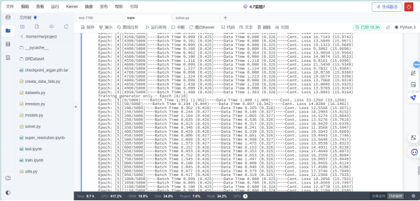

# 一、案例简介：


# 二、案例分析与关键代码：


### 案例分析：

##### 1.理解图像超分辨任务：
目标是通过深度学习，特别是生成对抗网络（GAN），将低分辨率图像转换为更高分辨率的版本。

##### 2.掌握相关知识点：
熟悉生成对抗网络（特别是SRGAN）、图像处理库（如PIL）以及数据可视化（如matplotlib）。

##### 3.数据集准备和理解：
使用DIV2K数据集进行训练，该数据集包含高分辨率和对应的低分辨率图像。
了解图像是如何下采样的，包括使用的下采样方法和参数。

##### 4.模型搭建与训练：
实现SRGAN网络结构，包括生成器和判别器。
设计合适的损失函数，包括内容损失（像素空间MSE和VGG特征空间MSE）和对抗损失。
##### 5.模型训练策略：

制定有效的训练策略，可能需要预训练生成器以稳定训练过程。

### 执行实验

划分文件：


参数：*采取原论文超参数设置：*

```python
config.crop_size = 96
config.scaling_factor = 4

# Generator parameters
config.G = edict()
config.G.large_kernel_size = 9
config.G.small_kernel_size = 3
config.G.n_channels = 64
config.G.n_blocks = 16

# Discriminator parameters
config.D = edict()
config.D.kernel_size = 3
config.D.n_channels = 64
config.D.n_blocks = 8
config.D.fc_size = 1024

# Learning parameters
config.checkpoint = None # path to model (SRGAN) checkpoint, None if none
config.batch_size = 16
config.start_epoch = 0
config.epochs = 10
config.workers = 4
config.vgg19_i = 5  # the index i in the definition for VGG loss; see paper
config.vgg19_j = 4  # the index j in the definition for VGG loss; see paper
config.beta = 1e-3  # the coefficient to weight the adversarial loss in the perceptual loss
config.print_freq = 50
config.lr = 1e-4
```


*模型代码（1.0版本）按照原论文思路及配置结合任务构建模型，部分参数在网络内部设定：*

```python

import torch
import torch.nn as nn
import torchvision.models as models

# 定义残差块，用于生成器中
class ResidualBlock(nn.Module):
    def __init__(self, in_features):
        super(ResidualBlock, self).__init__()
        # 残差块包含两个卷积层，每个卷积层后面跟着批量归一化和PReLU激活函数
        self.conv_block = nn.Sequential(
            nn.Conv2d(in_features, in_features, kernel_size=3, stride=1, padding=1),
            nn.BatchNorm2d(in_features, 0.8),
            nn.PReLU(),
            nn.Conv2d(in_features, in_features, kernel_size=3, stride=1, padding=1),
            nn.BatchNorm2d(in_features, 0.8),
        )

    # 前向传播函数，实现残差学习
    def forward(self, x):
        return x + self.conv_block(x)

# 定义生成器模型
class Generator(nn.Module):
    def __init__(self, scale_factor=2, num_residual_blocks=16):
        super(Generator, self).__init__()
        # 生成器的第一个卷积层，使用较大的卷积核以及PReLU激活函数
        self.conv1 = nn.Conv2d(3, 64, kernel_size=9, stride=1, padding=4, padding_mode='reflect', bias=True)
        self.prelu = nn.PReLU()
        # 残差块序列，用于深层特征提取
        self.residual_blocks = nn.Sequential(*[ResidualBlock(64) for _ in range(num_residual_blocks)])
        # 第二个卷积层，后面跟着批量归一化
        self.conv2 = nn.Conv2d(64, 64, kernel_size=3, stride=1, padding=1, bias=True)
        self.bn2 = nn.BatchNorm2d(64)
        # 上采样层，用于提高图像分辨率
        self.upsample = nn.Sequential(
            nn.Conv2d(64, 256, kernel_size=3, stride=1, padding=1, padding_mode='reflect', bias=True),
            nn.PixelShuffle(scale_factor),
            nn.PReLU(),
            nn.Conv2d(64, 256, kernel_size=3, stride=1, padding=1, padding_mode='reflect', bias=True),
            nn.PixelShuffle(scale_factor),
            nn.PReLU(),
            nn.Conv2d(64, 3, kernel_size=9, stride=1, padding=4, bias=True)
        )

    # 前向传播函数，依次应用所有层
    def forward(self, x):
        out = self.conv1(x)
        out = self.prelu(out)
        residual = out
        out = self.residual_blocks(out)
        out = self.conv2(out)
        out = self.bn2(out)
        out += residual  # 将输入添加到残差块的输出上（跳跃连接）
        out = self.upsample(out)  # 将特征上采样到目标分辨率
        return out

# 定义判别器模型
class Discriminator(nn.Module):
    def __init__(self):
        super(Discriminator, self).__init__()
        self.layer = nn.Sequential(
            nn.Conv2d(3, 64, kernel_size=3, stride=1, padding=1, bias=True),
            nn.LeakyReLU(0.2),
            nn.Conv2d(64, 64, kernel_size=3, stride=2, padding=1, bias=True),
            nn.BatchNorm2d(64),
            nn.LeakyReLU(0.2),
            nn.Conv2d(64, 128, kernel_size=3, stride=1, padding=1, bias=True),
            nn.BatchNorm2d(128),
            nn.LeakyReLU(0.2),
            nn.Conv2d(128, 128, kernel_size=3, stride=2, padding=1, bias=True),
            nn.BatchNorm2d(128),
            nn.LeakyReLU(0.2),
            nn.Conv2d(128, 256, kernel_size=3, stride=1, padding=1, bias=True),
            nn.BatchNorm2d(256),
            nn.LeakyReLU(0.2),
            nn.Conv2d(256, 256, kernel_size=3, stride=2, padding=1, bias=True),
            nn.BatchNorm2d(256),
            nn.LeakyReLU(0.2),
            nn.Conv2d(256, 512, kernel_size=3, stride=1, padding=1, bias=True),
            nn.BatchNorm2d(512),
            nn.LeakyReLU(0.2),
            nn.Conv2d(512, 512, kernel_size=3, stride=2, padding=1, bias=True),
            nn.BatchNorm2d(512),
            nn.LeakyReLU(0.2),
            nn.AdaptiveAvgPool2d(1),
            nn.Flatten(),
            nn.Linear(512, 1024),
            nn.Dropout(),
            nn.LeakyReLU(0.2),
            nn.Linear(1024, 1),
            nn.Sigmoid()
        )

    # 前向传播函数，应用层堆叠到输入张量
    def forward(self, x):
        out = self.layer(x)
        return out

# VGG19网络截断类，用于损失计算中的特征提取
class TruncatedVGG19(nn.Module):
    def __init__(self, i=5, j=4):
        super(TruncatedVGG19, self).__init__()
        # 加载预训练的VGG19模型，并在指定的层截断
        vgg19 = models.vgg19(pretrained=True).features
        self.features = nn.Sequential(*list(vgg19.children())[:((i-1)*5 + j)])
        # 冻结VGG19特征参数，防止在训练过程中更新
        for param in self.features.parameters():
            param.requires_grad = False

    # 前向传播函数，返回VGG19截断后的特征
    def forward(self, x):
        return self.features(x)
```


*模型代码2.0版本：*

```python
import torch
import torch.nn as nn
import torchvision.models as models

class ResidualBlock(nn.Module):
    def __init__(self, in_features, kernel_size=3):
        super(ResidualBlock, self).__init__()
        # 定义一个卷积块，包括两个卷积层，两个批归一化层和一个PReLU激活函数
        self.conv_block = nn.Sequential(
            nn.Conv2d(in_features, in_features, kernel_size=kernel_size, stride=1, padding=kernel_size//2),
            nn.BatchNorm2d(in_features),
            nn.PReLU(),
            nn.Conv2d(in_features, in_features, kernel_size=kernel_size, stride=1, padding=kernel_size//2),
            nn.BatchNorm2d(in_features),
        )

    def forward(self, x):
        # 前向传播过程中，将输入x和卷积块的输出相加
        return x + self.conv_block(x)

class Generator(nn.Module):
    def __init__(self, large_kernel_size=9, small_kernel_size=3, n_channels=64, n_blocks=16):
        super(Generator, self).__init__()
        # 定义生成器的各个组成部分，包括一个卷积层，一个PReLU激活函数，一个残差块，一个卷积层，一个批归一化层，以及一个上采样部分
        self.conv1 = nn.Conv2d(3, n_channels, kernel_size=large_kernel_size, stride=1, padding=large_kernel_size//2, padding_mode='reflect', bias=True)
        self.prelu = nn.PReLU()
        self.residual_blocks = nn.Sequential(*[ResidualBlock(n_channels, small_kernel_size) for _ in range(n_blocks)])
        self.conv2 = nn.Conv2d(n_channels, n_channels, kernel_size=small_kernel_size, stride=1, padding=small_kernel_size//2, bias=True)
        self.bn2 = nn.BatchNorm2d(n_channels)
        # 假设上采样因子为2，如果需要可以进行相应的修改
        self.upsample = nn.Sequential(
            nn.Conv2d(n_channels, n_channels * (2 ** 2), kernel_size=small_kernel_size, stride=1, padding=small_kernel_size//2, padding_mode='reflect', bias=True),
            nn.PixelShuffle(2),
            nn.PReLU(),
            nn.Conv2d(n_channels, n_channels * (2 ** 2), kernel_size=small_kernel_size, stride=1, padding=small_kernel_size//2, padding_mode='reflect', bias=True),
            nn.PixelShuffle(2),
            nn.PReLU(),
            nn.Conv2d(n_channels, 3, kernel_size=large_kernel_size, stride=1, padding=large_kernel_size//2, bias=True)
        )

    def forward(self, x):
        # 定义生成器的前向传播过程
        out = self.conv1(x)
        out = self.prelu(out)
        residual = out
        out = self.residual_blocks(out)
        out = self.conv2(out)
        out = self.bn2(out)
        out += residual  # 元素级别的相加
        out = self.upsample(out)
        return out

class Discriminator(nn.Module):
    def __init__(self, kernel_size=3, n_channels=64, n_blocks=8, fc_size=1024):
        super(Discriminator, self).__init__()
        layers = []
        # 假设在每个块后输入和输出通道数都翻倍
        for i in range(n_blocks):
            input_channels = n_channels if i == 0 else n_channels * (2 ** i)
            output_channels = n_channels * (2 ** (i + 1))
            layers.append(nn.Conv2d(input_channels, output_channels, kernel_size=kernel_size, stride=1 + i % 2, padding=kernel_size//2, bias=True))
            layers.append(nn.BatchNorm2d(output_channels))
            layers.append(nn.LeakyReLU(0.2))
            if i % 2 == 1:  # 每隔一个块进行下采样
                layers.append(nn.Conv2d(output_channels, output_channels, kernel_size=kernel_size, stride=2, padding=kernel_size//2, bias=True))
                layers.append(nn.BatchNorm2d(output_channels))
                layers.append(nn.LeakyReLU(0.2))

        self.layer = nn.Sequential(*layers)
        self.final = nn.Sequential(
            nn.AdaptiveAvgPool2d(1),
            nn.Flatten(),
            nn.Linear(n_channels * (2 ** n_blocks), fc_size),
            nn.LeakyReLU(0.2),
            nn.Linear(fc_size, 1),
            nn.Sigmoid()
        )

    def forward(self, x):
        # 定义判别器的前向传播过程
        out = self.layer(x)
        out = self.final(out)
        return out

# TruncatedVGG19
class TruncatedVGG19(nn.Module):
    def __init__(self, i=5, j=4):
        super(TruncatedVGG19, self).__init__()
        vgg19 = models.vgg19(pretrained=True).features
        self.features = nn.Sequential(*list(vgg19.children())[:((i-1)*5 + j)])
        for param in self.features.parameters():
            param.requires_grad = False

    def forward(self, x):
        return self.features(x)

```


*阅读了一些博客和Git-hub上的开源项目 加入SSResNet *

在SRGAN的训练过程中，首先预训练SRResNet网络，使其能够将低分辨率图像上采样到高分辨率。然后，将预训练的SRResNet作为生成器，结合一个判别器一起训练，形成GAN架构。在这个过程中，生成器试图生成越来越逼真的高分辨率图像，以欺骗判别器，而判别器试图越来越好地区分真实的高分辨率图像和生成的高分辨率图像。这个对抗过程使得生成器能够生成更逼真的高分辨率图像。

```python
class ConvolutionalBlock(nn.Module):
    """
    ConvolutionalBlock类定义了一个卷积块，包括卷积层、批量归一化层（如果需要）和激活层。
    卷积层的参数（如输入/输出通道数、卷积核大小和步长）由构造函数参数提供。
    批量归一化层是可选的，由batch_norm参数决定是否添加。
    激活层的类型由activation参数决定，可以是PReLU、LeakyReLU、Tanh或者没有激活层。
    """

    def __init__(self, in_channels, out_channels, kernel_size, stride=1, batch_norm=False, activation=None):
        super(ConvolutionalBlock, self).__init__()

        if activation is not None:
            activation = activation.lower()
            assert activation in {'prelu', 'leakyrelu', 'tanh'}

        layers = list()

        layers.append(
            nn.Conv2d(in_channels=in_channels, out_channels=out_channels, kernel_size=kernel_size, stride=stride,
                      padding=kernel_size // 2))

        if batch_norm is True:
            layers.append(nn.BatchNorm2d(num_features=out_channels))

        if activation == 'prelu':
            layers.append(nn.PReLU())
        elif activation == 'leakyrelu':
            layers.append(nn.LeakyReLU(0.2))
        elif activation == 'tanh':
            layers.append(nn.Tanh())

        self.conv_block = nn.Sequential(*layers)

    def forward(self, input):
        """
        前向传播函数接受一个输入张量，并应用卷积块的层到输入张量上，然后返回输出张量。
        """
        output = self.conv_block(input)

        return output

class SubPixelConvolutionalBlock(nn.Module):
    """
    SubPixelConvolutionalBlock类定义了一个子像素卷积块，包括卷积层、像素重排层和PReLU激活层。
    卷积层的参数（如卷积核大小和输入/输出通道数）由构造函数参数提供。
    像素重排层用于上采样，上采样倍数由scaling_factor参数决定。
    """

    def __init__(self, kernel_size=3, n_channels=64, scaling_factor=2):
        super(SubPixelConvolutionalBlock, self).__init__()

        self.conv = nn.Conv2d(in_channels=n_channels, out_channels=n_channels * (scaling_factor ** 2),
                              kernel_size=kernel_size, padding=kernel_size // 2)
        self.pixel_shuffle = nn.PixelShuffle(upscale_factor=scaling_factor)
        self.prelu = nn.PReLU()

    def forward(self, input):
        """
        前向传播函数接受一个输入张量，并应用子像素卷积块的层到输入张量上，然后返回输出张量。
        """
        output = self.conv(input)
        output = self.pixel_shuffle(output)
        output = self.prelu(output)

        return output


def __init__(self, large_kernel_size=9, small_kernel_size=3, n_channels=64, n_blocks=16, scaling_factor=4):
    """
    初始化 SRResNet 模型的参数。

    :param large_kernel_size: 输入和输出卷积层的卷积核大小
    :param small_kernel_size: 中间卷积层的卷积核大小
    :param n_channels: 卷积层的通道数
    :param n_blocks: 残差块的数量
    :param scaling_factor: 图像上采样的因子，必须是2、4或8
    """
    super(SRResNet, self).__init__()

    # 第一个卷积块，使用大卷积核，不使用批量归一化，激活函数为PReLU
    self.conv_block1 = ConvolutionalBlock(in_channels=3, out_channels=n_channels, kernel_size=large_kernel_size,
                                          batch_norm=False, activation='PReLu')

    # 一系列残差块，每个块中包含一个跨块的跳跃连接
    self.residual_blocks = nn.Sequential(
        *[ResidualBlock(kernel_size=small_kernel_size, n_channels=n_channels) for _ in range(n_blocks)])

    # 第二个卷积块，使用小卷积核，使用批量归一化，不使用激活函数
    self.conv_block2 = ConvolutionalBlock(in_channels=n_channels, out_channels=n_channels,
                                          kernel_size=small_kernel_size,
                                          batch_norm=True, activation=None)

    # 一系列子像素卷积块，每个块的上采样因子为2，总的上采样因子等于scaling_factor
    n_subpixel_convolution_blocks = int(math.log2(scaling_factor))
    self.subpixel_convolutional_blocks = nn.Sequential(
        *[SubPixelConvolutionalBlock(kernel_size=small_kernel_size, n_channels=n_channels, scaling_factor=2) for _
          in range(n_subpixel_convolution_blocks)])

    # 最后一个卷积块，使用大卷积核，不使用批量归一化，激活函数为Tanh
    self.conv_block3 = ConvolutionalBlock(in_channels=n_channels, out_channels=3, kernel_size=large_kernel_size,
                                          batch_norm=False, activation='Tanh')

def forward(self, lr_imgs):
    """
    定义 SRResNet 的前向传播过程。

    :param lr_imgs: 低分辨率输入图像，尺寸为 (N, 3, w, h) 的张量
    :return: 超分辨率输出图像，尺寸为 (N, 3, w * 缩放因子, h * 缩放因子) 的张量
    """
    output = self.conv_block1(lr_imgs)  # (N, 3, w, h)
    residual = output  # (N, n_channels, w, h)
    output = self.residual_blocks(output)  # (N, n_channels, w, h)
    output = self.conv_block2(output)  # (N, n_channels, w, h)
    output = output + residual  # (N, n_channels, w, h)
    output = self.subpixel_convolutional_blocks(output)  # (N, n_channels, w * 缩放因子, h * 缩放因子)
    sr_imgs = self.conv_block3(output)  # (N, 3, w * 缩放因子, h * 缩放因子)

    return sr_imgs

```


### 训练策略：

*10轮G1D1*: 这是最基本的训练策略，进行了10轮的生成器和判别器交替训练。此时，所有的评价指标（PSNR和SSIM）都处于相对较低的水平。

*预训练10轮生成器再G1D1十轮*: 在这个策略中，首先对生成器进行了10轮的预训练，然后再进行10轮的生成器和判别器交替训练。这个策略相较于前一个策略，所有的评价指标都有了显著的提升。

*加入SRRESNET结构G1D1*: 在这个策略中，将模型的生成器部分改为了SSResNet结构，并进行了10轮的生成器和判别器交替训练。这个策略相较于前一个策略，所有的评价指标都有了进一步的提升。

*加入SRRESNET训练周期内G1D2*: 在这个策略中，保持了SSResNet的生成器结构，但改变了生成器和判别器的训练比例，即在每个训练周期内，生成器训练1次，判别器训练2次。这个策略相较于前一个策略，所有的评价指标都有了小幅度的提升。

训练过程部分展示：


```python
# Epochs
for epoch in range(config.start_epoch, config.epochs):
    # At the halfway point, reduce learning rate to a tenth
    if epoch == int(config.epochs / 2 + 1):
        adjust_learning_rate(optimizer_g, 0.1)
        adjust_learning_rate(optimizer_d, 0.1)
    # One epoch's training
    train(train_loader=train_loader,
          generator=generator,
          discriminator=discriminator,
          truncated_vgg19=truncated_vgg19,
          content_loss_criterion=content_loss_criterion,
          adversarial_loss_criterion=adversarial_loss_criterion,
          optimizer_g=optimizer_g,
          optimizer_d=optimizer_d,
          epoch=epoch,
          device=config.device,
          beta=config.beta,
          print_freq=config.print_freq)
    # Save checkpoint
    torch.save({'epoch': epoch,
                'generator': generator,
                'discriminator': discriminator,
                'optimizer_g': optimizer_g,
                'optimizer_d': optimizer_d},
                'checkpoint_srgan.pth.tar')
```


```python
# 首先只训练生成器10个epoch
for epoch in range(10):
    print(f"仅训练生成器 - Epoch [{epoch + 1}/10]")
    train(train_loader=train_loader,
          generator=generator,
          discriminator=discriminator,  # 传入判别器但不进行训练
          truncated_vgg19=truncated_vgg19,
          content_loss_criterion=content_loss_criterion,
          adversarial_loss_criterion=adversarial_loss_criterion,  # 传入损失函数但不使用
          optimizer_g=optimizer_g,
          optimizer_d=optimizer_d,  # 传入优化器但不使用
          epoch=epoch,
          device=config.device,
          beta=config.beta,
          print_freq=config.print_freq,
          train_discriminator=False)  # 设置为False以不训练判别器

# 现在同时训练生成器和判别器再进行10个epoch
for epoch in range(10, 20):
    print(f"训练生成器和判别器 - Epoch [{epoch + 1}/20]")
    train(train_loader=train_loader,
          generator=generator,
          discriminator=discriminator,
          truncated_vgg19=truncated_vgg19,
          content_loss_criterion=content_loss_criterion,
          adversarial_loss_criterion=adversarial_loss_criterion,
          optimizer_g=optimizer_g,
          optimizer_d=optimizer_d,
          epoch=epoch,
          device=config.device,
          beta=config.beta,
          print_freq=config.print_freq,
          train_discriminator=True)  # 设置为True以训练判别器

    # 每个epoch后保存检查点
    torch.save({'epoch': epoch,
                'generator': generator.state_dict(),
                'discriminator': discriminator.state_dict(),
                'optimizer_g': optimizer_g.state_dict(),
                'optimizer_d': optimizer_d.state_dict()},
               f'checkpoint_srgan_epoch_{epoch}.pth.tar')
```





4.14最后一次训练完成：


# 三、结果分析：


### 运行结果：


### 总结与结果分析：


##### 1. 10轮G1D1
这是基线模型，仅进行10个训练周期，其中生成器和判别器的训练是同步的（一对一）。

从结果来看，该策略在所有数据集上均取得了最低的PSNR和SSIM值，这可能表明模型在这一阶段还未充分训练，生成器还未能有效地学习到如何重建高分辨率图像。

##### 2. 预训练10轮生成器再G1D1十轮
在这个策略中，我首先对生成器进行了10轮的预训练，然后再进行10轮G1D1的训练。

比较第一种策略的结果，能够看到PSNR和SSIM指标在所有数据集上都有明显的提升。这表明预训练生成器是有益的，它可以帮助模型更快地收敛并提高输出图像的质量。

##### 3. 加入SRRESNET结构G1D1
在此策略中，引入了SSRESNET结构，并执行了G1D1的训练。

结果显示，在所有数据集上的PSNR和SSIM指标进一步提高，这意味着SSRESNET结构更适合超分辨率任务，能够更好地捕捉图像的细节和纹理。

##### 4. 加入SRRESNET训练周期内G1D2
这个策略是在SSRESNET结构的基础上，每一轮训练中对生成器训练一次而对判别器训练两次。

在所有指标上，这一策略进一步提高了性能，这可能是因为更频繁地训练判别器可以提供更精确的反馈，从而激励生成器产生更接近真实的高分辨率图像。

### 结论
训练策略的选择显著影响了模型的性能。预训练生成器显著提高了模型的性能，而SRRESNET结构的引入进一步提升了PSNR和SSIM指标。

最好的结果来自于SRRESNET结构配合不对称的训练策略G1D2，这表明在对抗性训练中判别器对生成器的指导起到了关键作用。

在超分辨率任务中，网络结构和训练策略的选择对于最终图像质量至关重要


预训练10轮生成器再G1D1十轮


综合四个策略的结果，可以看到随着策略的逐步优化，模型在图像重建的质量上得到了一些改善。从指标数据来说从基线模型的简单训练到预训练生成器，再到引入SRResNet结构，以及调整训练周期内生成器与判别器的训练频率，每一步都为模型性能的提升做出了贡献。

但是从人眼来看采用原始SRGAN网络结构并预先训练生成器再交替训练生成器和判别器效果最佳，当然也有可能是训练次数不够，后期我应该增加各个训练策略的训练轮次。


# 四、实验心得
实验心得：

*理解模型结构的重要性*：利用不同的网络结构对模型性能有着显著的影响。特别是引入SRResNet结构后，模型在捕捉图像细节和纹理方面的能力大大增强。

*预训练的力量*：通过对生成器进行预训练，我发现模型能够更快地收敛，并在后续的训练中表现得更加稳定，这减少了训练时间并提高了效率。

*训练策略的调整*：调整训练策略，如改变生成器和判别器的训练频率，可以显著提升模型的性能。这种方法使得判别器能够提供更精确的反馈，从而激励生成器产生更高质量的图像。

关键问题及解决策略：

*问题：模型过拟合*
在早期阶段，模型在训练集上表现良好，但在验证集上则表现不佳。

*解决策略*：引入dropout技术，并使用了数据增强来提高模型的泛化能力。

*问题：训练时间过长。*
随着模型复杂度的增加，训练时间显著增长。

*解决策略*：通过优化网络结构和调整批次大小来减少每次迭代的计算量。同时，我也尝试了不同的优化器，最终选择了Adam优化器，因为它在加速收敛方面表现出色。


