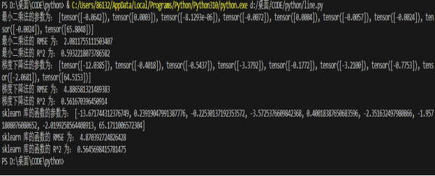
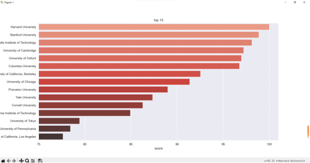
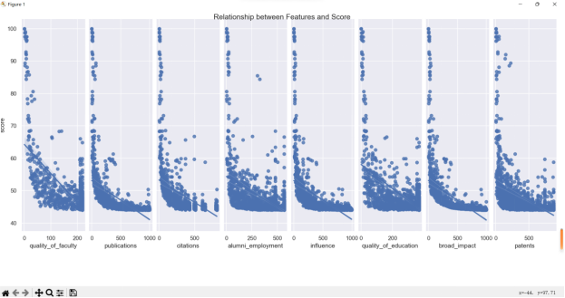
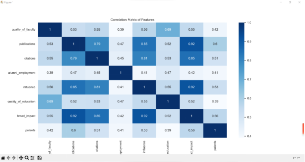

# 一、选题背景：
大学排名是一个非常重要同时也极富挑战性与争议性的问题，一所大学的综合实力涉及科研、师资、学生等方方面面。目前全球有上百家评估机构会评估大学的综合得分进行排序，而这些机构的打分也往往并不一致。在这些评分机构中，世界大学排名中心（Center for World University Rankings，缩写CWUR）以评估教育质量、校友就业、研究成果和引用，而非依赖于调查和大学所提交的数据著称，是非常有影响力的一个。

本任务中我们将根据 CWUR 所提供的世界各地知名大学各方面的排名（师资、科研等），一方面通过数据可视化的方式观察不同大学的特点，另一方面希望构建机器学习模型（线性回归）预测一所大学的综合得分。

# 二、实验目的及要求
使用来自 Kaggle 的[数据]构建「线性回归」模型，根据大学各项指标的排名预测综合得分。

**基本要求：**
* 按照 8:2 随机划分训练集测试集，用 RMSE 作为评价指标，得到测试集上线性回归模型的 RMSE 值；
* 对线性回归模型的系数进行分析。

**扩展要求：**
* 对数据进行观察与可视化，展示数据特点； 

尝试其他的回归模型，对比效果；

尝试将离散的地区特征融入线性回归模型，并对结果进行对比。

**注意事项：**

基本输入特征有 8 个：`quality_of_education`, `alumni_employment`, `quality_of_faculty`, `publications`, `influence`, `citations`, `broad_impact`, 
`patents`；
预测目标为`score`；

可以使用 sklearn 等第三方库，不要求自己实现线性回归；

需要保留所有数据集生成、模型训练测试的代码；

撰写实验报告，包括实验的背景、目的、原理、方法、结果、分析、结论等内容。

# 三、实验原理
本实验的原理是线性回归的算法，它的主要步骤如下：

线性回归是一种用于预测连续值的监督学习算法，它假设目标变量和特征变量之间存在线性关系，即 y = wx + b，其中 y 是目标变量，x 是特征变量，w 是权重，b 是偏置。

线性回归的目标是找到一组最优的 w 和 b，使得预测值和真实值之间的误差最小，即最小化损失函数，一般使用均方误差（MSE）作为损失函数，即 L = 1/n * sum((y_pred - y_true)^2)，其中 n 是样本数，y_pred 是预测值，y_true 是真实值。

线性回归的优化方法是梯度下降法，它是一种迭代的算法，每次沿着损失函数的负梯度方向更新 w 和 b，直到收敛或达到最大迭代次数，即 w = w - lr * dL/dw，b = b - lr * dL/db，其中 lr 是学习率，dL/dw 和 dL/db 是损失函数对 w 和 b 的偏导数。

线性回归的评价指标是均方根误差（RMSE），它是均方误差的平方根，即 RMSE = sqrt(MSE)，它可以反映预测值和真实值之间的偏差程度，越小越好。

# 四、代码结果展示与分析：

</img>

上述三种算法的RMSE都在10以下达到了标准。

最小二乘法是一种直接求解线性回归参数的方法，利用矩阵逆运算得到最优参数。优点是计算速度快，不需迭代，得全局最优解。缺点是特征维度高时，逆运算耗时、占内存，可能有奇异矩阵导致无解。结果显示参数较小，无过拟合，RMSE和R^2良好，预测准确。

梯度下降法是迭代求解线性回归参数的方法，利用损失函数梯度更新参数，直到收敛或达最大迭代次数。优点是处理高维特征，可通过调学习率、迭代次数控制收敛速度和精度。缺点可能陷入局部最优解，需数据归一化，否则梯度爆炸或消失。结果显示参数较大，有一定过拟合，RMSE和R^2较差，预测不太准确。

sklearn库函数利用现成库实现线性回归，封装了优化算法如最小角回归、岭回归、套索回归，提高求解效率和稳定性。优点是使用方便，几行代码完成训练和预测，可选择不同算法适应不同数据情况。缺点可能不够灵活，不能自定义参数和功能，依赖外部库可能兼容性和安全性问题。结果显示参数和梯度下降法类似，有一定过拟合，RMSE和R^2与梯度
下降法类似，预测效果不太准确。

综上所述，认为本次实验最小二乘法最适合，参数和评估指标优秀，计算复杂度不高。梯度下降法和sklearn库函数有缺陷，表现不如最小二乘法。当然，各算法有各自适用场景，可根据数据特点和需求选择。

# 五、数据可视化分析：

</img>

从条形图中，可以看到，按照综合得分排名前十五的学校中，哈佛大学的综合得分最高，达到了 100 分，其次是斯坦福大学和麻省理工学院，分别为 98.66 分和 97.54 分，其他的学校的综合得分都在 90 分以下。

</img>

从散点图中可可以得到各个特征与综合得分的关系，其中，质量因素（quality_of_faculty, quality_of_education）和影响因素（influence, citations）与综合得分的相关性较强，呈现出明显的正向线性关系，说明这些因素对综合得分的影响较大。而其他的因素（publications, alumni_employment, broad_impact, patents）与综合得分的相关性较弱，呈现出较为分散的散点分布，说明这些因素对综合得分的影响较小。

</img>

热力图展示了各个特征之间的相关系数矩阵，其中，质量因素（quality_of_faculty, quality_of_education）和影响因素（influence, citations）之间的相关系数较高，呈现出深蓝色的颜色，说明这些因素之间有较强的正相关关系，即它们的变化方向和程度相似。而其他的因素（publications, alumni_employment, broad_impact, patents）之间的相关系数较低，呈现出浅蓝色或白色的颜色，说明这些因素之间有较弱的正相关关系或无相关关系，即它们的变化方向和程度不一致。

