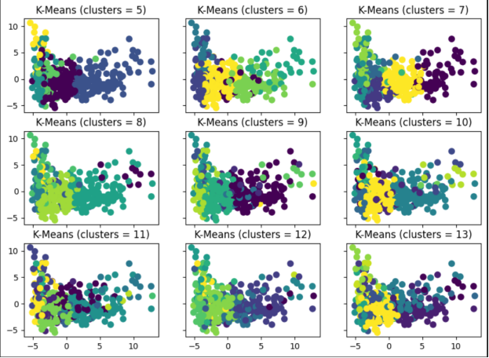
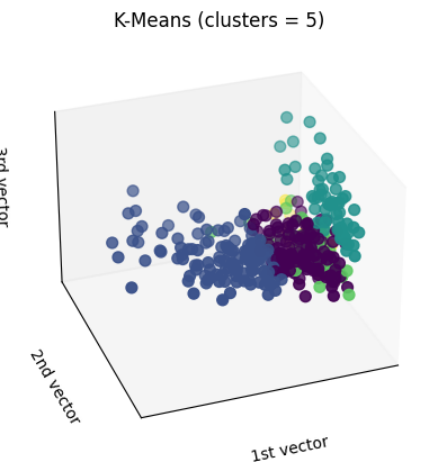
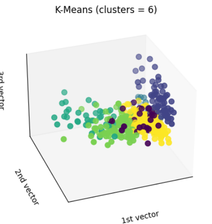
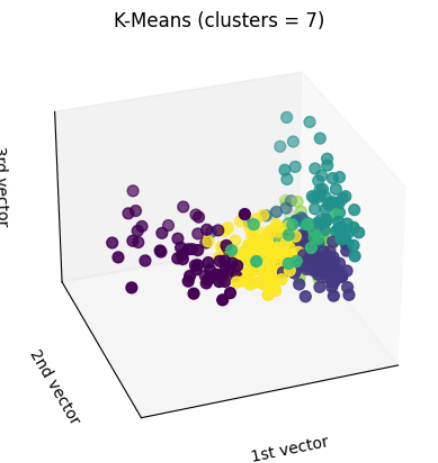
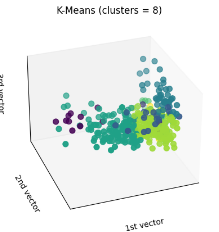
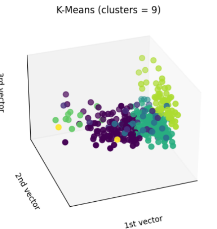
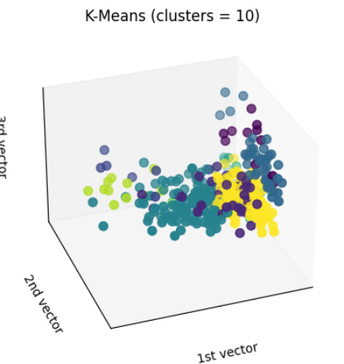
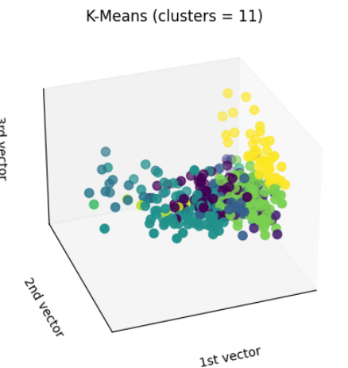
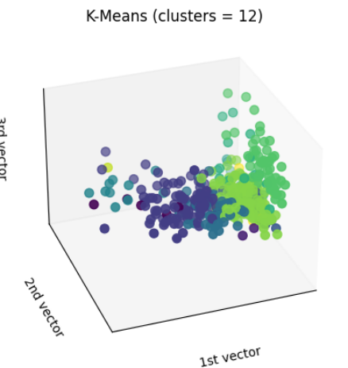
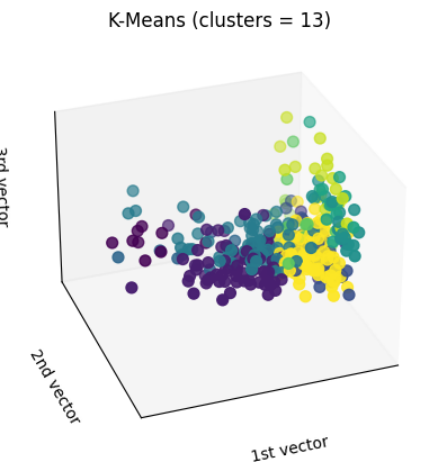

# 一、选题背景：

信息时代的大数据潮流带来了数据量的巨大增长，使数据分析和挖掘成为解决实际问题、获取有价值信息的核心手段。在其中，对文本数据的处理与分析显得尤为重要，涉及理解用户行为、挖掘潜在信息、进行情感分析等关键领域。然而，由于文本数据的高维度和复杂性，迫切需要高效处理和分析方法。

当前大数据时代的重要课题之一是如何充分利用文本数据进行聚类分析、特征提取、降维和可视化。这些技术能够帮助发现文本数据中的潜在模式和关联，提高文本数据的表达能力，简化高维度数据的复杂性，使分析结果更加直观易懂。

本实验选题旨在探索文本数据处理与分析的方法，借助CountVectorizer、TfidfVectorizer、KMeans聚类算法、主成分分析（PCA）等工具，对文本数据进行特征提取、聚类分析和可视化展示。旨在从实际文本数据中挖掘有价值信息，为解决实际问题提供强有力的支持

# 二、实验目的及要求

### 基本要求：
1. 将文本转化为向量，实现或调用无监督聚类算法，对论文聚类，例如10类（可使用已有工具包例如sklearn）；
2. 观察每一类中的论文，调整算法使结果较为合理；
3. 无监督聚类没有标签，效果较难评价，因此没有硬性指标，跑通即可，主要让大家了解和感受聚类算法，比较简单。

### 扩展要求：
1. 对文本向量进行降维，并将聚类结果可视化成散点图。
注：group和topic也不能完全算是标签，因为
    1. 有些文章作者投稿时可能会选择某个group/topic但实际和另外group/topic也相关甚至更相关；
    2. 一篇文章可能有多个group和topic，作为标签会出现有的文章同属多个类别，这里暂不考虑这样的聚类；
    3. group和topic的取值很多，但聚类常常希望指定聚合成出例如5/10/20类；
    4. 感兴趣但同学可以思考利用group和topic信息来量化评价无监督聚类结果，不作要求。

# 三、实验原理
1. **CountVectorizer和TfidfVectorizer**：
   - **算法原理：** CountVectorizer用于将文本数据转换为词频矩阵，而TfidfVectorizer则转换为TF-IDF矩阵。它们通过统计文本中词语的出现频率，构建特征矩阵来表示文本数据。
   - **应用：** 用于文本数据的特征提取，常用于文本挖掘和自然语言处理。

2. **KMeans聚类算法**：
   - **算法原理：** KMeans是一种无监督学习算法，通过迭代优化样本点与簇中心的距离，将样本划分为K个簇，使得簇内的样本相似度高，簇间的相似度低。
   - **应用：** 用于数据聚类，将相似的样本划分为同一簇。

3. **主成分分析（PCA）**：
   - **算法原理：** PCA通过线性变换将原始数据映射到新的坐标系，选择最重要的主成分来表示数据，以达到降维的目的。
   - **应用：** 用于数据降维，去除冗余信息，保留主要特征。

4. **Matplotlib**：
   - **库功能：** 用于绘图和可视化，包括折线图、散点图、柱状图等。
   - **应用：** 在数据分析和机器学习中，用于可视化分析结果。

这些算法和库的组合在你的代码中用于文本数据处理、聚类分析以及可视化展示。

# 四、代码（代码附有ipynb文件）结果展示：

</img>
</img>
</img>
</img>
</img>
</img>
</img>
</img>
</img>
</img>