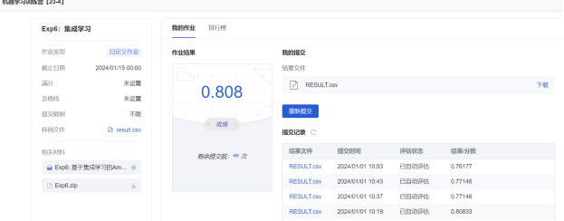

# 一、选题背景：
随着电商平台的兴起，以及疫情的持续影响，线上购物在我们的日常生活中扮演着越来越重要的角色。在进行线上商品挑选时，评论往往是我们十分关注的一个方面。然而目前电商网站的评论质量参差不齐，甚至有水军刷好评或者恶意差评的情况出现，严重影响了顾客的购物体验。因此，对于评论质量的预测成为电商平台越来越关注的话题，如果能自动对评论质量进行评估，就能根据预测结果避免展现低质量的评论。本案例中我们将基于集成学习的方法对 Amazon 现实场景中的评论质量进行预测。

# 二、实验目的及要求
本案例中需要大家完成两种集成学习算法的实现（Bagging、AdaBoost.M1），其中基分类器要求使用 SVM 和决策树两种，因此，一共需要对比四组结果（AUC 作为评价指标）：
- Bagging + SVM
- Bagging + 决策树
- AdaBoost.M1 + SVM
- AdaBoost.M1 + 决策树
注意集成学习的核心算法需要手动进行实现，基分类器可以调库。

*基本要求*
- 根据数据格式设计特征的表示
- 汇报不同组合下得到的 AUC
- 结合不同集成学习算法的特点分析结果之间的差异
- （使用 sklearn 等第三方库的集成学习算法会酌情扣分）

*扩展要求*
- 尝试其他基分类器（如 k-NN、朴素贝叶斯）
- 分析不同特征的影
- 分析集成学习算法参数的影响

# 三、实验原理
### 1. Bagging + SVM
Bagging (Bootstrap Aggregating) 是一种集成学习算法，通过训练多个模型并将它们的预测结果进行综合来提高预测的准确性。在 Bagging 中，每个模型是通过利用自助采样 (bootstrap sampling) 从原始数据集中随机选择一部分样本得到的，这样每个模型都会有一些不同的训练数据。

这种算法的目的是通过集成多个 SVM 模型的预测结果，来降低单个模型的预测误差，提高分类的准确性。

### 2. Bagging + 决策树
Bagging + 决策树是一种使用 Bagging 算法集成决策树模型的方法。在这种算法中，先通过自助采样从原始数据集中随机选择一部分样本得到多个训练集，然后每个训练集分别用于训练一个决策树模型。

Bagging + 决策树的优点是可以减少决策树模型的方差，提高预测的稳定性和准确性。

### 3. AdaBoost.M1 + SVM
AdaBoost.M1 (Adaptive Boosting) 是一种集成学习算法，通过加权多个模型的预测结果来提高预测的准确性。在 AdaBoost.M1 中，每个模型的训练样本在每一轮迭代时都会根据前一轮的错误率被重新加权。

在预测时，将测试样本输入到每个迭代得到的 SVM 模型中，并根据模型权重综合每个模型的预测结果，得到最终的预测结果。

### 4. AdaBoost.M1 + 决策树
AdaBoost.M1 + 决策树是一种使用 AdaBoost.M1 算法集成决策树模型的方法。在这种算法中，每一轮迭代根据前一轮的错误率对样本进行加权，然后使用加权后的样本训练一个决策树模型。

AdaBoost.M1 + 决策树的优点是可以通过迭代的方式逐渐减少错误样本的权重，提高模型对错误样本的关注度，从而提高预测的准确性。

# 三、代码（代码附有ipynb文件）结果展示例

</img>

四种模型表现值均大于0.75

从本次实验的评估标准来看表现最优的模型是Bagging+SVM

