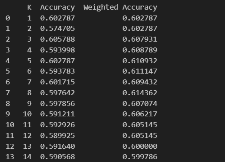
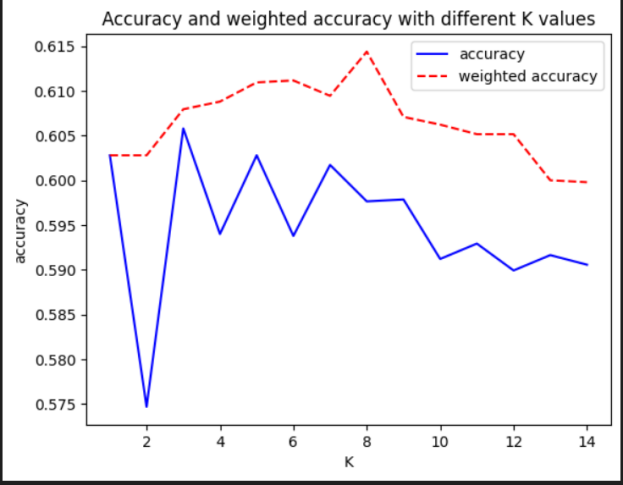

# 一、选题背景：
图像的智能处理一直是人工智能领域广受关注的一类技术，代表性的如人脸识别与 CT 肿瘤识别，在人工智能落地的进程中发挥着重要作用。其中车牌号识别作为一个早期应用场景，已经融入日常生活中，为我们提供了诸多便利，在各地的停车场和出入口都能看到它的身影。车牌号识别往往分为字符划分和字符识别两个子任务，本案例我们将关注字符识别的任务，尝试用 K-NN 的方法对分割好的字符图像进行自动识别和转化。

# 二、实验目的及要求
基本要求
- 完成数据的读入和表示，将图片表示成向量并和 label 对应上；
- 构建 K-NN 模型（可调库）对测试集中的图片进行预测并计算准确率；
- 分析当 K 取不同值时测试准确率的变化。

扩展要求
- 分析不同距离度量方式对模型效果的影响；
- 对比平权和加权 K-NN 的效果；

分析训练集大小对测试结果的影响。

# 三、实验原理
K-最近邻（K-NN）算法是一种基于实例的监督学习算法，用于分类和回归任务。在车牌号识别中，K-NN算法可以用于字符识别的任务。以下是K-NN实现车牌号的原理：

*数据表示：*
图像数据被转换为特征向量。每个字符图像被展平成一个一维数组，每个元素表示像素的强度或颜色值。这样，每个字符图像都可以被表示为一个特征向量。

*训练阶段：*
训练阶段首先需要准备带有标签的训练集。对于车牌号识别，每个字符图像都有对应的标签，即字符的类别。训练集中的字符图像和标签被用来构建K-NN模型。

在训练阶段，K-NN算法实际上只是将训练集存储在内存中，不进行显式的模型训练。模型的"训练"过程仅仅是将训练集加载到内存中以便后续的预测。

*预测阶段：*
当有新的字符图像需要识别时，K-NN算法首先计算该图像与训练集中所有样本的距离。距离可以使用不同的度量方式，如欧氏距离或曼哈顿距离。
然后，选择距离最近的K个训练样本，根据它们的标签进行投票（对于分类任务）。如果是回归任务，可以取K个样本的平均值。
最终，预测结果即为K个样本中投票最多的类别。

*参数K的选择：*
参数K表示选择多少个最近邻居。选择合适的K值对于模型性能至关重要。较小的K值可能导致模型对噪声敏感，而较大的K值可能导致模型对决策边界的过度平滑。

*加权K-NN：*
在加权K-NN中，对于预测结果的投票进行加权，距离更近的样本具有更大的权重。这可以提高对于距离近的样本更加重要的情况的处理能力。
总体而言，K-NN通过计算相似度或距离来寻找最近的邻居，利用邻居的标签进行预测，是一种简单而有效的分类和回归方法。在车牌号识别中，它可以用于识别字符图像的类别。

# 三、代码（代码附有ipynb文件）结果展示与分析：

</img>

</img>

