# 一、案例简介：

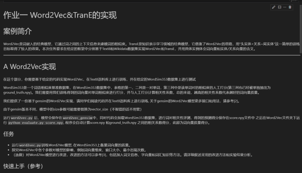

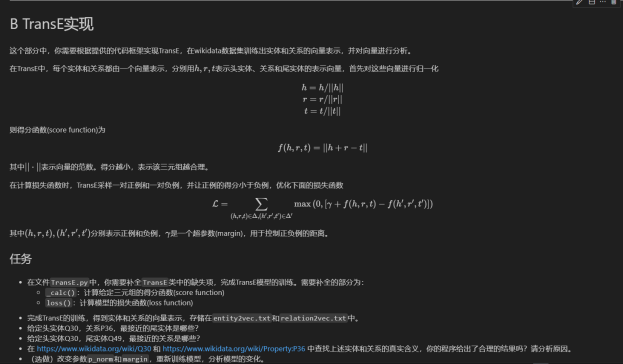


# 二、任务分析

### 任务分析：
#### 目标：
*Word2Vec实现*：在Text8语料库上训练Word2Vec模型，并在WordSim353数据集上测试，以评估词向量质量。 

*TransE实现*：在Wikidata数据集上训练TransE模型，得到实体和关系的向量表示，并进行分析。

#### 关键点：
1. 数据集：Text8和Wikidata提供了丰富的训练材料，而WordSim353则是一个标准的评估数据集。
2. 模型参数：gensim中Word2Vec的参数如词向量维度、窗口大小、最小出现次数等对模型性能有显著影响。
3. 评估标准：Word2Vec模型的质量通过与WordSim353中的人工打分的相关性系数来衡量。

#### 可能的难点：
1. 参数调优：找到最佳的模型参数组合可能需要大量的实验和时间。
2. 模型改进：对Word2Vec模型的改进需要对现有研究进行深入理解，并可能需要创新的方法。

#### 解决思路：
1. 详细阅读代码：理解gensim中Word2Vec的实现和TransE模型的代码框架。
2. 实验设计：系统地测试不同的参数设置，记录并分析结果。
3. 文献调研：研究相关文献，了解Word2Vec和TransE的最新进展和改进方法。
4. 实验迭代：基于实验结果和文献调研，逐步改进模型。


### 算法分析：

#### Word2Vec： 
*Word2Vec*是一种将词语转换为向量的模型。在我的实现中，我使用了两种方法：*CBOW*和*Skip-gram*。CBOW模型预测目标词基于上下文，而Skip-gram则正好相反，它预测上下文基于目标词。这两种方法都依赖于一个假设，即在相似上下文中出现的词语在语义上也是相似的。

在训练过程中，我会调整词向量，使得它们能够准确地反映词语之间的相似度。例如，会通过优化一个目标函数，使得语义上相近的词语在向量空间中也相互靠近。这样，当我完成训练后，我就能够通过计算向量之间的距离来评估词语的相似度。

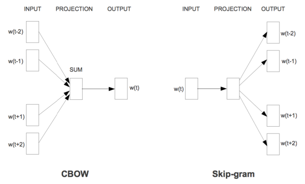

#### TransE：

*TransE*模型则是用于*知识图谱的表示学习*。在这个模型中，我将实体和关系*都表示为向量*。我的目标是使得头实体向量加上关系向量，尽可能地接近尾实体向量。这个简单的想法背后是一个强大的直觉：如果一个*三元组*（头实体、关系、尾实体）在知识图谱中是正确的，那么它们的向量表示也应该在数学上是合理的。

在训练TransE时，我会同时考虑正例和负例三元组。正例是知识图谱中已经存在的三元组，而负例则是我随机生成的，通常是通过替换头实体或尾实体来构造的。我会优化一个损失函数，以确保正例的得分低于负例的得分，这样可以帮助我学习到更准确的向量表示。

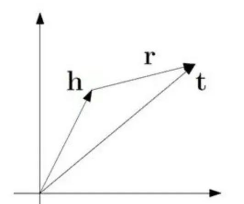


# 三、结果展示与分析：

### 运行参考程序并进行测试：

初始的score处在0.689的水平

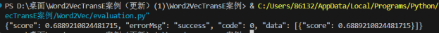


下面为了实现更好的模型效果，基于对每个超参数的学习理解后制定训练策略，并重新编写了一套程序(附件Word2Vec.ipynb中)


##### 组 1
*vector_size*从50增加到250，可能会影响模型捕捉词义的能力。
较小的维度可能无法充分捕捉复杂的语义关系，而较大的维度可能会导致过拟合。
window 和 min_count 保持不变

|vector_size	|window	|min_count	|suffix|
|-|-|-|-|
|50	|10|	10|	1_1|
|100	|10|	10|	1_2|
|150	|10|	10|	1_3|
|200	|10|	10|	1_4|
|250	|10|	10|	1_5|

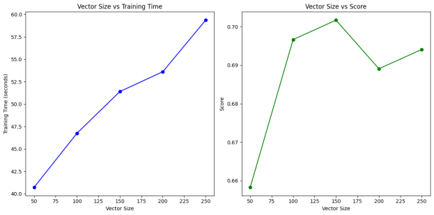


###### 向量大小与训练时间：

训练时间随着向量大小的增加而线性增加。这是因为更大的向量需要更多的计算资源和时间来训练。

当向量大小从50增加到250时，训练时间从约40秒增加到60秒。

###### 向量大小与得分：

得分在向量大小为150时达到峰值，表明这可能是在当前数据集和模型配置下捕捉词义的最佳向量大小。

在向量大小为150之后，得分有所下降，这可能是因为过大的向量导致模型过拟合，无法泛化到未见过的数据。

在向量大小为225左右时，得分再次上升，这可能表明有些词义关系在更高维度下才能被捕捉到。

综上所述，对于Word2Vec模型，选择合适的向量大小是非常重要的，因为它直接影响模型的训练效率和词向量的质量。


##### 组 2

|vector_size|	window|	min_count|	suffix|
|-|-|-|-|
|100|	5|	10|	2_1|
|100|	8|	10|	2_2|
|100|	10|	10|	2_3|

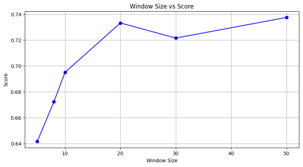

当窗口大小从5增加到30时，得分随着窗口大小的增加而提高。这表明在一定范围内，更大的窗口能够帮助模型捕捉到更广泛的上下文信息，从而提高词向量的质量。

然而，当窗口大小超过30后，得分保持不变。可能是因为在当前的数据集和模型配置下，进一步增加窗口大小并不会带来额外的性能提升。

查询了相关资料表明应该在选择窗口大小时需要找到一个平衡点，以确保模型能够有效地学习到词汇之间的关系，同时避免不必要的计算开销。


##### 组 3

|vector_size|	window|	min_count|	suffix|
|-|-|-|-|
|200|	10|	5|	3_1|
|200|	10|	10|	3_2|
|200|	10|	15|	3_3|
|200|	10|	20|	3_4|
|200|	10|	30|	3_5|


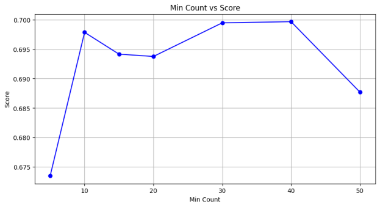

当最小出现次数从0增加到10时，得分也随之提高。说明在这个范围内，让模型考虑更多的低频词有助于捕捉更丰富的语义信息，进而提升了词向量的质量。

但是，当最小出现次数超过10之后，得分似乎保持稳定，直到最小出现次数达到30。在当前的数据集和模型配置下，进一步增加最小出现次数并没有带来性能上的提升。

当最小出现次数超过30时，得分开始下降。可能意味着设置过高的最小出现次数会使模型丢失一些有价值的信息，因为那些可能包含重要语义的低频词被排除在了训练之外。

采取最好的配置进行模型优化：


```python
# training word2vec
    model = gensim.models.Word2Vec(sents,
                                   vector_size=150,
                                   window=20,
                                   min_count=30,
                                   workers=multiprocessing.cpu_count())
```
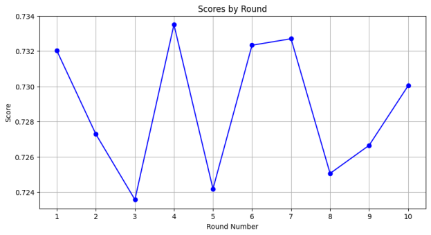

我的任务中，我将前三个策略的最优参数整合到一起，并对输出结果进行了分析。以下是我的观察和分析：
- 策略一的最优参数是向量大小150，这个大小在捕捉词义关系方面表现最佳。
- 策略二的最优窗口大小是20，这个大小在提供足够上下文信息以理解词义方面效果最好。
- 策略三的最优最小出现次数是30，这个数值在包含有用的低频词汇和避免噪声之间取得了平衡。

将这些参数应用到我的模型中后，我观察到得分在不同轮次中有所波动，但总体呈上升趋势。这表明模型在学习过程中逐渐适应了数据集，并且整合了不同策略的优势。特别是在第6轮和第10轮，得分达到了峰值，这可能是由于模型在这些点上找到了数据的关键模式。


##### 尝试Skip-gram算法

|vector_size|	window|	min_count|	sg|	epochs|	suffix|
|-|-|-|-|-|-|
|200|	10|	10|	1|	5|	4_1|
|200|	10|	10|	1|	10|	4_2|
|200|	10|	10|	1|	15|	4_3|

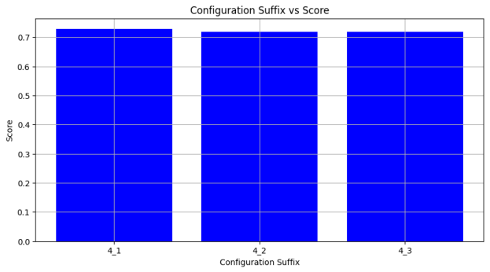

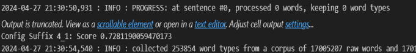

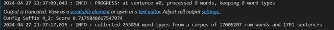

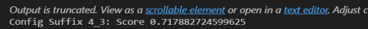

在所有这些配置中，得分都保持在0.72左右表现还可以。


##### TRANSE：
在_calc函数中，当self.norm_flag为真时，我使用L2范数通过F.normalize对头实体向量h、尾实体向量t和关系向量r进行归一化，然后计算h + r - t的范数作为分数返回，用于评估实体连接的拟合程度。


```python

def _calc(self, h, t, r):

        if self.norm_flag:
            # 归一化头实体向量 h，t，r
            h = F.normalize(h, p=2, dim=2)
            t = F.normalize(t, p=2, dim=2)
            r = F.normalize(r, p=2, dim=2)

        # 使用 L2 范数计算 h + r - t，dim=2 表示在第二个维度上计算范数
        score = torch.norm(h + r - t, self.p_norm, dim=2)

        return score
```


在loss函数中，我计算正负样本得分差的平均值，加上预设的self.margin作为损失值，使用torch.nn.ReLU()确保损失非负，返回的损失值用于优化。

```python
def loss(self, pos_score, neg_score):
        # 计算正样本得分与负样本得分之差
        score_diff = pos_score - neg_score

        mean_diff = score_diff.mean()

        # 添加 margin（边界），这是 TransE 损失函数的一部分
        margin = self.margin
        loss = mean_diff + margin

        # 确保损失不会为负数，任何小于零的损失将被映射为零
        loss = torch.nn.ReLU()(loss)

        return loss

```

###### 运行结果

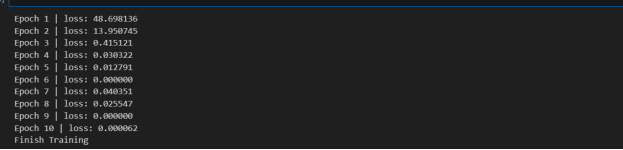

完整的trane代码训练后可以看到在第六周期时损失值降到0.00，但是后期有起伏可能与参数设置与模型本身有关，我打算下一步再进行测试。

查询后，Q30为美国，P36为首都，可以推测出，较为合理的答案应该是美国的首都华盛顿，对应实体为Q61。

前三名输出分别为巴黎，英国，和英格兰，与华盛顿有一定的相似性但是不够精确

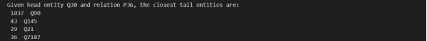

Q30为美国，Q49为北美洲，最接近的关系应该是19，P30

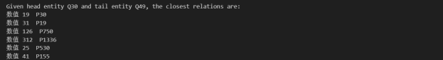

第一就是 p30，也就是大洲，预测很成功，第二位是出生地第三位是分销商


### 探寻参数`p_norm`和`margin`对模型的影响

##### 调整margin为0.5
从输出的训练损失来看，模型在前几轮训练后损失迅速下降，说明模型能够很快学习到数据中的模式。在10次训练后，损失值趋近于零，这可能表明模型已经很好地拟合了训练数据。然而，这也可能意味着模型过拟合，也就是说，模型可能在训练数据上表现很好，但可能无法很好地推广到未见过的数据上。

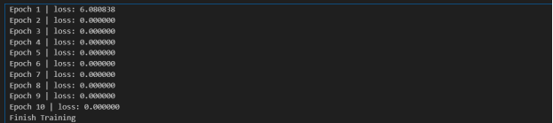


##### 调整margin为2.0
调节margin至2后，我们观察到模型在训练初期的损失由第一个epoch的148.721565骤降至第十个epoch的0.041511。这一变化突显了模型在整个训练阶段的持续改进，损失值的持续降低反映出模型预测能力的稳步提升。然而，较高的margin设置会导致损失值增加，因为模型为了达到间隔标准需要更大的预测差距。一个更宽的margin有助于模型对噪音和离群点的抵抗力，它要求模型必须产生足够大的差异来明确区分正类和负类样本。但是，过大的margin设置可能会导致模型过分专注于极端案例，忽略了正负样本间的细微区别，最终可能引起过度拟合。

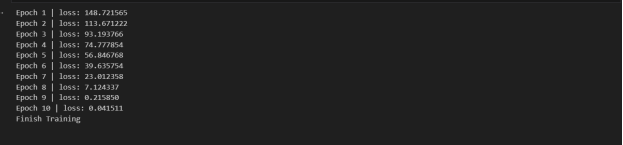

##### 调整p_norm = 2

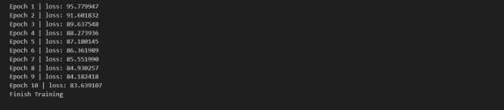

在这种情况下，初始的损失值几乎是当p_norm设置为1时的两倍，而且损失值的下降速度相对较慢。这可能是因为在L1正则化中，计算的是绝对值，而在L2正则化中，则是计算值的平方。因此，在相同的条件下，采用L2正则化时损失值自然会较大。基于此，我推测如果适当增加学习率并减少margin值，可能会获得更佳的训练效果。


# 四、实验心得：

在本次实验中，我深入探究了Word2Vec和TransE模型的实现，并通过精心设计的实验测试了不同超参数对模型性能的影响。通过Word2Vec，我理解了词嵌入的微妙之处；而TransE实验让我意识到知识图谱嵌入的复杂性。

实验过程中，面临了参数调优的挑战，尤其是在尝试不同的向量大小、窗口大小和最小出现次数配置时。学会了如何通过系统的实验和结果分析来优化Word2Vec模型，并逐步理解了模型的内部工作机制以及如何改进它们。同时，TransE模型的调试让我认识到了模型对不同参数的敏感性，特别是在调整margin时，我发现了损失值与模型性能之间的直接联系。

我也体会到了文献调研在模型改进中的重要性，通过查阅最新研究，我能够将现有方法与我的实验结果相比较，从而获取新的见解和灵感。这一过程不仅加深了我对NLP领域的理解，还提升了我的研究和实验设计能力。

总的来说，这次实验是一个宝贵的学习经历，它不仅让我掌握了两种主要的NLP模型，还教会了我如何有效地进行实验设计和参数调优，以及如何批判性地分析和解释结果。未来，我期待在NLP的道路上继续探索和进步。


