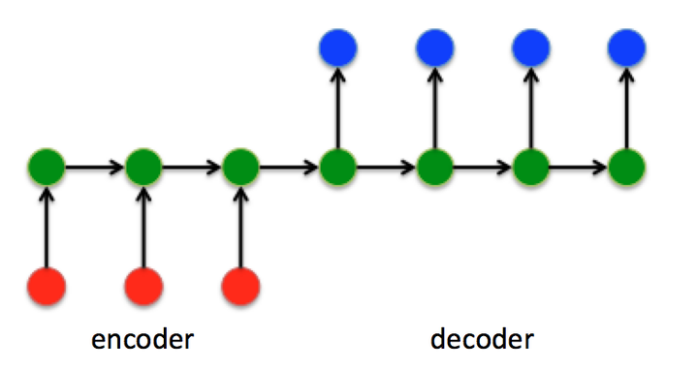
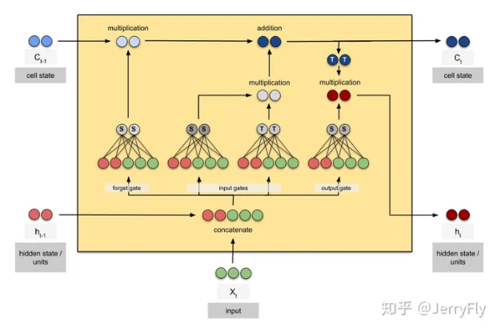
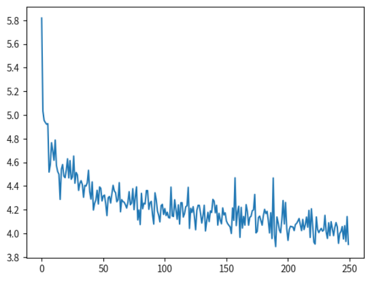

# 一、案例简介：


# 二、任务分析


### 任务分析：

##### 项目目标：
本项目旨在建立一个能够将中文文本翻译成英文文本的机器翻译系统。这需要理解和应用seq2seq模型，这是一种强大的神经网络架构，适用于处理序列到序列的任务，比如机器翻译。


##### 任务关键点：
1. 理解seq2seq架构：seq2seq模型由编码器和解码器两部分组成，都可以采用RNN、GRU或LSTM等递归神经网络结构。
2. 数据预处理：需要对提供的中英文本数据进行预处理，包括文本清洗、分词、编码等，为模型训练做好准备。
3. 模型训练：使用处理好的数据对seq2seq模型进行训练，调整参数以获得最佳性能。
4. 评测和测试：通过提供的测试数据集评测模型性能，并根据结果进行优化。

##### 可能的难点：

1. 序列长度不一：输入和输出序列的长度不同，这对模型的设计提出了挑战。
2. 上下文依赖：翻译质量高度依赖于上下文，需要模型能够有效捕捉长距离依赖。
3. 资源需求：训练有效的神经网络模型通常需要大量的计算资源和时间。

- Word2Vec实现：在Text8语料库上训练Word2Vec模型，并在WordSim353数据集上测试，以评估词向量质量。 
- TransE实现：在Wikidata数据集上训练TransE模型，得到实体和关系的向量表示，并进行分析。

##### 关键点：
1. 数据集：Text8和Wikidata提供了丰富的训练材料，而WordSim353则是一个标准的评估数据集。
2. 模型参数：gensim中Word2Vec的参数如词向量维度、窗口大小、最小出现次数等对模型性能有显著影响。
3. 评估标准：Word2Vec模型的质量通过与WordSim353中的人工打分的相关性系数来衡量。

##### 可能的难点：
1. 参数调优：找到最佳的模型参数组合可能需要大量的实验和时间。
2. 模型改进：对Word2Vec模型的改进需要对现有研究进行深入理解，并可能需要创新的方法。

##### 解决思路：
1. 详细阅读代码：理解gensim中Word2Vec的实现和TransE模型的代码框架。
2. 实验设计：系统地测试不同的参数设置，记录并分析结果。
3. 文献调研：研究相关文献，了解Word2Vec和TransE的最新进展和改进方法。
4. 实验迭代：基于实验结果和文献调研，逐步改进模型。


### 算法分析：

##### Seq2Seq模型： 
*Seq2Seq*模型是一种*序列到序列*的模型，通常用于机器翻译、文本摘要等任务。它包括两个主要部分：编码器（Encoder）和解码器（Decoder）。编码器负责将输入序列转换成一个固定长度的向量，解码器则负责将这个向量转换回一个输出序列。Seq2Seq模型可以通过引入注意力机制（Attention）来提高性能，使模型能够在解码时关注到编码器中不同部分的信息。



##### GRU算法
 Gated Recurrent Unit（GRU）是一种循环神经网络（RNN）的变体，用于解决标准RNN在处理长序列数据时容易出现的梯度消失问题。GRU通过引入更新门（Update Gate）和重置门（Reset Gate）来控制信息的流动，从而能够捕捉到长距离的依赖关系。


##### LSTM算法
Long Short-Term Memory（LSTM）是另一种RNN的变体，专门设计来解决长期依赖问题。LSTM通过引入三个门：输入门（Input Gate）、遗忘门（Forget Gate）和输出门（Output Gate），来精细地控制信息的保留和遗忘。



##### 注意力机制 
注意力机制（Attention Mechanism）是一种让模型在处理数据时能够关注到更重要部分的技术。在NLP中，注意力机制通常用于加强模型对序列中某些关键信息的关注，如在翻译任务中关注与当前翻译词汇最相关的输入词汇。


##### Transformer模型
这是自己写的一篇transformer实践文章

http://t.csdnimg.cn/bzhZD

Transformer是一种基于自注意力机制的模型架构，它完全摒弃了传统的循环层，仅通过注意力机制来处理序列数据。Transformer模型由编码器和解码器组成，每个部分都包含多个相同的层，每层都有自注意力和前馈神经网络。这种结构使得Transformer能够并行处理数据，大大提高了训练效率。


任务完成规划与思路

1. 初步实现：首先实现一个基本的seq2seq模型，使用RNN或LSTM作为编码器和解码器。
2. 评估和改进：通过测试数据集评估模型性能，尝试初级改进方法，如替换成GRU、使用双向编码器、超参数调优等。
3. 进一步优化：在模型表现有所提升后，进一步引入注意力机制和预训练词向量来提高翻译质量。
4. 尝试先进技术：根据资源允许的情况，尝试将模型架构替换为Transformer，进行更复杂的改进尝试，如beam search技术。

通过上述分析和规划，我计划逐步推进项目，从基础的seq2seq模型开始，逐步引入改进技术，最终实现一个高效且准确的中英翻译系统。
 

# 三、结果展示与分析：

运行参考程序并进行测试：

可以看到loss值最终4上下浮动，再看翻译的效果原始代码的翻译效果几乎没有，RNN 在这次文本翻译中表现较差主要因其难以捕捉长期依赖性、容易出现梯度问题、记忆容量有限、缺乏并行性。




引入Jieba分词：

```python
import jieba

class Lang:
    def index_words(self, sentence):
        if self.name == 'cn':
            # 使用Jieba分词处理中文文本
            sentence = jieba.cut(sentence, cut_all=False)
            for word in sentence:
                self.index_word(word)
        else:
            for word in sentence.split(' '):
                self.index_word(word)

```


划分验证集：

```python
# 划分训练集，验证集
def split_data(pairs, test_size=0.1):
    train_pairs, val_pairs = train_test_split(pairs, test_size=test_size, random_state=42)
    return train_pairs, val_pairs

# 保存数据到文件
def save_data(pairs, file_path):
    with open(file_path, 'w', encoding='utf-8') as f:
        for pair in pairs:
            f.write('\t'.join(pair) + '\n')

# 定义文件路径
data_file_path = '/home/mw/input/cna8958/cn-eng.txt'  # 替换为你的数据文件路径
train_file_path = 'cn-eng-train.txt'
val_file_path = 'cn-eng-val.txt'

# 读取和划分数据
pairs = read_data(data_file_path)
train_pairs, val_pairs = split_data(pairs)

# 保存训练集和验证集
save_data(train_pairs, train_file_path)
save_data(val_pairs, val_file_path)

```


训练集文件


验证集文件：


改进1
LSTM
采取原始配置进行训练，loss值降到3.1左右相比原始模型有明显的提升，测试集上的bleu得分为0.064，再看翻译的文本效果，总体来看看出模型的效果并不佳。


改进2：
GRU
采取GRUloss值降低到了2.8，bleu得分0.753并且从翻译的结果来看，GRU的翻译效果比较合理。


改进3：双向LSTM

```python
class BioEncoderLSTM(nn.Module):
    """
    双向LSTM编码器

    Args:
        input_size (int): 输入数据的大小
        hidden_size (int): 隐藏层大小
        n_layers (int): LSTM层数，默认为1
    """

    def __init__(self, input_size, hidden_size, n_layers=1):
        super(BioEncoderLSTM, self).__init__()

        self.input_size = input_size
        self.hidden_size = hidden_size
        self.n_layers = n_layers

        self.embedding = nn.Embedding(input_size, hidden_size)
        # 设置双向LSTM
        self.lstm = nn.LSTM(hidden_size, hidden_size, n_layers, bidirectional=True)

    def forward(self, word_inputs, hidden):
        seq_len = len(word_inputs)
        # 将输入的词嵌入表示
        embedded = self.embedding(word_inputs).view(seq_len, 1, -1)
        # 使用LSTM处理嵌入表示
        output, hidden = self.lstm(embedded, hidden)
        return output, hidden

    def init_hidden(self):
        # num_directions 设置为2
        num_directions = 2
        hidden = (torch.zeros(self.n_layers * num_directions, 1, self.hidden_size),
                  torch.zeros(self.n_layers * num_directions, 1, self.hidden_size))
        if USE_CUDA:
            hidden = (hidden[0].cuda(), hidden[1].cuda())
        return hidden


class DecoderLSTM(nn.Module):
    """
    LSTM解码器

    Args:
        hidden_size (int): 隐藏层大小
        output_size (int): 输出数据的大小
        n_layers (int): LSTM层数，默认为1
        dropout_p (float): dropout概率，默认为0.1
    """

    def __init__(self, hidden_size, output_size, n_layers=1, dropout_p=0.1):
        super(DecoderLSTM, self).__init__()

        self.hidden_size = hidden_size
        self.output_size = output_size
        self.n_layers = n_layers
        self.dropout_p = dropout_p

        self.embedding = nn.Embedding(output_size, self.hidden_size)
        self.rnn = nn.LSTM(self.hidden_size, self.hidden_size, n_layers, dropout=dropout_p)
        self.out = nn.Linear(self.hidden_size, output_size)

    def forward(self, word_input, last_hidden):
        # 将输入的词嵌入表示
        word_embedded = self.embedding(word_input).view(1, 1, -1)
        # 使用LSTM处理嵌入表示
        rnn_output, hidden = self.rnn(word_embedded, last_hidden)

        rnn_output = rnn_output.squeeze(0)
        # 输出通过线性层并进行log softmax
        output = F.log_softmax(self.out(rnn_output), dim=1)

        return output, hidden
```


调整学习率0.001：


测试集bleu得分：0.0823


验证集bleu得分0.0677：


训练轮次调整为100000轮损失值约为2.3


验证集结果：BLEU得分 0.1552


测试集评测结果：BLEU得分0.1558


引入注意力机制：


```python
class Attn(nn.Module):
    """
    注意力机制模块

    Args:
        hidden_size (int): 隐藏层大小
        max_length (int): 输入序列的最大长度，默认为 MAX_LENGTH
    """

    def __init__(self, hidden_size, max_length=MAX_LENGTH):
        super(Attn, self).__init__()
        self.hidden_size = hidden_size
        self.max_length = max_length
        self.attn = nn.Linear(self.hidden_size * 2, max_length)
        self.attn_combine = nn.Linear(self.hidden_size * 2, self.hidden_size)

    def forward(self, hidden, encoder_outputs):
        # 计算注意力权重
        attn_weights = F.softmax(
            self.attn(torch.cat((hidden[0], encoder_outputs), 1)), dim=1)

        # 将注意力权重应用到编码器输出
        attn_applied = torch.bmm(attn_weights.unsqueeze(0),
                                 encoder_outputs.unsqueeze(0))

        output = torch.cat((hidden[0], attn_applied[0]), 1)
        output = self.attn_combine(output).unsqueeze(0)

        return output, attn_weights
class AttnDecoderRNN_LSTM(nn.Module):
    """
    带注意力机制的 LSTM 解码器

    Args:
        hidden_size (int): 隐藏层大小
        output_size (int): 输出数据的大小
        n_layers (int): LSTM 层数，默认为 1
        dropout_p (float): dropout 概率，默认为 0.1
        max_length (int): 输入序列的最大长度，默认为 MAX_LENGTH
    """

    def __init__(self, hidden_size, output_size, n_layers=1, dropout_p=0.1, max_length=MAX_LENGTH):
        super(AttnDecoderRNN_LSTM, self).__init__()
        self.hidden_size = hidden_size
        self.output_size = output_size
        self.n_layers = n_layers
        self.dropout_p = dropout_p
        self.max_length = max_length

        self.embedding = nn.Embedding(output_size, hidden_size)
        self.attn = nn.Linear(hidden_size * 2, max_length)
        self.attn_combine = nn.Linear(hidden_size * 2, hidden_size)
        self.dropout = nn.Dropout(dropout_p)
        self.lstm = nn.LSTM(hidden_size, hidden_size, n_layers, dropout=dropout_p)
        self.out = nn.Linear(hidden_size, output_size)

    def forward(self, word_input, hidden, encoder_outputs):
        # 词嵌入表示
        word_embedded = self.embedding(word_input).view(1, 1, -1)
        word_embedded = self.dropout(word_embedded)

        # 计算注意力权重
        attn_weights = F.softmax(
            self.attn(torch.cat((word_embedded[0], hidden[0][0]), 1)), dim=1)
        # 将注意力权重应用到编码器输出
        attn_applied = torch.bmm(attn_weights.unsqueeze(0),
                                 encoder_outputs.unsqueeze(0))

        output = torch.cat((word_embedded[0], attn_applied[0]), 1)
        output = self.attn_combine(output).unsqueeze(0)

        output = F.relu(output)
        output, hidden = self.lstm(output, hidden)

        output = F.log_softmax(self.out(output[0]), dim=1)
        return output, hidden, attn_weights

    def init_hidden(self):
        # 初始化隐藏状态和细胞状态
        hidden = torch.zeros(self.n_layers, 1, self.hidden_size)
        cell = torch.zeros(self.n_layers, 1, self.hidden_size)
        if USE_CUDA:
            hidden = hidden.cuda()
            cell = cell.cuda()
        return (hidden, cell)
```

损失值约为1.6


验证集：BLEU0.1065


测试集结果：BLEU0.223


结果分析汇总：
 
实验结果分析

通过对不同模型和改进方法的实验，对各改进方法的效果进行详细分析。

### 原始RNN模型
训练集损失值：最终浮动在4左右

翻译效果：几乎没有

#### 分析：
RNN在文本翻译中表现较差，主要原因是难以捕捉长期依赖性，容易出现梯度消失问题，记忆容量有限，且缺乏并行性。

### 改进1：LSTM
训练集损失值：降至约3.1

测试集BLEU得分：0.064

-翻译效果：稍有提升，但整体效果不佳


#### 分析：
LSTM相比RNN在捕捉长期依赖性方面有所改进，但初步实现的效果仍不理想，可能由于超参数未优化或数据规模较小。

### 改进2：GRU
训练集损失值：降至约2.8

测试集BLEU得分：0.753

翻译效果：较合理，明显优于LSTM


#### 分析：
GRU在性能上介于RNN和LSTM之间，计算效率较高，且能够较好地捕捉长期依赖性。

在本次实验中，GRU取得了更好的效果，可能与模型简洁性和数据集规模较小有关。

### 改进3：双向LSTM
验证集BLEU得分：

50000轮训练：0.0677

100000轮训练：0.1552


测试集BLEU得分：

50000轮训练：0.0823

100000轮训练：0.1558

训练集损失值：约2.3（100000轮）

#### 分析：
双向LSTM通过引入双向编码器，能够更好地捕捉源语言的上下文信息，显著提升了模型性能。

训练轮次的增加也对模型性能有显著影响，长时间训练使模型在BLEU得分上有了显著提高。

### 改进4：引入注意力机制的LSTM
训练集损失值：约1.6

验证集BLEU得分：0.1065

测试集BLEU得分：0.223

### 分析：
注意力机制允许模型在解码过程中对源句子的不同部分给予不同的关注，进一步提升了翻译的效果。

引入注意力机制的LSTM模型在BLEU得分和翻译效果上均表现出色，尤其是测试集上的得分显著提高。

### 总结
通过实验可以看出，随着模型复杂度的增加和技术的改进，Seq2Seq模型的翻译效果得到了显著提升。具体改进效果如下：

1. 原始RNN：效果较差，难以捕捉长期依赖性。
2. LSTM：较RNN有提升，但效果仍不理想。
3. GRU：取得了较好的翻译效果，损失值降低，BLEU得分显著提升。
4. 双向LSTM：进一步提升了模型性能，长时间训练效果显著。
5. 注意力机制的LSTM：引入注意力机制后，模型性能大幅提升，特别是测试集上的翻译效果显著改善。


# 四、实验心得
因为云平台的截止时间当初设置较晚加上当时恰逢假期和考试，本次实验的战线拉的比较长，有很多细节做的没达到个人预期，实验框架不比我其他项目清晰。

但是后期自己实践了一下transformer框架，中日翻译（链接在transformer那一栏，写的算是比较完整，但是质量肯定不够高老师您有兴趣的话可以看一下。），两个结合感觉收获颇丰，学以致用，最后感谢助教老师的认真批改，辛苦啦！


