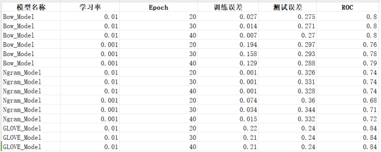
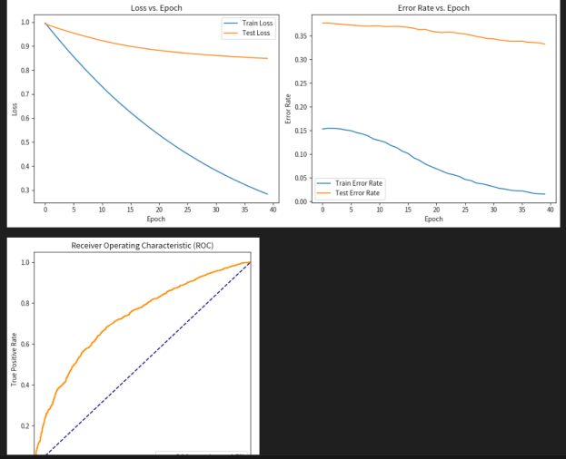

# 一、案例简介 

情感分析通常应用于社交媒体、产品评论、顾客反馈等领域，帮助企业和研究者理解公众情绪或产品的市场反响。本项目以Rotten Tomato的影评数据为基础，训练一个情感分析器，能够区分正面和负面评价。


# 二、任务分析和算法原理


### 项目完成思路
- 数据预处理：首先需要对数据集进行预处理，包括文本清洗（去除特殊字符、停用词等），以及对标签的解析。
- 特征提取：接着，需要从处理过的文本中提取特征。这里可以采用词袋模型、n-gram模型或词向量模型。每种模型都有其优缺点，可以实验哪种模型最适合当前的数据集。
- 模型训练：利用提取的特征和对应的情感标签，训练一个分类器。在本项目中，采用线性分类器，并通过最小化hinge loss来进行训练。
- 模型测试与评估：最后，在测试集上评估模型的性能，分析模型的准确率、召回率等指标，并绘制损失函数下降曲线。

### 关键点与难点
- 特征提取：选择合适的特征提取方法对模型性能影响很大。需要平衡特征的维度和特征的有效性。
- 模型训练：保证模型不过拟合同时，还要有足够的泛化能力，这需要合理的调整模型参数和训练策略。
- 损失函数优化：hinge loss的优化需要合理的梯度下降策略，确保模型能够有效学习。

### 解决方案
对于特征提取，可以尝试多种方法，并通过交叉验证来确定最佳的特征提取方法。

在模型训练过程中，采用正则化技术（如L1、L2正则化）来防止过拟合，并通过早停法等策略优化训练过程。

对于梯度下降函数，可以采用动量法或Adam优化器等高级优化技术，以提高收敛速度和模型性能。

### 算法原理：

##### 词袋模型 (Bag of Words, BoW)
词袋模型是一种将文本转换为数值特征向量的方法。在这个模型中，每个文档可以被表示为一个长向量，这个向量的每一维代表一个独立的词，在整个语料库中共有多少个独立的词，向量就有多少维。每一维的数值则表示该词在文档中出现的次数，或者是该词的重要性（通过TF-IDF计算）。

##### 工作原理
词汇表构建：首先，通过分析所有文档来构建一个词汇表（即所有不重复词项的集合）。这个词汇表包含了语料库中出现的所有独立词。
文档向量化：接着，每个文档都被转换成一个向量，这个向量的长度等于词汇表的大小。对于文档中的每一个词，我们在相应的位置上填充该词在文档中出现的次数（或者其他权重，如TF-IDF）。如果某个词在文档中没有出现，相应的位置就填充0。

##### 特点
- 优点：简单而直观，容易实现，对于很多文本分类任务来说效果不错。
- 缺点：向量的维度可能非常大，导致存储和计算成本高；忽略了词与词之间的顺序和上下文信息，有时这些信息对于理解文本很重要；容易受到高频无关词的干扰。

##### 应用场景
虽然词袋模型比较简单，但它在一些基础的文本处理任务中仍然非常有用，如垃圾邮件分类、情绪分析等。为了缓解一些缺点，经常会与TF-IDF等权重计算方法结合使用，以降低常见词的影响并增强模型的区分能力。

##### 示例
假设我们的语料库只有两个文档：

文档1: "The cat sat on the mat."

文档2: "The dog sat on the log."

构建的词汇表可能是：["the", "cat", "sat", "on", "mat", "dog", "log"]。

那么，文档1和文档2分别转换为向量后如下：

文档1向量: [2, 1, 1, 1, 1, 0, 0] （“the”出现两次，其他词各出现一次）

文档2向量: [2, 0, 1, 1, 0, 1, 1] （同样，“the”出现两次，其他相关词各出现一次）

这样，每个文档就被转换成了一个数值向量

```python
from collections import Counter

def extractFeatures_Bow(x):
    """
    从字符串x中提取特征
    @param string x: 
    @return dict: feature vector representation of x.
    """
    words = x.split()  # 将文本分割成单词列表
    feat = Counter(words)  # 计算各个单词出现的次数
    return dict(feat)
```


##### N-gram 算法
N-gram 是一种基于统计语言模型的算法，用于预测下一个词的出现概率，或者用于文本的其他分析任务。它将文本分割成一系列的N个连续词的组合（称为N-grams），通过分析这些词组的出现频率来理解或预测文本。

##### 工作原理
N-gram的生成：首先，选择一个特定的N值（例如，N=2为bigram，N=3为trigram）。然后，将文本切割成一系列的N个连续词的组合。例如，对于句子“The cat sat on the mat”，其bigrams（2-grams）包括["The cat", "cat sat", "sat on", "on the", "the mat"]。
概率计算：接着，计算每个N-gram在语料库中出现的频率，以及它们相对于它们前面N-1个词出现的条件概率。这些频率和概率用于构建一个语言模型，该模型可以预测下一个词的出现概率。
##### 特点
优点：
- 能够捕捉到一定长度的词序列，从而理解文本中的上下文信息。
- 相对简单易实现，计算效率较高。
在许多NLP任务中表现良好，如语音识别、文本生成、拼写检查等。
缺点：
- 当N值增加时，模型的复杂度急剧上升，因为可能的N-gram组合数量会指数增长。
- 容易受到数据稀疏问题的影响，因为大多数N-gram在实际语料库中可能从未出现过。
- 忽略了N-gram之外的长距离依赖，即上下文信息可能被限制在N个词内。

##### 应用场景
N-gram 模型在自然语言处理领域有广泛应用，包括但不限于：

- 语言模型和文本生成：通过预测下一个词的出现概率来生成文本。
- 语音识别：帮助确定哪个词序列在语音输入中最有可能出现。
- 文本分类和情感分析：通过分析N-gram的出现频率来理解文本的主题或情绪。

##### 示例
假设我们的语料库只有一个句子：“The cat sat on the mat。”，我们使用bigram（2-grams）模型。

生成的bigrams为：["The cat", "cat sat", "sat on", "on the", "the mat"]。

如果我们要计算“on the”的出现概率，我们可以查看“on the”这个bigram在文本中出现的次数，然后除以“on”这个词出现的次数。在这个简单的例子中，“on the”出现了1次，“on”也出现了1次，因此，“on the”的条件概率是1。

通过这种方式，N-gram模型能够根据历史信息预测文本中下一个词的出现概率


```python
from nltk import ngrams
from collections import Counter

def extractFeatures_Ngram(x, n=2):
    """
    从字符串x中提取N-gram特征
    @param string x: 输入的文本
    @param int n: N-gram中N的值
    @return dict: 文本x的特征向量表示
    """
    # 将文本分割成单词列表
    words = x.split()
    # 生成并获取n-grams
    n_grams = ngrams(words, n)
    # 计算n-grams的频率
    feat = Counter(n_grams)
    # 返回特征字典
    return dict(feat)
```

*本次我采用的是Glove模型：*

GloVe（Global Vectors for Word Representation）模型是一种用于学习单词向量表示的无监督学习算法，其核心思想是利用全局的统计信息来学习单词的分布式表示。

*全局统计信息*： GloVe模型利用整个语料库中的全局词汇共现统计信息来学习单词的向量表示。这种方法不仅考虑了上下文窗口内的词共现频率，还利用整个语料库的统计特征。

*共现矩阵*： 首先构建一个词汇表中所有单词的共现矩阵，其中每个元素表示两个单词在给定上下文窗口内共同出现的次数。

损失函数： GloVe模型的损失函数是基于单词对的共现概率比率来定义的，它旨在最大化对数似然函数，以便使得通过向量点积计算的条件概率尽可能接近实际的共现概率。

*向量表示*： 学习得到的单词向量表示反映了单词之间的语义和语法关系，例如，语义相近的单词在向量空间中距离较近，而语法上相关的单词在向量空间中也有类似的表现。

*优化*： GloVe模型通过梯度下降等优化算法来调整单词的向量表示，以最小化损失函数，从而得到最优的单词向量表示。


```python
import numpy as np
import collections
import matplotlib.pyplot as plt
from sklearn.metrics import roc_curve, auc

def load_glove_model(glove_file):
    print("Loading GloVe model...")  # 打印加载GloVe模型的信息
    glove_model = {}
    with open(glove_file, "r", encoding="utf-8") as f:
        for line in f:
            split_line = line.split()
            word = split_line[0]
            embedding = np.array(split_line[1:], dtype=float)
            glove_model[word] = embedding
    print(f"Loaded {len(glove_model)} words from GloVe model.")  # 打印加载的词汇量
    return glove_model

def extractFeatures_glove(x, glove_model, embedding_dim):
    words = x.split()  # 将文本分割为单词
    feature_vector = np.zeros(embedding_dim)  # 初始化特征向量为全零向量
    valid_words = 0
    for word in words:
        if word in glove_model:
            feature_vector += glove_model[word]  # 如果单词在GloVe模型中存在，将其向量加到特征向量中
            valid_words += 1
    if valid_words > 0:
        feature_vector /= valid_words  # 计算平均特征向量
    return feature_vector

def extractFeatures(x, glove_model, embedding_dim):
    feature_vector = extractFeatures_glove(x, glove_model, embedding_dim)  # 提取文本特征向量
    return {i: feature_vector[i] for i in range(len(feature_vector))}  # 返回特征向量的字典表示

def dotProduct(d1, d2):
    if len(d1) < len(d2):
        return dotProduct(d2, d1)  # 保证d1是较大的字典
    else:
        return sum(d1.get(f, 0) * v for f, v in d2.items())  # 计算点积

def readExamples(path):
    examples = []
    for line in open(path, encoding="ISO-8859-1"):
        y, x = line.split(' ', 1)  # 分割标签和文本内容
        examples.append((x.strip(), int(y)))  # 添加到例子列表中，去除首尾空格并转换标签为整数
    print(f'Read {len(examples)} examples from {path}')  # 打印读取的例子数量和路径
    return examples

def evaluatePredictor(examples, predictor):
    error = 0
    for x, y in examples:
        if predictor(x) != y:
            error += 1
    return 1.0 * error / len(examples)  # 计算误差率

def learnPredictor(trainExamples, testExamples, featureExtractor, glove_model, embedding_dim, numIters, eta):
    weights = collections.defaultdict(float)  # 初始化权重为默认字典
    trainErrors = []
    testErrors = []
    trainLosses = []
    testLosses = []

    for i in range(numIters):
        totalTrainLoss = 0
        totalTestLoss = 0

        for x, y in trainExamples:
            featureVector = featureExtractor(x, glove_model, embedding_dim)  # 提取训练样本的特征向量
            predicted = dotProduct(featureVector, weights)  # 计算预测值
            loss = max(0, 1 - predicted * y)  # 计算hinge loss
            totalTrainLoss += loss
            if loss > 0:
                for feature, value in featureVector.items():
                    weights[feature] += eta * value * y  # 更新权重

        for x, y in testExamples:
            featureVector = featureExtractor(x, glove_model, embedding_dim)  # 提取测试样本的特征向量
            predicted = dotProduct(featureVector, weights)  # 计算预测值
            loss = max(0, 1 - predicted * y)  # 计算hinge loss
            totalTestLoss += loss

        trainError = evaluatePredictor(trainExamples, lambda x: (1 if dotProduct(featureExtractor(x, glove_model, embedding_dim), weights) >= 0 else -1))  # 计算训练误差率
        testError = evaluatePredictor(testExamples, lambda x: (1 if dotProduct(featureExtractor(x, glove_model, embedding_dim), weights) >= 0 else -1))  # 计算测试误差率

        trainErrors.append(trainError)
        testErrors.append(testError)
        trainLosses.append(totalTrainLoss / len(trainExamples))  # 计算平均训练损失
        testLosses.append(totalTestLoss / len(testExamples))  # 计算平均测试损失

        print(f"At iteration {i}, loss on training set is {totalTrainLoss / len(trainExamples)}, loss on test set is {totalTestLoss / len(testExamples)}, error rate on training set is {trainError}, error rate on test set is {testError}")

    plt.figure(figsize=(12, 5))
    plt.subplot(1, 2, 1)
    plt.plot(range(numIters), trainLosses, label="Train Loss")  # 绘制训练损失曲线
    plt.plot(range(numIters), testLosses, label="Test Loss")  # 绘制测试损失曲线
    plt.xlabel("Epoch")
    plt.ylabel("Loss")
    plt.title("Loss vs. Epoch")
    plt.legend()
    plt.subplot(1, 2, 2)
    plt.plot(range(numIters), trainErrors, label="Train Error Rate")  # 绘制训练误差率曲线
    plt.plot(range(numIters), testErrors, label="Test Error Rate")  # 绘制测试误差率曲线
    plt.xlabel("Epoch")
    plt.ylabel("Error Rate")
    plt.title("Error Rate vs. Epoch")
    plt.legend()
    plt.tight_layout()
    plt.show()

    testLabels = [y for _, y in testExamples]
    predScores = [dotProduct(featureExtractor(x, glove_model, embedding_dim), weights) for x, _ in testExamples]  # 计算测试集预测得分

    fpr, tpr, _ = roc_curve(testLabels, predScores)  # 计算ROC曲线的参数
    rocAuc = auc(fpr, tpr)  # 计算ROC曲线下的面积

    plt.figure(figsize=(6, 6))
    plt.plot(fpr, tpr, color='darkorange', lw=2, label=f'ROC curve (area = {rocAuc:.2f})')  # 绘制ROC曲线
    plt.plot([0, 1], [0, 1], color='navy', linestyle='--')
    plt.xlim([0.0, 1.0])
    plt.ylim([0.0, 1.05])
    plt.xlabel('False Positive Rate')
    plt.ylabel('True Positive Rate')
    plt.title('Receiver Operating Characteristic (ROC)')
    plt.legend(loc="lower right")
    plt.show()

    return weights  # 返回学习得到的权重
```

学习与梯度更新

使用随机梯度下降训练分类器模型，监测训练过程中的损失和误差率变化，并绘制测试集上的ROC曲线来评估模型的分类性能。

```python
import collections
import matplotlib.pyplot as plt
from sklearn.metrics import roc_curve, auc

def learnPredictor(trainExamples, testExamples, featureExtractor, numIters, eta):
    '''
    给定训练数据和测试数据，特征提取器|featureExtractor|、训练轮数|numIters|和学习率|eta|，
    返回学习后的权重weights
    你需要实现随机梯度下降优化权重
    '''
    weights = collections.defaultdict(float)  # 初始化权重为默认值为0的字典
    trainErrors = []  # 存储训练误差率
    testErrors = []   # 存储测试误差率
    trainLosses = []  # 存储训练损失
    testLosses = []   # 存储测试损失

    for i in range(numIters):  # 迭代训练 numIters 次
        totalTrainLoss = 0  # 记录训练集总损失
        totalTestLoss = 0   # 记录测试集总损失

        # 在训练集上进行训练
        for x, y in trainExamples:
            featureVector = featureExtractor(x)  # 提取特征向量
            predicted = dotProduct(featureVector, weights)  # 计算预测值
            loss = max(0, 1 - predicted * y)  # 计算损失
            totalTrainLoss += loss  # 累加训练集损失
            if loss > 0:  # 如果存在损失，则更新权重
                for feature, value in featureVector.items():
                    weights[feature] += eta * value * y

        # 在测试集上计算损失
        for x, y in testExamples:
            featureVector = featureExtractor(x)  # 提取特征向量
            predicted = dotProduct(featureVector, weights)  # 计算预测值
            loss = max(0, 1 - predicted * y)  # 计算损失
            totalTestLoss += loss  # 累加测试集损失

        # 计算并记录训练集和测试集的误差率
        trainError = evaluatePredictor(trainExamples, lambda x: (1 if dotProduct(featureExtractor(x), weights) >= 0 else -1))
        testError = evaluatePredictor(testExamples, lambda x: (1 if dotProduct(featureExtractor(x), weights) >= 0 else -1))
        trainErrors.append(trainError)
        testErrors.append(testError)

        # 计算并记录训练集和测试集的平均损失
        trainLosses.append(totalTrainLoss / len(trainExamples))
        testLosses.append(totalTestLoss / len(testExamples))
        # 打印每轮迭代的训练和测试结果
        print("At iteration %d, loss on training set is %f, loss on test set is %f, error rate on training set is %f, error rate on test set is %f" %
              (i, totalTrainLoss / len(trainExamples), totalTestLoss / len(testExamples), trainError, testError))

    plt.figure(figsize=(12, 5))
    # 绘制损失随迭代次数变化的曲线
    plt.subplot(1, 2, 1)
    plt.plot(range(numIters), trainLosses, label="Train Loss")
    plt.plot(range(numIters), testLosses, label="Test Loss")
    plt.xlabel("Epoch")
    plt.ylabel("Loss")
    plt.title("Loss vs. Epoch")
    plt.legend()
    # 绘制误差率随迭代次数变化的曲线
    plt.subplot(1, 2, 2)
    plt.plot(range(numIters), trainErrors, label="Train Error Rate")
    plt.plot(range(numIters), testErrors, label="Test Error Rate")
    plt.xlabel("Epoch")
    plt.ylabel("Error Rate")
    plt.title("Error Rate vs. Epoch")
    plt.legend()

    plt.tight_layout()
    plt.show()

    # 准备数据以绘制ROC曲线
    testLabels = [y for _, y in testExamples]  # 获取测试集标签
    predScores = [dotProduct(featureExtractor(x), weights) for x, _ in testExamples]  # 获取预测分数

    # 计算ROC曲线的参数
    fpr, tpr, _ = roc_curve(testLabels, predScores)
    rocAuc = auc(fpr, tpr)

    # 绘制ROC曲线
    plt.figure(figsize=(6, 6))
    plt.plot(fpr, tpr, color='darkorange', lw=2, label='ROC curve (area = %0.2f)' % rocAuc)
    plt.plot([0, 1], [0, 1], color='navy', linestyle='--')
    plt.xlim([0.0, 1.0])
    plt.ylim([0.0, 1.05])
    plt.xlabel('False Positive Rate')
    plt.ylabel('True Positive Rate')
    plt.title('Receiver Operating Characteristic (ROC)')
    plt.legend(loc="lower right")
    plt.show()

    return weights
```


# 四、结果展示与分析

以下是对各个模型结果汇总之后制作的表格：



*对模型的分析全部保存在了notebook中 *


绘制曲线示例 每一组都有：

Bow


N-Gram




Glove：


