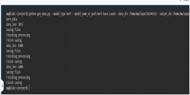

# 一、案例简介：


# 二、任务分析


### 任务分析：
DocRED任务要求模型能够从一篇文档中识别并抽取出实体间的关系。这任务的复杂性在于关系可能跨越多个句子，甚至整个文档。此外，关系类型繁多，确保模型能够准确识别和分类这些关系至关重要。这就是为什么使用BERT这种强大的预训练语言模型，它通过大规模语料学习到的丰富知识有助于我们挖掘文档级的深层语言和关系信息。


### 任务关键点：
1. *数据预处理和格式化*：为了适配BERT模型，需要将原始文档转化为模型可接受的格式。其中涉及对文本的分词、编码，以及特殊符号的插入来标注实体等。
2. *模型构建*：在BERT的基础上构建文档级关系抽取模型。需要添加特定的输出层来预测文档中实体对之间的关系。
3. *训练策略*：包括选择适当的损失函数、优化器、学习率调度策略以及处理潜在的类别不平衡问题等。
4. *性能评估*：通过在开发集上评估模型的性能，并进行必要的模型调优。最终，将模型性能在测试集上进行评估。


### 可能遇到的难点及解决方案：
1. *长文档的处理*：由于BERT有最大序列长度的限制，长文档的处理成为一个挑战。解决方法：可以通过截断、分块处理等技术来处理过长的文档。
2. *资源限制*：BERT及其变体通常需要大量的计算资源。解决方法：可通过减小模型尺寸、使用梯度累积等技术来缓解资源限制。
3. *类别不平衡*：关系抽取任务中常常遇到正负样本不平衡的问题。解决方法：使用损失函数的加权、过采样或欠采样技术来缓解类别不平衡。

### 代码关键点及其分析：
##### 1.gendata.py 分析
*关键点*

1. 数据处理流程中考虑实体位置信息，以及BERT tokenizer的使用。
2. 特别对待关系抽取中的实体对，使用四个额外的符号来标注关系中的实体。
3. 实现的数据预处理适应BERT模型输入格式的需要。

*难点及解决方案*
- *实体标注*：保证标注准确性可能比较棘手。将实体标注为特殊符号并插入原始文本需要精确控制位置信息。解决方案是仔细检查和调试标注逻辑，确保每个实体正确标示和位置准确。
- *Tokenizer的处理*：需要注意处理BERT tokenizer处理长文本时可能出现的问题，如单词被切分等。一个常用的策略是审查tokenizer的输出，确保文本切分和ID转换无误。

##### 2. config.py 分析
*关键点*

1. 封装模型配置和训练/测试过程中的各项参数，提供灵活的模型训练和评估配置。
2. 使用BertModel构建关系抽取的模型框架，并对模型进行自定义适配和增强。
3. 参数管理: config.py提供了一个中央位置来管理与训练、评估相关的参数，这使得实验设置、超参数调优更加有条不紊。
4. 灵活性和可扩展性: 通过参数化模型配置，config.py不仅可用于当前的关系抽取任务，还能够轻松适配于新的任务或模型修改，增强了代码的适用范围和复用性。
5. 集成预训练模型: 明确了如何使用来自transformers库的BertModel或RobertaModel，为关系抽取任务提供强大的语言表示基础。

##### REModel.py 分析
*关键点*

- 模型结构: REModel 定义了关系抽取任务的模型结构。它利用BERT或RoBERTa 作为编码器来获取文本的上下文表示，并通过额外的层（如双线性层）来预测实体对之间的关系。
- 距离编码: 引入了额外的距离编码来捕捉实体对之间的相对位置信息，这对于理解实体之间的关系是有益的。这种编码方式通过距离嵌入（dis_embed）和双线性层来实现。
- 适配BERT表示: 模型使用了BERT的输出，并通过线性层调整尺寸以适配特定任务的需要。这个过程是在 REModel 的 forward 方法中实现的，允许模型通过针对关系抽取进一步处理BERT的上下文表示。

##### train.py 分析
*关键点*

设定了模型训练和评估的主要逻辑，包括模型的初始化、训练循环、保存最优模型等。
引入评估步骤来监控训练过程，使用开发集(dev set)来调整模型参数。

##### test.py 分析
*关键点*

提供了模型测试的脚本，允许加载训练好的模型并在测试集上进行评估。
使用了sklearn库的平均精度分数(average_precision_score)来衡量模型性能。


### 任务完成规划与思路：
1. *详细审查代码*：确保理解每个代码文件的功能和责任，以及它们如何相互作用。
2. *数据准备*：清理、预处理和格式化数据，使其可以直接被模型使用。
3. *模型开发和测试*：构建基于BERT的关系抽取模型，首先在小规模数据上进行测试，确保模型的正确性。
4. *训练和评估*：在完整的数据集上进行模型训练，定期评估模型性能，并进行调优。
5. *结果分析*：对比不同模型结构、不同训练策略和超参数的效果，选择最优配置。
6. *模型检验*：将训练好的模型输出文件上传到Codalab检验。


### 算法分析：
 
#### BERT模型原理;
BERT (Bidirectional Encoder Representations from Transformers)模型是Google在2018年提出的一种预训练语言表示模型。其核心思想在于使用大量无标签文本，在不特定于下游任务的情况下，通过自监督学习（self-supervised learning）的方式预训练出一个通用的语言表示模型。

##### 原理
- Transformer架构: BERT基于Transformer模型，特别是其编码器部分。每个Transformer编码器包含多个编码器层，每层都包含自注意力机制和前馈神经网络。
- 自注意力(Self-Attention): 允许模型在处理每个单词时考虑句子中的其他单词，从而捕获句子内部的依赖关系。这对于理解复杂的语言结构尤其重要。

##### 预训练任务:
- 遮蔽语言模型(Masked LM): BERT随机遮蔽输入句子中的一些token，然后预测这些遮蔽的token，这要求模型理解和推理句子的上下文。
- 下一个句子预测(Next Sentence Prediction): 给定一对句子，模型需要预测第二个句子是否在原文中紧接在第一个句子之后，这有助于模型学习句子间关系。

通过以上方法，BERT能够学到一个深层、丰富的双向表示，对于许多NLP任务来说，这样的表示具有很强的通用性和适应性。

##### 关系抽取任务原理:
关系抽取任务的目的是识别文本中实体之间的语义关系。这种任务通常涉及以下几个步骤：

- 实体识别: 首先，需要在文本中识别出实体。这可以通过命名实体识别(NER)模型实现。
- 关系分类: 然后，对于文本中的实体对，确定它们之间是否存在特定的关系，并识别出这种关系的类别。这通常通过分类模型完成，模型的输入包括实体及其上下文的表示。


# 三、关于二十个问题的回答：
Config的内容放到了压缩包里面


Gen_data:

```python
import numpy as np
import os
import json
import argparse
from transformers import BertTokenizer, RobertaTokenizer

MODEL_CLASSES = {
    'bert': BertTokenizer,
    'roberta': RobertaTokenizer,
}

rel2id = {'P1376': 79, 'P607': 27, 'P136': 73, 'P137': 63, 'P131': 2, 'P527': 11, 'P1412': 38, 'P206': 33, 'P205': 77, 'P449': 52, 'P127': 34, 'P123': 49, 'P86': 66, 'P840': 85, 'P355': 72, 'P737': 93, 'P740': 84, 'P190': 94, 'P576': 71, 'P749': 68, 'P112': 65, 'P118': 40, 'P17': 1, 'P19': 14, 'P3373': 19, 'P6': 42, 'P276': 44, 'P1001': 24, 'P580': 62, 'P582': 83, 'P585': 64, 'P463': 18, 'P676': 87, 'P674': 46, 'P264': 10, 'P108': 43, 'P102': 17, 'P25': 81, 'P27': 3, 'P26': 26, 'P20': 37, 'P22': 30, 'Na': 0, 'P807': 95, 'P800': 51, 'P279': 78, 'P1336': 88, 'P577': 5, 'P570': 8, 'P571': 15, 'P178': 36, 'P179': 55, 'P272': 75, 'P170': 35, 'P171': 80, 'P172': 76, 'P175': 6, 'P176': 67, 'P39': 91, 'P30': 21, 'P31': 60, 'P36': 70, 'P37': 58, 'P35': 54, 'P400': 31, 'P403': 61, 'P361': 12, 'P364': 74, 'P569': 7, 'P710': 41, 'P1344': 32, 'P488': 82, 'P241': 59, 'P162': 57, 'P161': 9, 'P166': 47, 'P40': 20, 'P1441': 23, 'P156': 45, 'P155': 39, 'P150': 4, 'P551': 90, 'P706': 56, 'P159': 29, 'P495': 13, 'P58': 53, 'P194': 48, 'P54': 16, 'P57': 28, 'P50': 22, 'P1366': 86, 'P1365': 92, 'P937': 69, 'P140': 50, 'P69': 25, 'P1198': 96, 'P1056': 89}

def main():

    parser = argparse.ArgumentParser()
    parser.add_argument("--model_type", type=str, default="bert")
    parser.add_argument("--model_name_or_path", type=str, default="bert-base-cased")
    parser.add_argument("--do_lower_case", action="store_true")
    parser.add_argument('--data_dir', type = str, default =  "docred_data")
    parser.add_argument('--output_dir', type = str, default = "prepro_data")
    parser.add_argument('--max_seq_length', type = int, default = 512)

    args = parser.parse_args()
    model_type = args.model_type
    data_dir = args.data_dir
    output_dir = args.output_dir
    max_seq_length = args.max_seq_length

    assert(model_type in ['bert', 'roberta'])

    if not os.path.exists(output_dir):
        os.makedirs(output_dir)

    train_annotated_file_name = os.path.join(data_dir, 'train_annotated.json')
    dev_file_name = os.path.join(data_dir, 'dev.json')
    test_file_name = os.path.join(data_dir, 'test.json')

    fact_in_annotated_train = set([])

    tokenizer = MODEL_CLASSES[model_type].from_pretrained(args.model_name_or_path, do_lower_case=args.do_lower_case)

    def save_data_format(ori_data, is_training):
        data = []
        for i in range(len(ori_data)):
            Ls = [0]
            L = 0
            for x in ori_data[i]['sents']:
                L += len(x)
                Ls.append(L)

            vertexSet =  ori_data[i]['vertexSet']
            # point position added with sent start position
            for j in range(len(vertexSet)):
                for k in range(len(vertexSet[j])):
                    vertexSet[j][k]['sent_id'] = int(vertexSet[j][k]['sent_id'])

                    sent_id = vertexSet[j][k]['sent_id']
                    dl = Ls[sent_id]
                    pos1 = vertexSet[j][k]['pos'][0]
                    pos2 = vertexSet[j][k]['pos'][1]
                    vertexSet[j][k]['pos'] = (pos1+dl, pos2+dl)

            ori_data[i]['vertexSet'] = vertexSet

            item = {}
            item['vertexSet'] = vertexSet
            labels = ori_data[i].get('labels', [])

            train_triple = set([])
            new_labels = []
            for label in labels:
                rel = label['r']
                assert(rel in rel2id)
                label['r'] = rel2id[label['r']]

                train_triple.add((label['h'], label['t']))

                label['in_annotated_train'] = False
                # question: 这里的fact_in_annotated_train代表什么？
                '''fact_in_annotated_train代表在已标注的训练集中出现的事实(或实体对-关系对),它用于标记每个标签(label)是否在训练集中被明确标注过。这个集合用于后续判断测试或验证数据中的实体对关系是否在训练数据中出现过，以此来标记这些关系是否为训练集中的“已知”关系。'''
                if is_training:
                    for n1 in vertexSet[label['h']]:
                        for n2 in vertexSet[label['t']]:
                            fact_in_annotated_train.add((n1['name'], n2['name'], rel))
                else:
                    for n1 in vertexSet[label['h']]:
                        for n2 in vertexSet[label['t']]:
                                if (n1['name'], n2['name'], rel) in fact_in_annotated_train:
                                    label['in_annotated_train'] = True

                new_labels.append(label)

            item['labels'] = new_labels
            item['title'] = ori_data[i]['title']

            # question: 这里的na_triple代表什么？
            '''na_triple代表那些在文档中出现但没有明确关系(Not Available)的实体对(head entity, tail entit)。在生成数据时,这些实体对被认为是负样本,即它们之间不存在训练集中定义的任何关系。这对于训练模型识别实体对间不存在关系的能力是有帮助的。'''
            na_triple = []
            for j in range(len(vertexSet)):
                for k in range(len(vertexSet)):
                    if (j != k):
                        if (j, k) not in train_triple:
                            na_triple.append((j, k))

            item['na_triple'] = na_triple
            item['Ls'] = Ls
            item['sents'] = ori_data[i]['sents']
            data.append(item)
        return data

    def init(data_file_name, rel2id, max_seq_length = 512, is_training = True, suffix=''):
        ori_data = json.load(open(data_file_name))
        data = save_data_format(ori_data, is_training)
        print ('data_len:', len(data))

        print("Saving files")
        json.dump(data , open(os.path.join(output_dir, suffix + '.json'), "w"))
        json.dump(rel2id , open(os.path.join(output_dir, 'rel2id.json'), "w"))

        sen_tot = len(ori_data)
        bert_token = np.zeros((sen_tot, max_seq_length), dtype = np.int64)
        bert_mask = np.zeros((sen_tot, max_seq_length), dtype = np.int64)
        # question: 这里的bert_starts_ends代表什么？
        '''bert_starts_ends代表每个token(或词)在BERT处理后的token序列中的起始和结束位置。由于BERT使用子词(subwor)分词,一个词可能被分成多个子词,bert_starts_ends记录了每个原始词对应的子词序列的起始和结束位置,这对于将BERT的输出与原始文本对齐非常重要。'''
        bert_starts_ends = np.ones((sen_tot, max_seq_length, 2), dtype = np.int64) * (max_seq_length - 1)

        if model_type=='bert':
            for i in range(len(ori_data)):
                item = ori_data[i]
                tokens = []
                for sent in item['sents']:
                    tokens += sent

                subwords = list(map(tokenizer.tokenize, tokens))
                subword_lengths = list(map(len, subwords))
                flatten_subwords = [x for x_list in subwords for x in x_list ]

                tokens = [ tokenizer.cls_token ] + flatten_subwords[: max_seq_length - 2] + [ tokenizer.sep_token ]
                # question: token_start_idxs的公式中为什么要加1\
                '''在BERT的处理中,序列的开头通常会添加一个特殊的分类token(如[CLS]),因此在计算原始词在处理后序列中的位置时需要加1,以便正确地跳过这个开头的特殊token,确保位置索引与实际的子词位置相匹配。'''
                token_start_idxs = 1 + np.cumsum([0] + subword_lengths[:-1])
                # question: 为什么要把token_start_idxs >= max_seq_length-1的都置为max_seq_length - 1
                '''这是因为BERT模型有最大处理长度的限制(如512 tokens),当序列长度超过这个限制时,超出部分的tokens会被截断。将token_start_idxs大于或等于max_seq_length-1的索引置为max_seq_length - 1是为了确保在序列被截断时,这些处于序列末尾的词的索引不会超出数组边界,从而避免索引错误。这里的-1考虑到了序列的结束符号(如[SEP]），确保了结束符号的位置也被正确考虑。'''
                token_start_idxs[token_start_idxs >= max_seq_length-1] = max_seq_length - 1
                token_end_idxs = 1 + np.cumsum(subword_lengths)
                token_end_idxs[token_end_idxs >= max_seq_length-1] = max_seq_length - 1

                tokens = tokenizer.convert_tokens_to_ids(tokens)
                pad_len = max_seq_length - len(tokens)
                mask = [1] * len(tokens) + [0] * pad_len
                tokens = tokens + [0] * pad_len

                bert_token[i] = tokens
                bert_mask[i] = mask 

                bert_starts_ends[i, :len(subword_lengths), 0] = token_start_idxs
                bert_starts_ends[i, :len(subword_lengths), 1] = token_end_idxs
        else:
            for i in range(len(ori_data)):
                item = ori_data[i]
                words = []
                for sent in item['sents']:
                    words += sent

                idxs = []
                text = ""
                for word in words:
                    if len(text)>0:
                        text = text  + " "
                    idxs.append(len(text))
                    text += word
                
                subwords = tokenizer.tokenize(text)

                char2subwords = []
                L = 0
                sub_idx = 0
                L_subwords = len(subwords)
                while sub_idx < L_subwords:
                    subword_list = []
                    prev_sub_idx = sub_idx
                    while sub_idx < L_subwords:
                        subword_list.append(subwords[sub_idx])
                        sub_idx += 1

                        subword = tokenizer.convert_tokens_to_string(subword_list)
                        sub_l = len(subword)
                        if text[L:L+sub_l]==subword:
                            break
                    
                    assert(text[L:L+sub_l]==subword)
                    char2subwords.extend([prev_sub_idx] * sub_l)

                    L += len(subword)

                if len(text) > len(char2subwords):
                    text = text[:len(char2subwords)]

                assert(len(text)==len(char2subwords))
                tokens = [ tokenizer.cls_token ] + subwords[: max_seq_length - 2] + [ tokenizer.sep_token ]

                L_ori = len(tokens)
                tokens = tokenizer.convert_tokens_to_ids(tokens)

                pad_len = max_seq_length - len(tokens)
                mask = [1] * len(tokens) + [0] * pad_len
                tokens = tokens + [0] * pad_len

                bert_token[i] = tokens
                bert_mask[i] = mask 

                for j in range(len(words)):
                    idx = char2subwords[idxs[j]] + 1
                    idx = min(idx, max_seq_length-1)

                    x = idxs[j] + len(words[j])
                    if x == len(char2subwords):
                        idx2 = L_ori
                    else:
                        idx2 = char2subwords[x] + 1
                        idx2 = min(idx2, max_seq_length-1)

                    bert_starts_ends[i][j][0] = idx
                    bert_starts_ends[i][j][1] = idx2

        print("Finishing processing")
        np.save(os.path.join(output_dir, suffix + '_bert_token.npy'), bert_token)
        np.save(os.path.join(output_dir, suffix + '_bert_mask.npy'), bert_mask)
        np.save(os.path.join(output_dir, suffix + '_bert_starts_ends.npy'), bert_starts_ends)
        print("Finish saving")

    init(train_annotated_file_name, rel2id, max_seq_length = max_seq_length, is_training = True, suffix='train')
    init(dev_file_name, rel2id, max_seq_length = max_seq_length, is_training = False, suffix='dev')
    init(test_file_name, rel2id, max_seq_length = max_seq_length, is_training = False, suffix='test')

if __name__ == '__main__':
    main()

```


# 四、训练模型及结果分析

数据预处理：

1.随机抽取原数据的百分之十：
```python

import json
import random

def sample_data(input_file, output_file, sample_ratio=0.1):
    with open(input_file, 'r', encoding='utf-8') as f:
        data = json.load(f)
    
    # 计算抽样数量
    sample_size = int(len(data) * sample_ratio)
    
    # 随机选择数据
    sampled_data = random.sample(data, sample_size)
    
    # 保存抽样后的数据
    with open(output_file, 'w', encoding='utf-8') as f:
        json.dump(sampled_data, f, ensure_ascii=False, indent=4)

# 示例使用
input_file = '/home/mw/input/NLP49532/train_annotated.json'
output_file = '/home/mw/input/NLP49532/train_annotated_sampled_10.json'#云平台这个input文件件不支持上传所以路径需要多次修改
sample_data(input_file, output_file)

```


2.Gen_data:




采用原始数据的百分之十先训练三十轮：
使用如下命令（由于网络问题模型是下载到本地传的，采取梯度累积）：

```sh
python /home/mw/project/train.py \
  --model_type bert \
  --model_name_or_path /home/mw/input/bert_hug6412/ \
  --prepro_data_dir /home/mw/work/prepro_data_1 \
  --max_seq_length 512 \
  --evaluate_during_training_epoch 5 \
  --batch_size 16 \
  --gradient_accumulation_steps 2 \  采用梯度累积方法
  --learning_rate 4e-5 \
  --weight_decay 0.0 \
  --adam_epsilon 1e-8 \
  --max_grad_norm 1.0 \
  --num_train_epochs 30 \
  --seed 42 \
  --logging_steps 50 \
  --save_name BERT_10 \
  --train_prefix train \
  --test_prefix dev
```


采用原始数据的百分之十先训练60轮：


采用原始数据的百分之十训练150轮：


损失减少和模型收敛

30轮训练: 这一阶段，模型正在初步学习数据的基本特征，损失值较高，表明模型还远未收敛。不足以捕捉复杂的数据模式，特别是对于"非NA"（具有特定关系）的样本，性能极低，几乎没有学到有效信息。

60轮训练: 在这一阶段，模型的训练损失显著减少，说明模型已经开始适应训练数据，学习到了一定的数据结构和特征。然而，对于"非NA"的样本，虽然性能有所提升，但提升空间仍然很大。

150轮训练: 经过深入的训练之后，模型显示出更加明显的性能改善。损失值进一步降低，对于"非NA"样本的准确度显著提高，说明模型在这一阶段能够很好地区分不同的类别。

准确性、F1分数和AUC值

准确性提升: 随着训练轮数的增加，无论是“NA"样本还是"非NA"样本的准确性都有显著提升，尤其是"非NA"样本，这是因为模型开始理解更复杂的关系特征。

F1分数和AUC值: 150轮训练相较于30轮和60轮，F1分数和AUC值有了显著提升，这两个指标反映了模型对于正样本的识别能力。高F1分数和AUC值意味着模型能够在保持高精确率的同时提高召回率，实现了更好的类别平衡。
训练策略的选择

根据上述分析，显然随着训练轮数的增加，模型的整体性能有所提高。然而，也需要注意训练过程中的过拟合风险。较长时间的训练可能会使模型过度拟合训练数据，尤其是在没有足够验证和正则化手段的情况下。

对于初步了解数据和快速迭代原型设计，短轮次训练（如30轮）可能更为适用。

对于需要更深入理解复杂数据模式的场景，更多轮次的训练（如150轮）或许能够带来性能上的显著提升。

综合考虑性能和计算成本，60轮训练提供了一个中间值，但最佳选择依赖于具体任务的需求和可用资源。

*结论*: 综上所述，不同训练轮数的选择对模型性能有明显影响。为了取得最佳性能，我们需要在追求高精度和避免过拟合之间找到平衡点，同时也考虑计算成本。实践中，应用交叉验证、早停法（early stopping）等技术，以确定最适合的训练轮数和避免过拟合。此外，持续监控模型在独立验证集上的性能，对于选择最佳训练策略至关重要。


采用百分百原始数据训练30轮：


对比两次训练结果——一次是使用全部原始数据训练的三十轮，另一次是使用原始数据的百分之十训练了30轮、60轮、和150轮。

##### 损失降低和模型收敛
使用全部原始数据，我们看到了从第0轮的训练损失0.8038降至第29轮的0.0014的显著下降。这表明，更多的训练数据有助于模型收敛，并显著提高学习效率。

##### 准确性、F1和AUC
在使用全部数据的训练中，我们观察到"非NA"准确性的显著增长，从最初的0.01增长到第29轮的0.96。这个数据点明显高于使用10%数据时的相应值。这表明扩大数据集可以极大地帮助模型理解和分类具有特定关系的实体对。

同时，F1分数和AUC值都有了显著提高，反映出模型对于正样本的识别能力增强。使用全部数据训练30轮的F1达到了0.5421，AUC达到了0.5292，这较使用部分数据训练的结果有了明显提高。

##### 数据量的重要性
*数据量的重要性*：对比两次训练的结果可以看出，尽可能使用更多的训练数据对于提高模型性能至关重要。因此，在条件允许的情况下，应尽可能利用全部可用数据进行训练。

##### 长期训练的价值
*长期训练的价值*：虽然在部分数据上训练了更多轮次也能实现性能提升，但使用全部数据进行的相对较少轮次的训练就能取得更好的结果，显示出数据量对于模型学习的重要性。同时，这也暗示在有大量数据情况下，适度增加训练轮数可能会进一步提高模型性能。


总结来说，使用全部数据进行训练所带来的性能提升证明了扩大数据规模的重要性。在资源允许的情况下，应尽可能利用完整数据集，应该适当增加训练轮数以最大化模型性能，但是时间条件不太允许，实验后再继续尝试。


##### 上传文件到codalab进行评测：


官方提交格式：
Submission file should contains all extracted relational facts from test set with necessary meta information, following the json format:
```json
{
        "title": <str>, # title of the document
        "h_idx": <int>, # index of the head entity
        "t_idx": <int>, # index of the tail entity
        "r": <str>, # Wikidata ID of the relation 
        "evidence": <list<int>> # indices of the evidence sentences
}
```

格式化代码：

``` python
import json
import torch

class Config(object):
    # 已有的初始化方法和其他方法
    def test(self, model, save_name, output=False, input_theta=-1):
        data_idx = 0
        eval_start_time = time.time()
        test_result = []
        total_recall = 0
        top1_acc = have_label = 0

        # 保留原有逻辑
        
        # 在for循环结束后，添加格式化输出并写入文件的代码
        if output:
            formatted_output = []
            for item in test_result:
                formatted_item = {
                    "title": item["title"],
                    "h_idx": item["h_idx"],  # 头实体索引
                    "t_idx": item["t_idx"],  # 尾实体索引
                    "r": item["r"],          # 预测的关系类型
                    # 这里假设“evidence”字段不适用或为空
                    "evidence": []          
                }
                formatted_output.append(formatted_item)
            
            # 将格式化后的测试结果保存到JSON文件中
            output_file_path = os.path.join(self.checkpoint_dir, f"{save_name}_submission.json")
            with open(output_file_path, "w") as output_file:
                json.dump(formatted_output, output_file, ensure_ascii=False, indent=2)
            print(f"测试结果已保存到：{output_file_path}")

    # 保留其他方法...
```

评分结果：


在参照官方文档查阅资料后发现评分未有较大改变，后调整代码结构得到最终的评分结果如下，但是仍然偏低，打算在实验后继续探索


感谢助教老师

