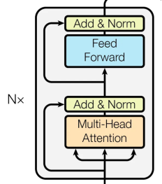

# 一、案例简介：


# 二、任务分析


### 任务分析：
#### 1. 要求关键点
- 多步推理能力：问题解答不仅仅基于单句文本，需要通过综合案件文书中多个部分的信息进行推理。
- 准确理解案件信息：包括时间、地点、人物关系等，对裁判文书的事实描述部分进行准确解析。
- 高效信息检索：从大量文本中快速检索出与问题相关的信息。
- 答案格式的多样性：问题的答案可能是文本片段、是非题（YES/NO）或者需要拒答（unknown）。
#### 2.难点分析
- 平台环境：目前平台环境的处理速度过慢并且不够稳定导致影响了实验进度。
- 复杂的推理路径：多步推理要求模型能够理解和连接文书中分散的信息片段，这在技术上是非常挑战性的。
- 文本理解的深度：法律文书的语言通常较为复杂，含有大量的专业术语和隐含信息，需要模型具备深入理解的能力。
- 信息的准确检索：如何从长篇的文书中准确快速地抽取和问题密切相关的信息，避免无关信息的干扰。
- 答案的多样性处理：模型需要根据问题的不同，灵活选择答案的形式，这要求模型具有很高的灵活性和适应性。

#### 3. 解决策略
- 使用预训练语言模型：如司法BERT例如THUNLP中的MS与XS模型，它在法律领域的大量文本上进行预训练，可以更好地理解法律专业术语和复杂句子结构。
- 引入多步推理机制：通过设计能够进行多步推理的模型架构，如图神经网络（GNN），利用其在图中节点间传播信息的能力来模拟推理过程。
- 信息检索与聚焦机制：设计信息检索模块，使用问题引导的注意力机制，对可能含有答案的文本片段给予更高的权重，减少无关信息的干扰。
- 多任务学习：同时训练模型解决片段抽取、是非题判断和拒答识别等多种任务，提高模型对答案多样性的处理能力。
- 数据增强和迁移学习：使用额外的法律领域数据集，如CJRC，通过迁移学习和数据增强技术提升模型的泛化能力和鲁棒性。


### 算法分析：

#### Transformer： 
Transformer模型是由Google在2017年提出的一种全新的深度学习架构，它在《Attention is All You Need》一文中首次亮相，主要用于处理序列到序列（Seq2Seq）的任务，特别是在自然语言处理（NLP）领域，如机器翻译、文本摘要等。Transformer模型的核心是自注意力机制（Self-Attention），它能够处理长距离依赖问题，同时具备高并行性和效率。

#### 1. 输入和输出处理
在NLP领域，Transformer模型处理的输入通常是文本数据，输出则是根据具体任务而定的文本信息。模型的输入输出处理包括以下几个步骤：
Tokenize：将文本切分成一个个的单词或字。
Embedding：将每个单词或字转换成对应的向量表示。在Transformer中，这一步通常是通过学习得到的。
Positional Encoding：由于Transformer模型没有像RNN那样的递归结构来处理序列的顺序信息，因此需要通过位置编码来为每个单词添加位置信息。

#### 2.Transformer结构
编码器（Encoder）和解码器（Decoder）两部分组成，形成一个典型的Seq2Seq架构。每个部分都包含了多个相同的层（通常是6层），这些层内部又包含了多个子结构。

#### 2.1 Embedding层和Positional Encoding
- Embedding：模型的输入首先通过Embedding层，将每个单词或字转换为固定维度的向量。
- Positional Encoding：为了使模型能够利用单词的顺序信息，每个单词的Embedding向量会与一个位置编码向量相加。位置编码是通过特定的数学公式计算得到，确保模型能够根据单词的相对或绝对位置捕获序列的顺序。

#### 2.2 Encoder
每个Encoder层包含两个主要的子结构：
- Self-Attention Mechanism：允许模型在处理每个单词时考虑到句子中的所有单词，从而能够捕获它们之间的依赖关系。
- Position-wise Feed-Forward Networks：这是一个简单的全连接神经网络，它对Self-Attention层的输出进行进一步处理。每个子结构后面都使用了残差连接（Residual Connection）和层归一化（Layer Normalization），以促进深层网络的训练和收敛。




#### 2.3 Decoder
Decoder也包含了多个层，每层有三个主要的子结构：
- Masked Self-Attention Mechanism：与Encoder中的Self-Attention类似，但是通过Masking技术防止模型看到未来的信息，确保预测仅依赖于已知的输出。
- Encoder-Decoder Attention：允许Decoder层关注到Encoder的输出，通过这种方式，Decoder可以专注于输入序列中与当前预测最相关的部分。
- Position-wise Feed-Forward Networks：与Encoder中相同的全连接网络。
Decoder的结构旨在将Encoder的输出转换为最终的序列输出。


#### 2.4 Attention机制
Transformer的核心是Attention机制，尤其是Scaled Dot-Product Attention。它使用了三个向量集合：查询（Q）、键（K）和值（V）。Attention机制通过计算查询和所有键之间的相似度，来为每个值分配一个权重，然后输出加权的值的和。这种机制使得模型能够集中注意力于重要的信息上。

#### 2.5 Multi-Head Attention
为了让模型能够在不同的位置捕获到序列的不同特征，Transformer使用了Multi-Head Attention。它实质上是并行运行多个Scaled Dot-Product Attention，然后将它们的输出合并起来。这种方式增加了模型的表达能力。


#### 3. 训练过程
- 数据准备：通常使用平行语料库作为训练数据，进行机器翻译任务训练。
- 损失函数和优化器：使用交叉熵损失函数，采用Adam优化器。
- 超参数设置：包括层数、模型大小、注意力头数等。

#### 4. 性能评估
- 评估指标：BLEU分数常用于评估机器翻译的准确性。
- 实验结果：在多个机器翻译任务中，Transformer模型达到了当时的最佳性能。
- 对比分析：相较于RNN和LSTM，Transformer在处理长距离依赖关系时更有效，且训练速度更快。

#### 5. 应用场景和局限性
- 适用性分析：除了机器翻译，Transformer也成功应用于文本摘要、问答系统等任务。
- 局限性讨论：模型参数量大，需要大量的数据和计算资源。


#### 通俗理解：
如果把语言理解比作是一场盛大的宴会，那么Transformer就像是精心设计的宴会厅，通过其独特的自注意力机制，确保每位宾客（词语）都能与其他宾客进行充分的交流，无论他们坐得多远。
而接下来要介绍的BERT则是在这个宴会厅里举行的一场特别培训班，通过预先学习宴会中可能出现的各种对话（大量文本数据），让服务员（模型）更好地理解和服务每一位宾客，无论他们提出什么样的请求（NLP任务）。


#### BERT：
BERT（Bidirectional Encoder Representations from Transformers）是Google于2018年提出的一种预训练语言表示模型。BERT通过双向编码器表示（即同时考虑上下文信息）来生成深层语义表示，极大地提升了多种自然语言处理任务的性能。

##### 1. BERT的核心思想
BERT的核心思想是通过预训练一个双向的Transformer模型，使其能够在各种下游任务中生成高质量的语言表示。BERT的预训练分为两个阶段：掩码语言模型（Masked Language Model, MLM）和下一句预测（Next Sentence Prediction, NSP）。
##### 2. BERT的架构
BERT模型基于Transformer的编码器部分，包含多个堆叠的Transformer编码器层。BERT的具体架构如下：


- 输入嵌入：BERT的输入由词嵌入（Token Embeddings）、位置嵌入（Position Embeddings）和段落嵌入（Segment Embeddings）三部分组成。
- 多层Transformer编码器：BERT通常包含12层（BERT-Base）或24层（BERT-Large）的Transformer编码器，每层都包含多头自注意力机制和前馈神经网络。

#### 2.1 输入嵌入
BERT的输入是一个拼接后的文本对，例如句子A和句子B。输入嵌入包括三部分：
- Token Embeddings：将每个词或词片段映射为固定维度的向量。
- Position Embeddings：为每个位置添加一个位置编码，以保留单词顺序信息。
- Segment Embeddings：添加段落嵌入，用于区分句子A和句子B。

#### 2.2 掩码语言模型（Masked Language Model, MLM）
MLM任务是指在预训练过程中随机掩盖输入序列中的一些单词，然后让模型预测这些被掩盖的单词是什么。通过这种方式，模型可以学习到每个单词在不同上下文中的表示。

- 掩码处理：在输入序列中随机选择15%的单词进行掩盖，其中80%被替换为[MASK]，10%被替换为随机单词，10%保持不变。
- 预测掩码单词：模型根据上下文信息预测被掩盖的单词，从而学习到更好的单词表示。

#### 2.3 下一句预测（Next Sentence Prediction, NSP）
NSP任务是为了让模型理解句子之间的关系。具体方法是给模型提供一对句子，并让模型预测第二个句子是否是第一个句子的后续句子。
句子对构建：从语料库中随机选择句子对，其中50%的句子对是连续的，50%是随机的。
预测任务：模型通过训练学习句子对之间的关系，从而在下游任务中更好地处理句子对的上下文关系。

### 3. 优势和应用

#### 3.1 提升下游任务性能
通过在大规模文本数据上进行预训练，BERT能够生成高质量的语言表示，从而在各种下游任务中显著提升性能，如文本分类、命名实体识别、问答系统等。

#### 3.2 处理长距离依赖问题
BERT的双向编码器使其能够同时考虑上下文信息，从而有效地捕捉长距离依赖关系。这在需要理解复杂句子结构和上下文关系的任务中尤为重要。

#### 3.3 高效迁移学习
BERT通过预训练和微调的方式，可以在各种下游任务中高效迁移。通过在下游任务中进行微调，BERT能够快速适应并取得优异的表现。

### 4. 应用实例
- 文本分类：BERT在情感分析、新闻分类等任务中表现出色。
- 命名实体识别（NER）：在识别命名实体（如人名、地名、组织名）任务中，BERT大幅提升了性能。
- 问答系统：BERT在SQuAD等问答基准测试中取得了优异成绩，能够理解问题并从文本中准确提取答案。
- 文本生成和翻译：通过结合BERT与生成模型，能够生成高质量的文本内容，并在机器翻译任务中表现优异。

### 本次任务：
在司法阅读理解任务中，BERT模型起到了至关重要的作用，尤其在处理法律文书中的复杂语言结构和实现多步推理方面。
1. 理解复杂的法律语言
法律文书通常包含密集的专业术语和复杂的句子结构。BERT模型通过双向的上下文理解能力，能够有效地理解并处理这种复杂的语言环境。
2. 实现多步推理
在司法阅读理解中，往往需要模型结合多个信息源进行推理，才能得出正确的答案。
3. 提升信息检索效率
由于BERT模型能够生成深层的语义表示，它可以帮助更准确地定位和提取与问题相关的信息。
4. 支持多种问题类型
司法阅读理解任务中的问题类型多样，包括基于事实的问题、是非问题以及需要细节支持的问题等。

下载模型：


模型对应目录文件展示（后期可能需要将模型文件的名称进行修改以适应项目代码，如bert_config.json可能需要修改为config.json)：


数据预处理：


模型训练我主要采用了四个模型：

Chinese_bert_wwm_ext_pytorch

Chinese_roberta_wwm_ext_pytorch 

THUBERT_ms(民事）

THUBERT_xs（刑事）

按照以下命令每个模型训练十轮（其中包含一次训练了一次的预实验）：

```sh
python run_cail.py --name train_v1 --bert_model /home/mw/input/bert_wwm9691/chinese_wwm_ext_pytorch --data_dir /home/mw/project/data --batch_size 2 --eval_batch_size 32 --lr 1e-5 --gradient_accumulation_steps 1 --epochs 10
```

生成的提交文件示例：


# 三、关键代码及注释

放到了压缩包中的ReadCODE.ipynb中

# 四、结果展示与分析：


评估代码：

```python
import sys
import ujson as json
import re
import string
from collections import Counter
import pickle

def normalize_answer(s):
    def remove_articles(text):
        return re.sub(r'\b(a|an|the)\b', ' ', text)

    def white_space_fix(text):
        return ' '.join(text.split())

    def remove_punc(text):
        exclude = set(string.punctuation)
        return ''.join(ch for ch in text if ch not in exclude)

    def lower(text):
        return text.lower()

    return white_space_fix(remove_articles(remove_punc(lower(s))))

def f1_score(prediction, ground_truth):
    normalized_prediction = normalize_answer(prediction)
    normalized_ground_truth = normalize_answer(ground_truth)

    ZERO_METRIC = (0, 0, 0)

    if normalized_prediction in ['yes', 'no', 'unknown'] and normalized_prediction != normalized_ground_truth:
        return ZERO_METRIC
    if normalized_ground_truth in ['yes', 'no', 'unknown'] and normalized_prediction != normalized_ground_truth:
        return ZERO_METRIC

    prediction_tokens = list(normalized_prediction)
    ground_truth_tokens = list(normalized_ground_truth)
    common = Counter(prediction_tokens) & Counter(ground_truth_tokens)
    num_same = sum(common.values())
    if num_same == 0:
        return ZERO_METRIC
    precision = 1.0 * num_same / len(prediction_tokens)
    recall = 1.0 * num_same / len(ground_truth_tokens)
    f1 = (2 * precision * recall) / (precision + recall)
    return f1, precision, recall

def exact_match_score(prediction, ground_truth):
    return (normalize_answer(prediction) == normalize_answer(ground_truth))

def update_answer(metrics, prediction, gold):
    em = exact_match_score(prediction, gold)
    f1, prec, recall = f1_score(prediction, gold)
    metrics['em'] += float(em)
    metrics['f1'] += f1
    metrics['prec'] += prec
    metrics['recall'] += recall
    return em, prec, recall

def update_sp(metrics, prediction, gold):
    cur_sp_pred = set(map(tuple, prediction))
    gold_sp_pred = set(map(tuple, gold))
    tp, fp, fn = 0, 0, 0
    for e in cur_sp_pred:
        if e in gold_sp_pred:
            tp += 1
        else:
            fp += 1
    for e in gold_sp_pred:
        if e not in cur_sp_pred:
            fn += 1
    prec = 1.0 * tp / (tp + fp) if tp + fp > 0 else 0.0
    recall = 1.0 * tp / (tp + fn) if tp + fn > 0 else 0.0
    f1 = 2 * prec * recall / (prec + recall) if prec + recall > 0 else 0.0
    if fp + fn == 0:
        em, prec, recall, f1 = 1.0, 1.0, 1.0, 1.0
    else:
        em = 0.0
    metrics['sp_em'] += em
    metrics['sp_f1'] += f1
    metrics['sp_prec'] += prec
    metrics['sp_recall'] += recall
    return em, prec, recall

def eval(prediction_file, gold_file):
    with open(prediction_file, encoding='utf-8') as f:  # Specify UTF-8 encoding here
        prediction = json.load(f)
    with open(gold_file, encoding='utf-8') as f:  # Specify UTF-8 encoding here
        gold = json.load(f)

    metrics = {'em': 0, 'f1': 0, 'prec': 0, 'recall': 0,
        'sp_em': 0, 'sp_f1': 0, 'sp_prec': 0, 'sp_recall': 0,
        'joint_em': 0, 'joint_f1': 0, 'joint_prec': 0, 'joint_recall': 0}
    for dp in gold:
        cur_id = str(dp['_id'])
        can_eval_joint = True
        if cur_id not in prediction['answer']:
            print('missing answer {}'.format(cur_id))
            can_eval_joint = False
        else:
            em, prec, recall = update_answer(
                metrics, prediction['answer'][cur_id], dp['answer'])
        if cur_id not in prediction['sp']:
            print('missing sp fact {}'.format(cur_id))
            can_eval_joint = False
        else:
            sp_em, sp_prec, sp_recall = update_sp(
                metrics, prediction['sp'][cur_id], dp['supporting_facts'])

        if can_eval_joint:
            joint_prec = prec * sp_prec
            joint_recall = recall * sp_recall
            if joint_prec + joint_recall > 0:
                joint_f1 = 2 * joint_prec * joint_recall / (joint_prec + joint_recall)
            else:
                joint_f1 = 0.
            joint_em = em * sp_em

            metrics['joint_em'] += joint_em
            metrics['joint_f1'] += joint_f1
            metrics['joint_prec'] += joint_prec
            metrics['joint_recall'] += joint_recall

    N = len(gold)
    for k in metrics.keys():
        metrics[k] /= N

    print(metrics)

if __name__ == '__main__':
    eval(sys.argv[1], sys.argv[2])
```


