# 一、案例简介 

新冠肺炎疫情牵动着我们每一个人的心，在这个案例中，我们将尝试用社会计算的方法对疫情相关的新闻和谣言进行分析，助力疫情信息研究。本次作业为开放性作业，我们提供了疫情期间的社交数据，鼓励同学们从新闻、谣言以及法律文书中分析社会趋势。（提示：运用课上学到的方法，如情感分析、信息抽取、阅读理解等分析数据）


# 二、项目执行
### 1.谣言分析与检测


#### 1.1数据说明

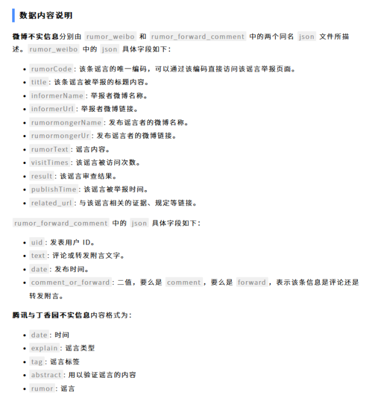


#### 1.2数据预处理

```python
import os
import json
import pandas as pd

# 文件路径
weibo_dir = '/home/mw/input/NLP61475/rumor/rumor/rumor_weibo'
forward_comment_dir = '/home/mw/input/NLP61475/rumor/rumor/rumor_forward_comment'

# 初始化数据列表
weibo_data = []
forward_comment_data = []

# 处理rumor_weibo文件夹中的数据
for filename in os.listdir(weibo_dir):
    if filename.endswith('.json'):
        filepath = os.path.join(weibo_dir, filename)
        with open(filepath, 'r', encoding='utf-8') as file:
            data = json.load(file)
            weibo_data.append(data)

# 处理rumor_forward_comment文件夹中的数据
for filename in os.listdir(forward_comment_dir):
    if filename.endswith('.json'):
        filepath = os.path.join(forward_comment_dir, filename)
        with open(filepath, 'r', encoding='utf-8') as file:
            data = json.load(file)
            # 提取rumorCode
            rumor_code = filename.split('_')[1].split('.')[0]
            for comment in data:
                comment['rumorCode'] = rumor_code  # 添加rumorCode以便后续匹配
                forward_comment_data.append(comment)

# 转换为DataFrame
weibo_df = pd.DataFrame(weibo_data)
forward_comment_df = pd.DataFrame(forward_comment_data)
weibo_df.to_csv('/home/mw/work/NLP6/weibo_data.csv', index=False, encoding='utf-8')
forward_comment_df.to_csv('/home/mw/work/NLP6/forward_comment_data.csv', index=False, encoding='utf-8')

```


### 2对谣言内容的数据统计与分析

#### 2.1 首先对微博的访问次数[Visit Time]进行统计分析，大多数的谣言被访问次数集中在50-300

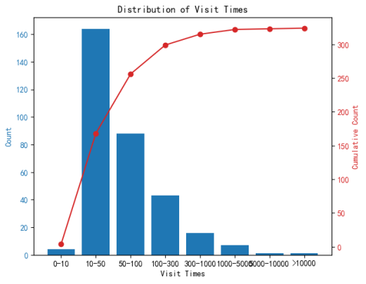

#### 2.2统计发布者与被举报者信息，本次统计前十名
一个账户最多发布是三条，其余为两条，发布的条数较为平均，不存在一人多条发布。

个人分析：

原因一是因为发布违规谣言被封号

原因二平台加强了对相关内容的监管

这些发布谣言的用户确实可恨，有的用户我去搜了一下目前确实已经没有了（也可能改名了）

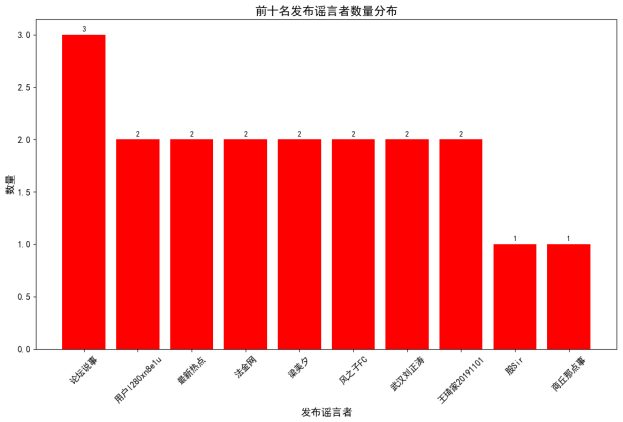

举报者最多的一个用户风fun道举报了37条谣言

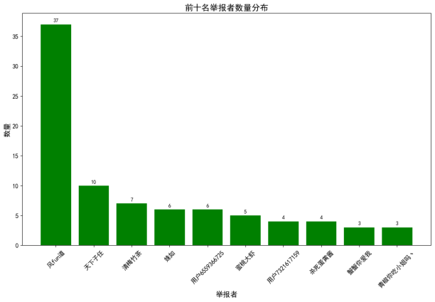


#### 2.3 时间序列分析通过现有数据采用ARIMA模型进行分析（模型较为简单）

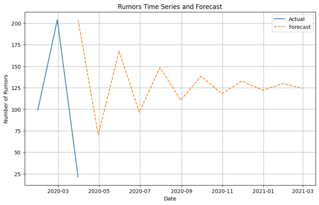


#### 2.4 绘制词云图
从图片结果可以看到武汉，中国，病毒，冠状病毒，确诊，感染等字眼，整体微博谣言内容基本全部围绕着疫情这个话题进行杜撰的。


#### 2.5对谣言进行情感分析选取前十名
前十消极谣言内容


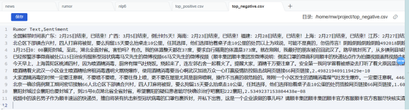


前十积极谣言内容

里面有屠呦呦教授和对火神山医院的内容，虽然是谣言但是从深层次思考也能部分体现当时人们所关注的主要是医疗方面。


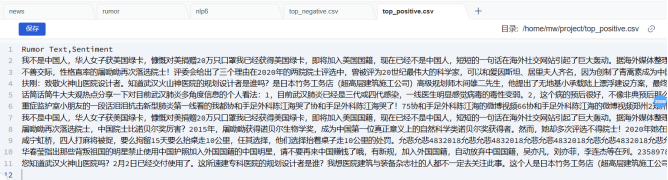


#### 2.6谣言检测系统
微博谣言数据和辟谣数据集，分别存储在 rumor_df 和 fact_df 中。这些数据集包含了谣言标题和辟谣信息，是系统判断的依据。

利用两种关键模型来分析谣言文本。一是 SimCSE 模型，它能够为文本生成语义嵌入表示，通过加载预训练的 Transformer 模型和使用 SentenceTransformer 库实现。二是 BERT 模型，用于命名实体识别（NER），通过 transformers 库加载预训练的 BERT   模型和使用 pipeline 函数配置实现。

定义了几个关键函数来支持谣言检测过程：

- extract_entities 函数用于从文本中提取命名实体。
- entity_similarity 函数计算两个文本之间的命名实体相似度。
- combined_similarity 函数结合了文本的语义相似度（通过 - SimCSE 模型计算）和命名实体相似度，以综合评估两个文本之间的相似度。

最后，通过 debunk_rumor 函数来实现谣言检测的具体逻辑：

对于给定的谣言文本，利用 combined_similarity 函数计算其与所有辟谣标题的相似度。

根据相似度评分，找到最相似的辟谣标题，并输出该辟谣标题的解释和依据，从而判断谣言的真实性。

通过这种结合语义和命名实体分析的方式，系统能够更准确和全面地评估微博中的谣言信息，提供有力的辟谣依据。


```python
import json
import pandas as pd
import numpy as np
from sentence_transformers import SentenceTransformer, models, util
from transformers import pipeline, BertTokenizer, BertForTokenClassification
import torch

# 加载微博谣言数据和辟谣数据集
def load_data():
    # 加载谣言数据
    rumor_df = pd.read_csv('/home/mw/work/NLP6/weibo_data.csv')
    
    # 加载辟谣数据
    fact_data = []
    with open('/home/mw/input/NLP61475/rumor/rumor/fact.json', 'r', encoding='utf-8') as f:
        for line in f:
            fact_data.append(json.loads(line.strip()))
    
    fact_df = pd.DataFrame(fact_data)
    fact_df = fact_df.dropna(subset=['title'])
    
    return rumor_df, fact_df

def extract_entities(text):
    """提取命名实体"""
    entities = ner_pipeline(text)
    return {entity['word'] for entity in entities}

def entity_similarity(text1, text2):
    """计算命名实体相似度"""
    entities1 = extract_entities(text1)
    entities2 = extract_entities(text2)
    if not entities1 or not entities2:
        return 0.0
    intersection = entities1.intersection(entities2)
    union = entities1.union(entities2)
    return len(intersection) / len(union)

def combined_similarity(text1, text2):
    """结合句子嵌入相似度和实体相似度"""
    embed_sim = util.pytorch_cos_sim(model.encode([text1], convert_to_tensor=True), 
                                     model.encode([text2], convert_to_tensor=True)).item()
    entity_sim = entity_similarity(text1, text2)
    return 0.5 * embed_sim + 0.5 * entity_sim

def debunk_rumor(input_rumor):
    """谣言检测"""
    similarity_scores = [combined_similarity(input_rumor, fact_text) for fact_text in fact_df['title']]
    
    most_similar_index = np.argmax(similarity_scores)
    most_similar_fact = fact_df.iloc[most_similar_index]
    
    print("微博谣言:", input_rumor)
    print(f"辟谣判断：{most_similar_fact['explain']}")
    print(f"辟谣依据：{most_similar_fact['title']}")

if __name__ == "__main__":
    # 加载数据
    rumor_df, fact_df = load_data()
    
    # 定制路径加载SimCSE模型
    simcse_path = '/home/mw/input/MINI_LLM3084'
    word_embedding_model = models.Transformer(simcse_path)
    pooling_model = models.Pooling(word_embedding_model.get_word_embedding_dimension())
    model = SentenceTransformer(modules=[word_embedding_model, pooling_model])
    model.to('cuda')
    
    # 定制路径加载预训练的NER模型
    ner_model_path = '/home/mw/input/bert_base_case9058'
    tokenizer = BertTokenizer.from_pretrained(ner_model_path)
    ner_model = BertForTokenClassification.from_pretrained(ner_model_path)
    ner_pipeline = pipeline('ner', model=ner_model, tokenizer=tokenizer, aggregation_strategy="simple", device=0)
    
    # 举个例子进行谣言检测
    weibo_rumor = "据最新研究发现，此次新型肺炎病毒传播途径是华南海鲜市场进口的豺——一种犬科动物携带的病毒，然后传给附近的狗，狗传狗，狗传人。狗不生病，人生病。人生病后又传给狗，循环传染。"
    debunk_rumor(weibo_rumor)

```


微博谣言: 据最新研究发现，此次新型肺炎病毒传播途径是华南海鲜市场进口的豺——一种犬科动物携带的病毒，然后传给附近的狗，狗传狗，狗传人。狗不生病，人生病。人生病后又传给狗，循环传染。

辟谣判断：尚无定论

辟谣依据：狗能感染新型冠状病毒


微博谣言: 我已经获得美国绿卡，即将加入美国国籍，现在已经不是中国人，短短的一句话在海外社交网站引起了巨大轰动。据海外媒体整理，这段话是一名来自中国宁波的女子。为了快速加入美国国籍，该女子以个人名义在中国采购了20万只口罩捐赠给美国国土安全部抵抗疫情。

辟谣判断：伪科学

辟谣依据：可以确定美国病毒是5株，中国2株，伊朗和美国一样


### 3.疫情相关中文新闻数据分析


#### 3.1数据预处理
实现加载新闻评论数据，对数据进行清洗、展开和分词处理，最终将预处理后的结果保存为 CSV 文件。


```python
import os
import json
import pandas as pd
import jieba
from bs4 import BeautifulSoup

# 加载数据
def load_data(comment_folder):
    comment_data = []

    # 加载评论数据
    for filename in os.listdir(comment_folder):
        if filename.endswith('.txt'):
            with open(os.path.join(comment_folder, filename), 'r', encoding='utf-8') as file:
                comment_data.extend(json.loads(file.read()))

    comment_df = pd.DataFrame(comment_data)
    
    return comment_df

# 预处理数据
def preprocess_data(comment_df):
    # 去除缺失值
    comment_df.dropna(subset=['time', 'title', 'url'], inplace=True)

    # 将评论的数据展开
    comment_expanded = []
    for i, row in comment_df.iterrows():
        # 标准化格式，确保time字段为datetime类型
        try:
            row['time'] = pd.to_datetime(row['time'], format='%m-%d %H:%M')
        except:
            row['time'] = None

        for comment in row['comment']:
            # 标准化评论时间
            try:
                comment['comment_time'] = pd.to_datetime(comment.get('time'), format='%Y-%m-%d %H:%M:%S')
            except:
                comment['comment_time'] = None
                
            comment_expanded.append({
                'time': row['time'],
                'title': row['title'],
                'url': row['url'],
                'comment_area': comment.get('area'),
                'comment_content': comment.get('content'),
                'comment_nickname': comment.get('nickname'),
                'comment_reply_to': comment.get('reply_to'),
                'comment_time': comment['comment_time']
            })
    
    comment_expanded_df = pd.DataFrame(comment_expanded)
    return comment_expanded_df

# 文本清洗函数
def clean_text(text):
    if isinstance(text, str):  # 添加此检查以确保传递给 BeautifulSoup 的是字符串
        text = BeautifulSoup(text, 'html.parser').get_text()
        text = ''.join(e for e in text if e.isalnum() or e.isspace())
    return text

# 文本预处理
def preprocess_text(df):
    df['clean_comment_content'] = df['comment_content'].apply(lambda x: clean_text(x) if pd.notnull(x) else '')
    df['comment_tokens'] = df['clean_comment_content'].apply(lambda x: list(jieba.cut(x)))
    
    return df

# 保存预处理数据
def save_preprocessed_data(df, file_path):
    os.makedirs(os.path.dirname(file_path), exist_ok=True)
    df.to_csv(file_path, index=False, escapechar='\\')  # 添加escapechar参数

def main():
    comment_folder = '/home/mw/input/NLP61475/news/news/comment'  # 替换为实际路径
    output_file = '/home/mw/work/NLP6/preprocessed_comments_data.csv'

    comment_df = load_data(comment_folder)
    cleaned_df = preprocess_data(comment_df)
    cleaned_df = preprocess_text(cleaned_df)
    save_preprocessed_data(cleaned_df, output_file)

    print('数据预处理完成并保存为', output_file)

if __name__ == '__main__':
    main()
```

#### 3.2评论者地区统计
主要集中一线城市，其中北京数量最多超过剩余九名之和，
- 原因一：是跟北京人口有关包含本地人口和外来人口当时疫情加上春运期间会导致许多人员无法返乡
- 原因二：是因为首都处于政治中心当地百姓对时政会更加敏感。

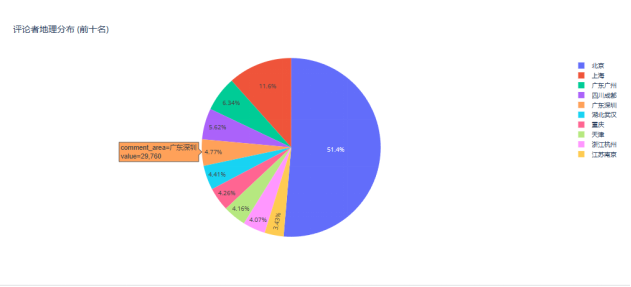

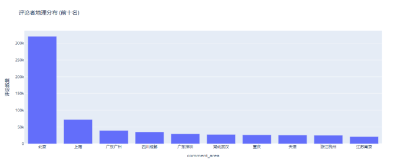

前十五名也可以看到基本都是直辖市或者各省省会城市。

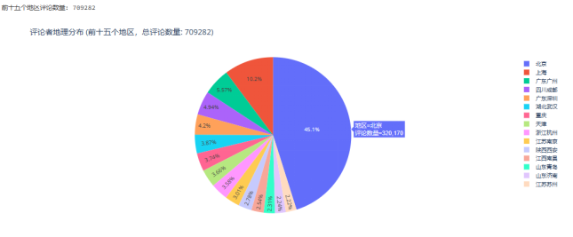

总评论量在1532928条达到了百万级

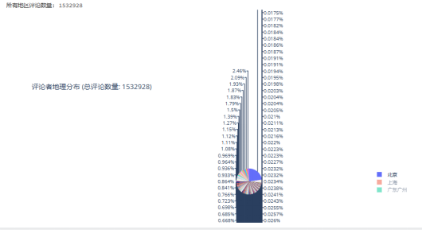


#### 3.3时间统计
数据是1月1日到3月8日基本上可以看到每天的评论数量都是在15000左右。

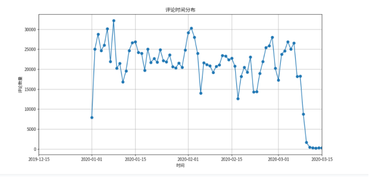


#### 3.4新闻关键词统计与分析

可以看到前几个新闻标题关键词全部是和疫情相关，主要反映了当时是大事是疫情，主要集中在中国武汉为现实相符。

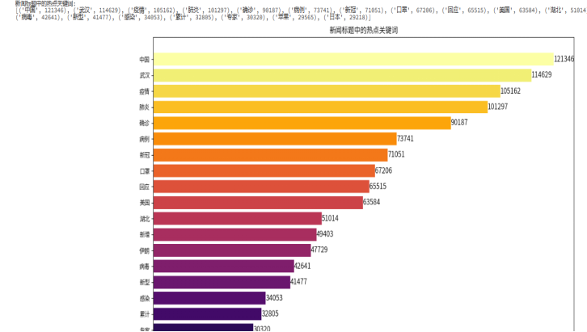


#### 3.5评论关键词统计与分析

评论的内容主要是中国美国，加油武汉等
1. 中国的原因首先因为数据集采自于国内加上疫情在国内爆发
2. 美国的原因是因为当时有说法病毒的源头来自于美国，评论内容主要包含了对美国的谴责。
3. 武汉加油是国民的心声，是中华民族团结一致共度难关的最好体现。


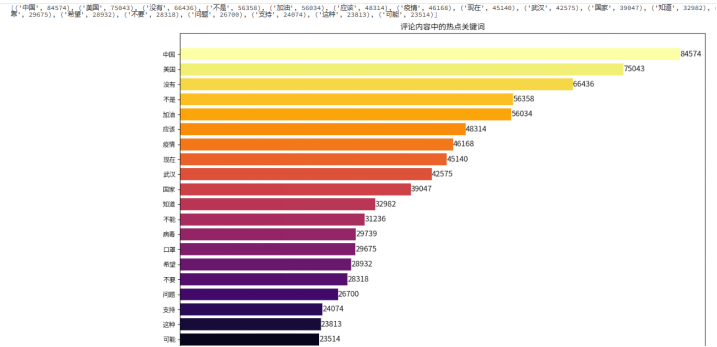


#### 3.6 每日评论情感分析

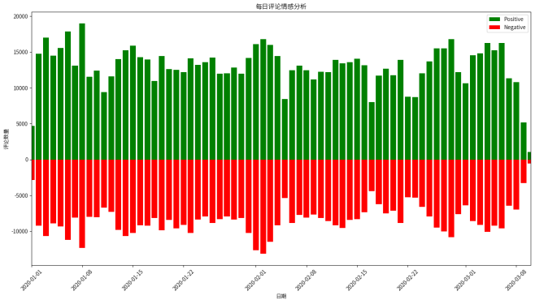


深层次分析
###### 1.社会学角度：
社会情绪波动：图表显示了每日新闻评论中积极和消极情感的比例。可以看到，随着疫情的发展，消极评论有波动增加的趋势，反映了社会整体情绪的波动。

###### 2.心理学角度：
焦虑和恐慌：负面评论的增加反映了人们的焦虑和恐慌情绪。这种情绪可能导致心理健康问题，如焦虑症和抑郁症。

情绪传染：负面情绪容易在社交媒体上迅速传播，形成情绪传染效应，进一步加剧社会恐慌。

###### 3.人民群众的角度：
信息需求：人们在疫情期间对信息的需求增加，积极评论可能反映了对正确信息的认可和对未来的希望。

生活影响：负面评论可能反映了疫情对日常生活的影响，如经济压力、社交隔离等。

###### 4.媒体角度：
报道倾向：媒体报道的倾向性会显著影响公众情绪。正面报道可能缓解社会恐慌，而负面报道则可能加剧恐慌。

信息真实性：媒体在报道疫情时应确保信息的真实性和准确性，避免传播不实信息。

###### 5.政府角度：
政策影响：政府的防疫政策和措施直接影响公众情绪。有效的政策和透明的信息发布可以提高公众信任度，减少恐慌。

危机管理：政府在危机管理中的表现，如资源分配、医疗支援等，都会影响公众情绪。

###### 6.经济角度：
经济压力：疫情对经济的冲击是负面评论增加的一个重要原因。失业、收入减少等经济压力会导致社会情绪的不稳定。

经济恢复：正面评论可能反映了对经济恢复的信心和对政府经济刺激政策的认可。

###### 7.法律角度：
法律保障：法律文书数据反映了政府在疫情期间对谣言传播的法律应对措施。这些措施对控制谣言传播、稳定社会情绪起到了重要作用。

法律教育：加强法律教育，提升公众对法律的认识，有助于减少谣言传播，稳定社会情绪。

###### 8.教育角度：
公众教育：通过教育提高公众对疫情的科学认识，减少恐慌情绪。教育机构可以通过线上教育等方式提供科学防疫知识。

信息素养：提高公众的信息素养，增强辨别谣言的能力，减少不实信息的传播。

###### 9.文化角度：
文化影响：不同文化背景的人对疫情的反应可能不同。文化中的集体主义或个体主义倾向会影响公众的情感反应。

文化传播：通过文化传播正能量，如艺术作品、励志故事等，可以缓解公众的负面情绪。

###### 10.科技角度：
技术支持：利用大数据、人工智能等技术手段进行情感分析，可以及时了解公众情绪，采取相应措施。

信息传播：社交媒体平台应加强信息审核，防止不实信息传播，利用技术手段传播正确信息。


*稳定情绪的措施*
1. 透明信息发布：政府和权威机构应及时、透明地发布疫情信息，避免信息真空导致的谣言传播。
2. 心理疏导：提供心理咨询服务，帮助公众应对焦虑和恐慌情绪。可以通过热线电话、线上咨询等方式提供支持。
3. 媒体责任：媒体应承担社会责任，确保报道的真实性和客观性，避免过度渲染负面新闻。
4. 公众教育：加强对公众的科学防疫知识教育，提高辨别谣言的能力，减少不实信息的传播。
5. 社区支持：社区可以组织互助活动，提供生活和心理支持，增强社会凝聚力。
6. 法律措施：加强对谣言传播的法律打击，严惩造谣者，保护公众的知情权和安全感。
7. 经济支持：政府应出台经济支持政策，减轻疫情对民众经济生活的影响，如提供失业救济、减税等。
8. 正能量传播：鼓励传播正能量的故事和信息，如抗疫英雄、社区互助等，增强公众的信心和希望。
9. 技术应用：利用大数据和人工智能技术进行情感分析，及时了解公众情绪，采取相应的疏导措施。
10. 国际合作：加强国际合作，共享防疫经验和技术，提升全球抗疫能力，增强公众对战胜疫情的信心。


评论词云：


#### 3.7 新闻标题词云图

新闻标题词云图主要包含新冠肺炎，确诊病例累计等词汇


### 实验心得：
这次实验不仅是一次编程和数据处理的练习，更是一次综合运用社会计算手段对疫情信息进行分析的实践。通过这次实验，我们深刻体会到数据分析在实际问题解决中的重要性和巨大潜力。尤其是在面对重大公共卫生事件时，及时准确地分析和传播信息，对于稳定社会情绪、指导公众行为具有重要意义。

总结来说，这次实验让我学会了如何运用情感分析等技术手段进行数据分析，理解了数据背后的社会现象，并进一步思考了如何通过科技手段应对类似的公共危机。此外，实验中遇到的问题和挑战也锻炼了我的问题解决能力和团队合作精神。这些都将成为我未来学习和工作的宝贵财富。

